# Agentic Architecture Design Document
## VnMLStudio.Plugin.LlamaCppSharp — Agentic Orchestration Layer

**Version:** 1.0  
**Date:** 2026-08-14  
**Scope:** P0 Reflection → P1 Planning & Multi-Agent → P2 Learning & Proactive → P3 Dynamic Tool Synthesis  
**Author:** Hoang Nguyen Cong
---

## 1. Executive Summary

Tài liệu này mô tả kiến trúc agentic từ **Level 2 (Simple Agent)** lên **Level 5 (Self-improving Agent)** cho hệ thống LLM local (LlamaCppSharp). Kiến trúc được thiết kế theo dạng **layered, drop-in replacement**, cho phép nâng cấp từng level mà không phá vỡ harness gốc.

| Level | Tên | Đặc điểm chính |
|:-----:|-----|----------------|
| 0 | Static LLM | Chỉ trả lời, không tool |
| 1 | Tool-using LLM | RAG, Function Calling |
| 2 | Simple Agent | ReAct + Memory + Tools |
| 3 | Autonomous Agent | Planning + Reflection + Multi-step |
| 4 | Multi-Agent System | Collaboration + Delegation |
| 5 | Self-improving Agent | Learning + Adaptation + Tool Synthesis |

---

## 2. High-Level Design

### 2.1 System Architecture

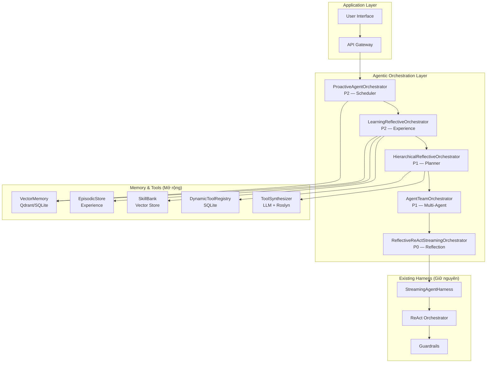

### 2.2 Orchestrator Chain (Decorator Pattern)

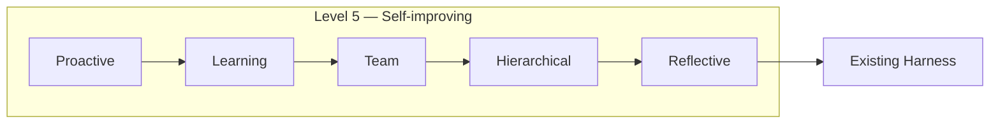
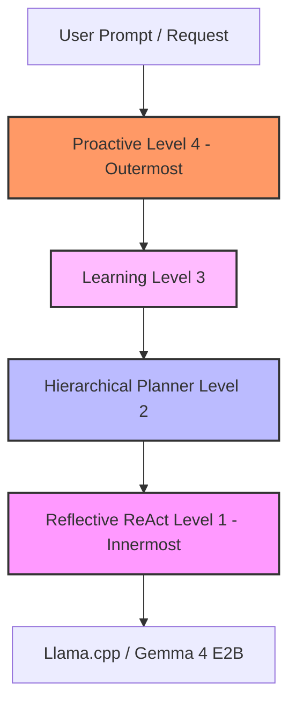
**Nguyên tắc:** Mỗi orchestrator wrap orchestrator bên trong qua `IStreamingAgentOrchestrator`. Có thể bật/tắt từng layer qua DI mà không sửa code.

### 2.3 Data Flow — End to End

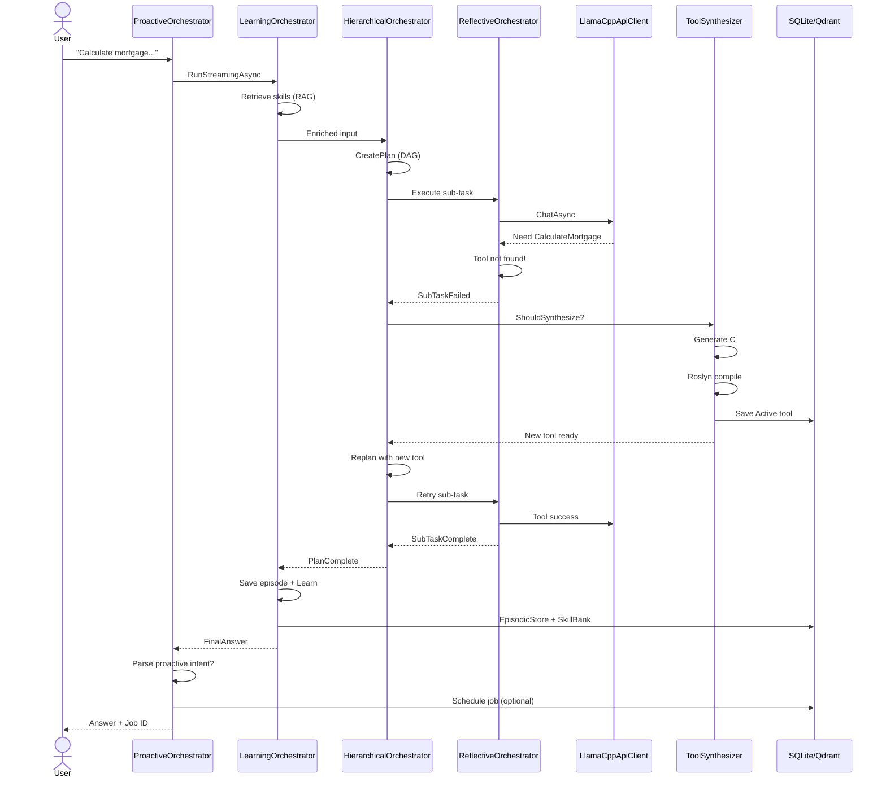

---

## 3. Agent Capability Levels

### 3.1 Capability Matrix

| Tiêu chí | L0 | L1 | L2 | L3 | L4 | L5 |
|----------|:--:|:--:|:--:|:--:|:--:|:--:|
| Tool Use | ❌ | ✅ | ✅ | ✅ | ✅ | ✅ |
| Memory | ❌ | ⚠️ | ✅ | ✅ | ✅ | ✅ |
| Planning | ❌ | ❌ | ⚠️ | ✅ | ✅ | ✅ |
| Autonomy | ❌ | ❌ | ⚠️ | ✅ | ✅ | ✅ |
| Reflection | ❌ | ❌ | ❌ | ✅ | ✅ | ✅ |
| Task Decomposition | ❌ | ❌ | ❌ | ✅ | ✅ | ✅ |
| Multi-Agent | ❌ | ❌ | ❌ | ❌ | ✅ | ✅ |
| Learning | ❌ | ❌ | ❌ | ❌ | ❌ | ✅ |
| Event-Driven | ❌ | ❌ | ❌ | ❌ | ❌ | ✅ |
| Tool Synthesis | ❌ | ❌ | ❌ | ❌ | ❌ | ✅ |

### 3.2 Level Transition Diagram

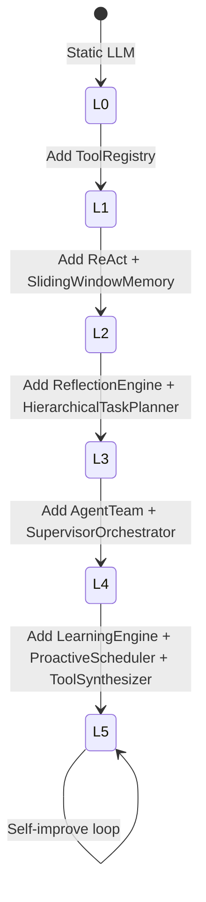

---

## 4. Detailed Design

### 4.1 P0 — Reflection Engine

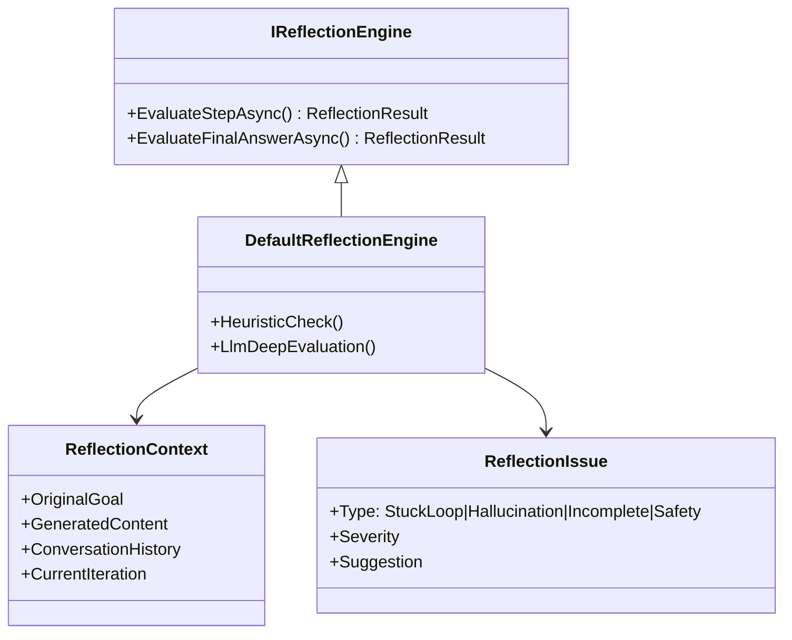

**Phát hiện:**
- Stuck loop: gọi cùng tool 3+ lần
- Hallucination: claim có source nhưng chưa gọi tool
- Misinterpret: tool trả empty nhưng claim "found X"
- Context window risk: auto-summarize

### 4.2 P1 — Hierarchical Task Planner

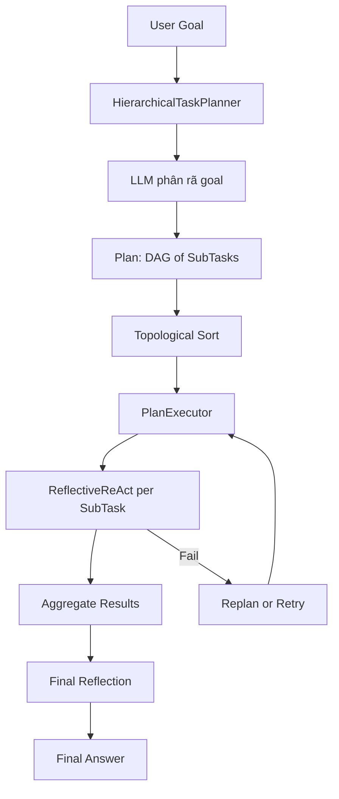

**Components:**
- `ITaskPlanner`: tạo/refine plan
- `Plan`: DAG với dependency
- `PlanExecutor`: topological sort + parallel execution nếu độc lập

### 4.3 P1 — Agent Team

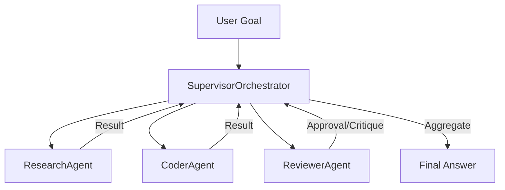

### 4.4 P2 — Learning from Experience

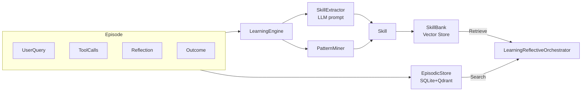

**Skill lifecycle:**
```
Draft → Validate on 3 similar episodes → Active (rate ≥ 70%)
                                    → Rejected (rate < 30% after 5 uses)
```

### 4.5 P2 — Proactive Scheduler

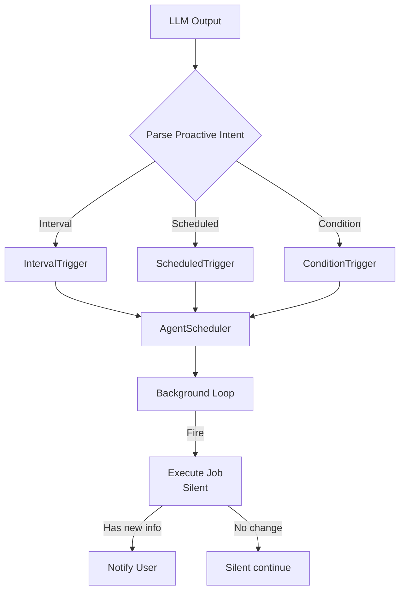

### 4.6 P3 — Dynamic Tool Synthesis

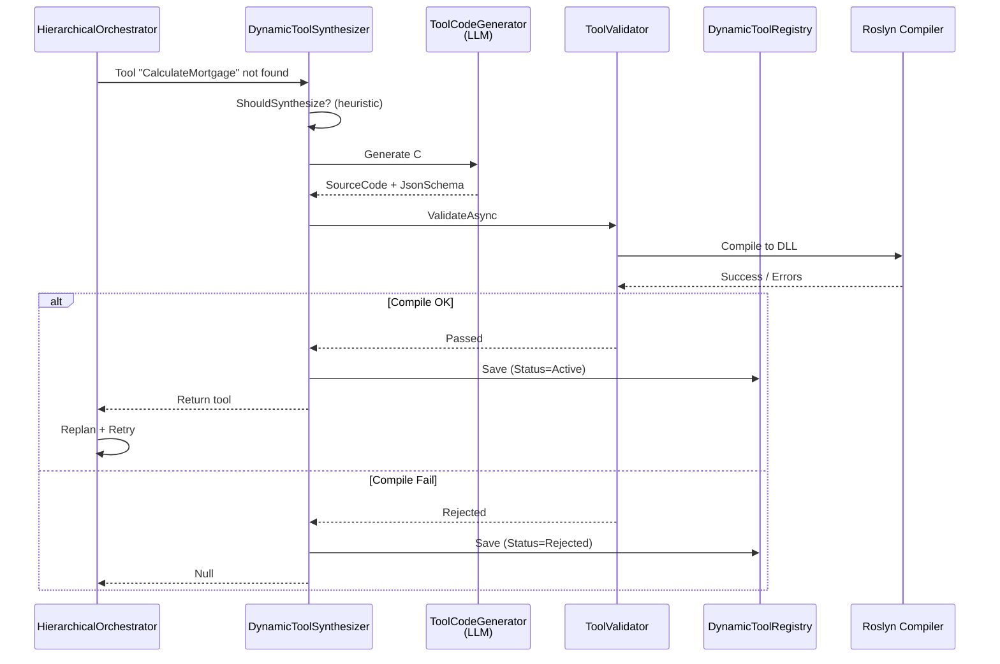

**Safety guards:**
- SQL: block DROP, DELETE, TRUNCATE, EXEC, sp_, xp_
- C#: compile trong MemoryStream, không load vào app domain chính
- Max synthesis per plan: default 2

---

## 5. Quick Implementation Guideline

### 5.1 Phase 1: P0 Reflection (1-2 tuần)

```bash
# 1. Implement ReflectionEngine
# 2. Wrap ReflectiveStreamingAgentHarness
# 3. Test với các case: stuck loop, hallucination
```

```csharp
services.AddSingleton<IReflectionEngine>(sp => new DefaultReflectionEngine(
    sp.GetRequiredService<LlamaCppApiClient>(),
    new ReflectionEngineOptions(),
    sp.GetRequiredService<ILoggerFactory>()));
```

### 5.2 Phase 2: P1 Planning + Multi-Agent (2-3 tuần)

```bash
# 1. Implement HierarchicalTaskPlanner
# 2. Implement AgentTeam (Research + Coder + Reviewer)
# 3. Wire vào HierarchicalReflectiveOrchestrator
```

```csharp
services.AddSingleton<ITaskPlanner, HierarchicalTaskPlanner>();
services.AddSingleton<IStreamingAgentOrchestrator>(sp => new HierarchicalReflectiveOrchestrator(
    sp.GetRequiredService<ITaskPlanner>(),
    sp.GetRequiredService<ReflectiveReActStreamingOrchestrator>(),
    planReflection: sp.GetRequiredService<IReflectionEngine>(),
    loggerFactory: sp.GetRequiredService<ILoggerFactory>()));
```

### 5.3 Phase 3: P2 Learning + Proactive (2-3 tuần)

```bash
# 1. Setup HybridEpisodicStore (SQLite + embedding)
# 2. Implement LearningEngine
# 3. Implement ProactiveAgentOrchestrator
# 4. Wrap: Proactive → Learning → Hierarchical
```

```csharp
services.AddSingleton<IEpisodicStore>(sp => new HybridEpisodicStore(
    sp.GetRequiredService<IEmbeddingService>(),
    sp.GetRequiredService<ILoggerFactory>()));

services.AddSingleton<ISkillBank, InMemorySkillBank>();
services.AddSingleton<ILearningEngine>(sp => new LearningEngine(
    sp.GetRequiredService<LlamaCppApiClient>(),
    sp.GetRequiredService<IEpisodicStore>(),
    sp.GetRequiredService<IEmbeddingService>(),
    sp.GetRequiredService<ISkillBank>(),
    sp.GetRequiredService<ILoggerFactory>()));

services.AddSingleton<IStreamingAgentOrchestrator>(sp =>
{
    var baseOrc = new ReflectiveReActStreamingOrchestrator(...);
    var learningOrc = new LearningReflectiveOrchestrator(baseOrc, ...);
    var hierarchicalOrc = new HierarchicalReflectiveOrchestrator(
        sp.GetRequiredService<ITaskPlanner>(), learningOrc, ...);
    return new ProactiveAgentOrchestrator(hierarchicalOrc, ...);
});
```

### 5.4 Phase 4: P3 Tool Synthesis (2-3 tuần)

```bash
# 1. Implement DynamicToolRegistry
# 2. Implement ToolCodeGenerator + ToolValidator
# 3. Wire vào HierarchicalReflectiveOrchestrator
```

```csharp
services.AddSingleton<IDynamicToolRegistry>(sp => new DynamicToolRegistry(
    sp.GetRequiredService<ILoggerFactory>()));
services.AddSingleton<IToolCodeGenerator>(sp => new ToolCodeGenerator(
    sp.GetRequiredService<LlamaCppApiClient>(), ...));
services.AddSingleton<IToolValidator, ToolValidator>();
services.AddSingleton<IToolSynthesizer, DynamicToolSynthesizer>();
```

---

## 6. Best Practices

### 6.1 Memory & Storage

| Practice | Lý do |
|----------|-------|
| Dùng `DateTimeOffset` + `.ToString("O")` | Consistent timezone handling |
| `SemaphoreSlim` cho SQLite access | Thread safety |
| Hybrid: SQLite metadata + Qdrant vector | Balance query vs semantic search |
| Embed cả `UserQuery + FinalAnswer + Tags` | Semantic search chính xác hơn |

### 6.2 Reflection

- **Heuristic trước, LLM sau:** heuristic nhanh, LLM đắt → chỉ gọi LLM khi heuristic ambiguous
- **Max iterations:** luôn giới hạn `MaxIterations` và `MaxToolRounds`
- **Context window:** monitor token count, auto-summarize khi > 80% limit

### 6.3 Learning

- **Chỉ learn từ episodes rõ ràng:** success score < 0.7 hoặc failure score > 0.3 → skip
- **Skill validation:** test trên 3 episodes lịch sử trước khi promote Active
- **EMA success rate:** `rate = 0.9 * old + 0.1 * new` — smooth, không nhạy với outlier

### 6.4 Tool Synthesis

- **Sandbox compile:** dùng `CSharpCompilation.Emit(MemoryStream)`, không write disk nếu có thể
- **Max synthesis per plan:** default 2, tránh infinite synthesis loop
- **Heuristic trigger:** chỉ synthesize khi error chứa "not found", "missing", "unsupported" — không trigger với runtime error
- **SQL blacklist:** block DROP, DELETE, TRUNCATE, EXEC, sp_, xp_

### 6.5 Orchestrator Chain

```
Proactive (outermost)
  → Learning
    → AgentTeam
      → HierarchicalPlanner
        → ReflectiveReAct (innermost)
```

**Nguyên tắc:** Outer layers enrich input / schedule follow-up. Inner layers execute. Reflection ở mọi layer.

---

## 7. Use Case — When to Use Which Level

### 7.1 Decision Matrix

| Use Case | Level | Lý do |
|----------|:-----:|-------|
| FAQ chatbot đơn giản | **L0-L1** | Không cần tool, chỉ cần RAG |
| Tìm kiếm tài liệu + trích xuất thông tin | **L1-L2** | ReAct + Search tool |
| Phân tích dữ liệu đa bước | **L3** | Hierarchical planner để phân rã |
| Code review + generate + review lại | **L4** | Multi-Agent: Coder + Reviewer |
| Agent tự học cách debug lỗi mới | **L5** | Learning + Tool Synthesis |
| Theo dõi giá cổ phiếu, notify khi đạt ngưỡng | **L5** | Proactive + Learning |
| Tích hợp API mà không có SDK sẵn | **L5** | Dynamic Tool Synthesis |

### 7.2 Level Selection Flowchart

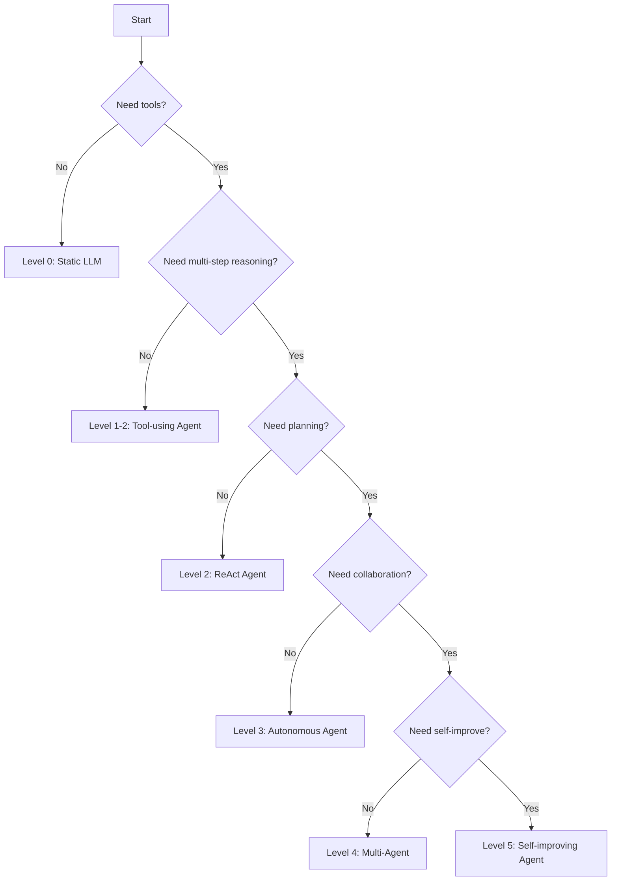

### 7.3 Concrete Examples

| Scenario | Level | Components Active |
|----------|:-----:|-------------------|
| "Tìm giá iPhone 15" | L2 | ReAct + SearchWeb tool |
| "So sánh giá iPhone 15 trên 3 trang, tính trung bình" | L3 | HierarchicalPlanner: [SearchA]→[SearchB]→[SearchC]→[CalcAvg] |
| "Viết API endpoint, viết test, review code" | L4 | AgentTeam: Coder → Reviewer → Coder (fix) |
| "Debug lỗi này, nhớ cách fix để lần sau dùng lại" | L5 | LearningEngine + EpisodicStore + SkillBank |
| "Theo dõi giá Bitcoin, báo tôi khi xuống dưới 50k" | L5 | ProactiveScheduler + ConditionTrigger |
| "Tôi cần tool tính IRR nhưng không có sẵn" | L5 | DynamicToolSynthesizer → Generate C# → Compile → Retry |

---

## 8. Appendix

### 8.1 Full DI Registration (Level 5)

```csharp
// Program.cs
builder.Services
    // P0: Reflection
    .AddSingleton<IReflectionEngine>(sp => new DefaultReflectionEngine(
        sp.GetRequiredService<LlamaCppApiClient>(),
        new ReflectionEngineOptions(),
        sp.GetRequiredService<ILoggerFactory>()))
    
    // P1: Planning
    .AddSingleton<ITaskPlanner, HierarchicalTaskPlanner>()
    
    // P2: Learning
    .AddSingleton<IEpisodicStore>(sp => new HybridEpisodicStore(
        sp.GetRequiredService<IEmbeddingService>(),
        sp.GetRequiredService<ILoggerFactory>(),
        "Data Source=agent.db;Mode=ReadWriteCreate;Cache=Shared"))
    .AddSingleton<ISkillBank, InMemorySkillBank>()
    .AddSingleton<ILearningEngine>(sp => new LearningEngine(
        sp.GetRequiredService<LlamaCppApiClient>(),
        sp.GetRequiredService<IEpisodicStore>(),
        sp.GetRequiredService<IEmbeddingService>(),
        sp.GetRequiredService<ISkillBank>(),
        sp.GetRequiredService<ILoggerFactory>()))
    
    // P2: Proactive
    .AddSingleton<IAgentScheduler, InMemoryAgentScheduler>()
    
    // P3: Tool Synthesis
    .AddSingleton<IDynamicToolRegistry>(sp => new DynamicToolRegistry(
        sp.GetRequiredService<ILoggerFactory>(),
        "Data Source=agent.db;Mode=ReadWriteCreate;Cache=Shared"))
    .AddSingleton<IToolCodeGenerator>(sp => new ToolCodeGenerator(
        sp.GetRequiredService<LlamaCppApiClient>(),
        sp.GetRequiredService<ILoggerFactory>()))
    .AddSingleton<IToolValidator, ToolValidator>()
    .AddSingleton<IToolSynthesizer>(sp => new DynamicToolSynthesizer(
        sp.GetRequiredService<IToolCodeGenerator>(),
        sp.GetRequiredService<IToolValidator>(),
        sp.GetRequiredService<IDynamicToolRegistry>(),
        sp.GetRequiredService<ILoggerFactory>()))
    
    // Orchestrator Chain (inner → outer)
    .AddSingleton<IStreamingAgentOrchestrator>(sp =>
    {
        var client = sp.GetRequiredService<LlamaCppApiClient>();
        var reflection = sp.GetRequiredService<IReflectionEngine>();
        var planner = sp.GetRequiredService<ITaskPlanner>();
        var learning = sp.GetRequiredService<ILearningEngine>();
        var episodic = sp.GetRequiredService<IEpisodicStore>();
        var embedder = sp.GetRequiredService<IEmbeddingService>();
        var scheduler = sp.GetRequiredService<IAgentScheduler>();
        var synthesizer = sp.GetRequiredService<IToolSynthesizer>();
        var toolRegistry = sp.GetRequiredService<IDynamicToolRegistry>();
        var loggerFactory = sp.GetRequiredService<ILoggerFactory>();

        // Innermost
        var baseOrc = new ReflectiveReActStreamingOrchestrator(
            client, reflection, options: null);

        // P2: Learning
        var learningOrc = new LearningReflectiveOrchestrator(
            baseOrc, learning, episodic, embedder, loggerFactory);

        // P1: Hierarchical
        var hierarchicalOrc = new HierarchicalReflectiveOrchestrator(
            planner, learningOrc,
            planReflection: reflection,
            toolSynthesizer: synthesizer,
            dynamicToolRegistry: toolRegistry,
            options: new HierarchicalOptions { MaxSynthesisPerPlan = 2 },
            loggerFactory: loggerFactory);

        // P2: Proactive (outermost)
        return new ProactiveAgentOrchestrator(
            hierarchicalOrc, scheduler, reflection,
            new ProactiveOptions(), loggerFactory);
    });
```

### 8.2 Database Schema Summary

| Table | Purpose | Module |
|-------|---------|--------|
| `Episodes` | Lưu trajectory (query, tools, reflection, outcome) | P2 Learning |
| `SynthesizedTools` | Lưu tool tự sinh (source code, schema, status) | P3 Tool Synthesis |
| `ModuleSettings` | Settings app | Existing |
| `EncryptedSettings` | Settings mã hóa | Existing |

### 8.3 Event Flow Summary

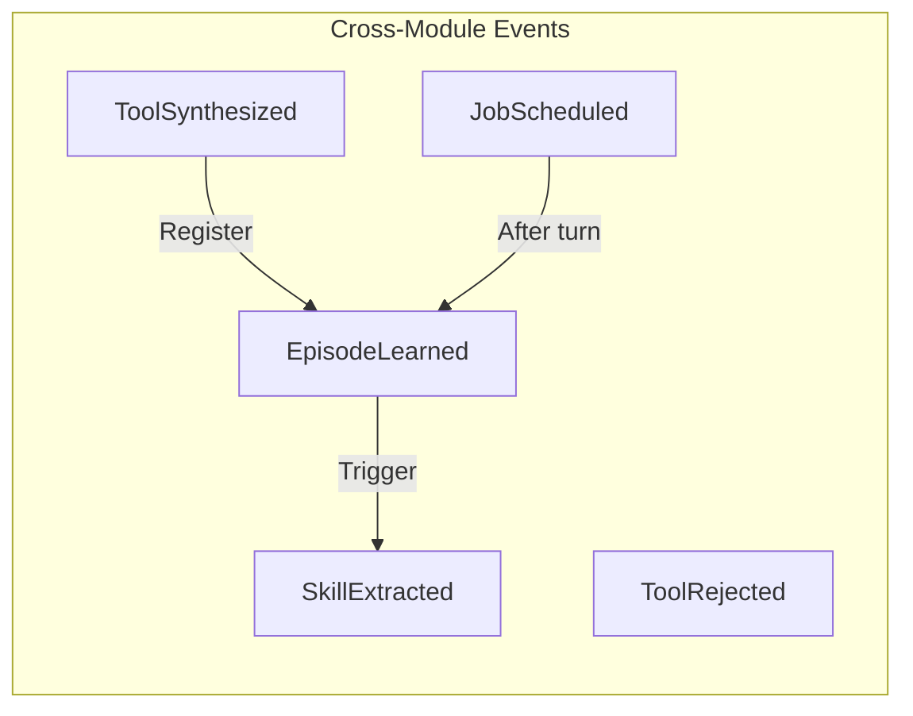

---

**End of Document**
