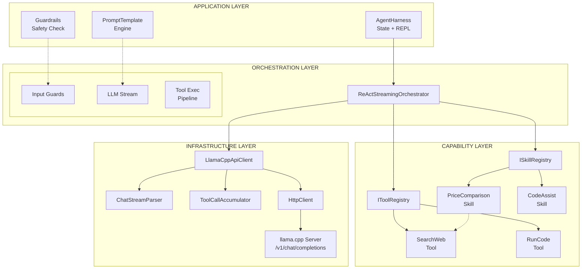
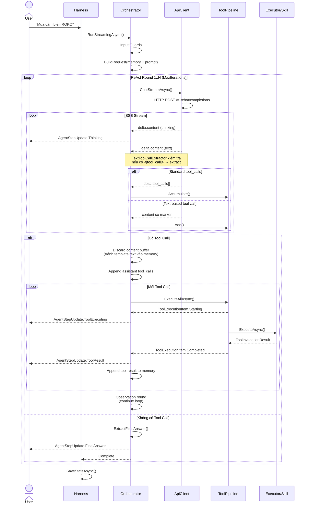
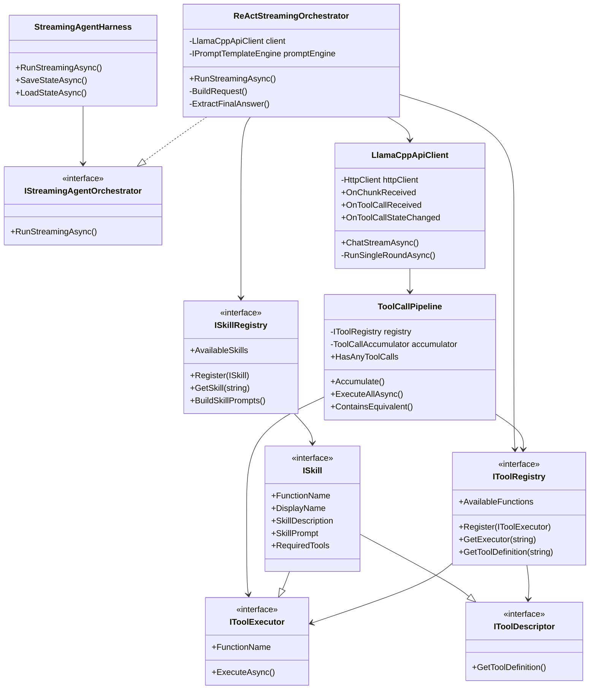
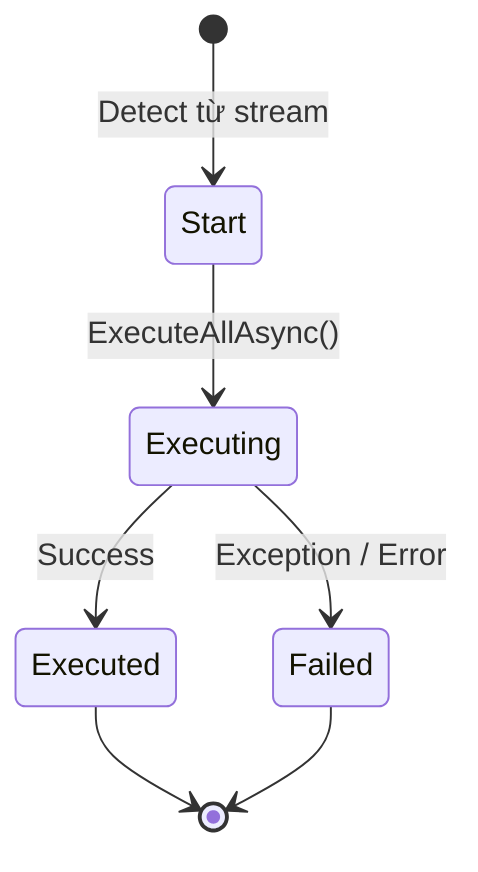
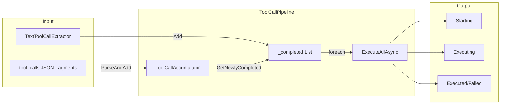
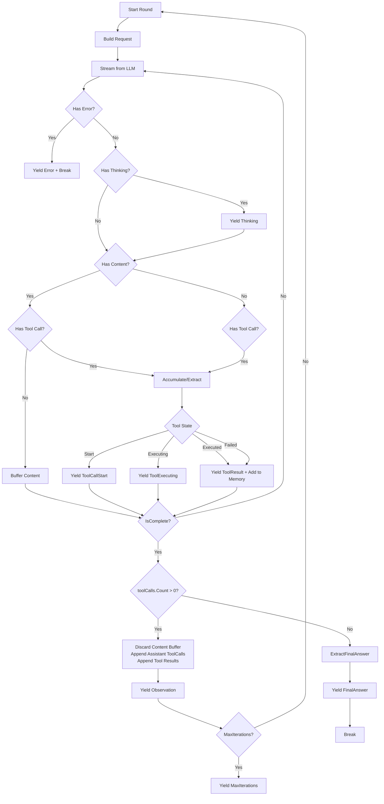
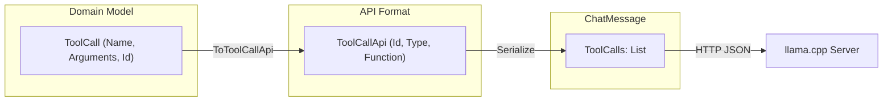
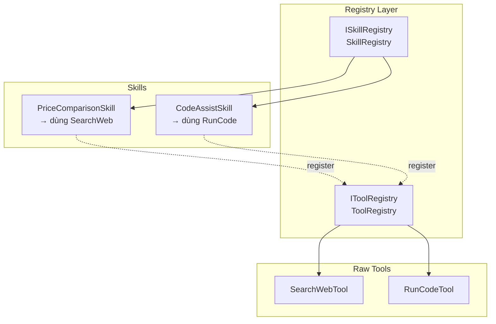

# TÀI LIỆU KIẾN TRÚC & TRIỂN KHAI
## VnMLStudio LLM Agent Framework

> Version: 1.0  
> Last updated: 2026-08-05  
> Author: VnMLStudio Team

---

## Mục lục

1. [High Level Design (HLD)](#1-high-level-design-hld)
2. [Detail Design (DD)](#2-detail-design-dd)
3. [Quick Guideline: Implement Agent Skills](#3-quick-guideline-implement-agent-skills)
4. [Quick Guideline: Run Agent Harness](#4-quick-guideline-run-agent-harness)
5. [Checklist Triển Khai](#5-checklist-triển-khai)
6. [Example PriceHunter Agent](#6-example-pricehunter-agent)

---

## 1. High Level Design (HLD)

### 1.1 Tổng quan kiến trúc

Hệ thống được thiết kế theo mô hình **Layered Plugin Architecture**, tách biệt rõ ràng giữa:
- **Infrastructure Layer**: Giao tiếp với LLM server (llama.cpp / Ollama / OpenAI-compatible)
- **Orchestration Layer**: Điều phối vòng lặp ReAct, quản lý memory và state
- **Capability Layer**: Tools và Skills (business logic chuyên biệt)
- **Application Layer**: Harness, Guardrails, Prompt Template Engine



### 1.2 Luồng xử lý chính (ReAct + Tool Calling)



### 1.3 Các nguyên tắc thiết kế then chốt

| Nguyên tắc | Áp dụng |
|-----------|---------|
| **Single Responsibility** | `LlamaCppApiClient` chỉ gọi HTTP. `Orchestrator` chỉ điều phối. `Skill` chỉ xử lý 1 nhiệm vụ. |
| **Open/Closed** | Thêm skill/tool mới không sửa `Orchestrator` hay `Harness`. |
| **Dependency Inversion** | `IStreamingAgentOrchestrator`, `IToolRegistry`, `ISkillRegistry`, `IConversationMemory`. |
| **Fail Fast** | `EnsureSuccessStatusCode`, `CancellationToken` linked với timeout mỗi step. |

---

## 2. Detail Design (DD)

### 2.1 Component Interaction



### 2.2 Chi tiết Module

#### 2.2.1 LlamaCppApiClient

| Aspect | Detail |
|--------|--------|
| **Nhiệm vụ** | Giao tiếp HTTP với llama.cpp server qua OpenAI-compatible API |
| **Streaming** | `IAsyncEnumerable<ChatStreamItem>` với `ResponseHeadersRead` |
| **Tool Detection** | 2 kênh: (1) Standard `delta.tool_calls`, (2) Text-based `<|tool_call|>` |
| **Deduplication** | `ToolCallPipeline.ContainsEquivalent()` + flag `hasStandardToolCalls`/`hasTextToolCalls` |
| **Event Model** | `OnChunkReceived`, `OnToolCallReceived`, `OnToolCallStateChanged`, `OnStreamComplete` |
| **ID Consistency** | `ToolCall.Id` gán 1 lần từ `ToolCallBuilder`, xuyên suốt Start→Executing→Executed |

**Lưu ý quan trọng**: `ChatStreamItem.ToolCallState` phân biệt rõ:
- `Start`: Vừa detect từ stream
- `Executing`: Pipeline bắt đầu chạy `executor.ExecuteAsync`
- `Executed`/`Failed`: Kết quả trả về



#### 2.2.2 ToolCallPipeline



| Method | Mục đích |
|--------|----------|
| `Accumulate(string)` | Nhận fragment JSON từ `delta.tool_calls`, trả về `ToolCall` hoàn chỉnh |
| `ForceCompleteAll()` | Ép hoàn thành khi `finish_reason = tool` |
| `ExecuteAllAsync()` | Chạy tuần tự từng tool, yield `ToolExecutionItem` (Starting + Completed) |
| `Add()` | Thêm tool call từ text-based extraction vào `_completed` |

#### 2.2.3 ReActStreamingOrchestrator

Vòng lặp chính (`MaxIterations` mặc định 3-5):



**Guard quan trọng trong Orchestrator**:
- `if (toolCalls.Count == 0)` → Final Answer
- `if (toolCalls.Count > 0)` → Append `ChatRequestBuilder.CreateAssistantToolCallMessage()`, KHÔNG yield content buffer
- Content buffer bị discard ở tool round để tránh "Thought: I need to search..." lọt vào memory

#### 2.2.4 ChatRequestBuilder & Message Format

**OpenAI API Format (bắt buộc đúng để llama.cpp không 500)**:

```json
// Assistant message có tool_calls
{
  "role": "assistant",
  "content": null,
  "tool_calls": [
    {
      "id": "call_xxx",
      "type": "function",
      "function": {
        "name": "SearchWeb",
        "arguments": "{\"query\":\"giá ROKO\"}"
      }
    }
  ]
}

// Tool result message
{
  "role": "tool",
  "tool_call_id": "call_xxx",
  "name": "SearchWeb",
  "content": "Kết quả tìm kiếm..."
}
```

**Mapping**:
- `ToolCall` (domain model: `Name`, `Arguments`, `Id`) → `ToolCallApi` (API format: `Id`, `Type`, `Function.Name/Arguments`)
- `ChatMessage.ToolCalls` là `List<ToolCallApi>` để serialize đúng schema
- `ChatRequestBuilder.Clone()` phải là **deep clone** (JSON serialize/deserialize) để tránh mutate request gốc giữa các round



#### 2.2.5 SkillRegistry vs ToolRegistry

| | ToolRegistry | SkillRegistry |
|---|---|---|
| **Implement** | `IToolRegistry` | `ISkillRegistry` |
| **Quản lý** | `IToolExecutor` + `ToolDefinition` | `ISkill` (kế thừa cả 2) |
| **Mục đích** | Raw tool (SearchWeb, RunCode) | Business capability (PriceComparison) |
| **Đăng ký** | `Register(new SearchWebTool())` | `Register(new PriceComparisonSkill())` |
| **Tự động** | SkillRegistry tự động `Register(skill)` vào ToolRegistry | — |



### 2.3 State Persistence

```json
{
  "agentName": "PriceHunter",
  "sessionId": "...",
  "messages": [
    {"role":"user","content":"..."},
    {"role":"assistant","content":null,"tool_calls":[{"id":"...","function":{"name":"SearchWeb"}}]},
    {"role":"tool","tool_call_id":"...","content":"..."}
  ],
  "steps": [...]
}
```

**Lưu ý**: `messages` array phải tuân thứ tự OpenAI:
1. `system`
2. `user`
3. `assistant` (có `tool_calls` nếu gọi tool)
4. `tool` (mỗi tool_call_id tương ứng 1 message)

---

## 3. Quick Guideline: Implement Agent Skills

### 3.1 Bước 1: Tạo Skill class

```csharp
using System.Text.Json.Nodes;
using VnMLStudio.Plugin.LlamaCppSharp.Agent.Skills;
using VnMLStudio.Plugin.LlamaCppSharp.Application;
using VnMLStudio.Plugin.LlamaCppSharp.Domain;

public class MySkill : ISkill
{
    public string FunctionName => "MySkill";
    public string DisplayName => "Tên hiển thị";
    public string SkillDescription => "Dùng khi nào...";

    public string SkillPrompt => @"
## SKILL: MySkill
Khi user hỏi về X, gọi skill này. KHÔNG tự trả lời.
";

    public IReadOnlyCollection<string> RequiredTools => new[] { "SearchWeb" };

    public ToolDefinition GetToolDefinition() => new()
    {
        Type = "function",
        Function = new()
        {
            Name = FunctionName,
            Description = "Mô tả cho LLM biết khi nào dùng",
            Parameters = new JsonObject
            {
                ["type"] = "object",
                ["properties"] = new JsonObject
                {
                    ["param1"] = new JsonObject { ["type"] = "string" }
                },
                ["required"] = new JsonArray("param1")
            }
        }
    };

    public async Task<ToolInvocationResult> ExecuteAsync(ToolCall toolCall, CancellationToken ct)
    {
        // Parse args defensive
        var args = ParseArgs(toolCall.Arguments);

        // Chạy logic nội bộ (có thể gọi sub-tools)
        var result = await DoWorkAsync(args, ct);

        return new ToolInvocationResult
        {
            ToolCallId = toolCall.Id ?? Guid.NewGuid().ToString(),
            FunctionName = FunctionName,
            Result = result,
            IsError = false
        };
    }
}
```

### 3.2 Bước 2: Đăng ký

```csharp
var toolRegistry = new ToolRegistry();
var skillRegistry = new SkillRegistry(toolRegistry);

// Register raw tools trước (nếu skill dùng)
toolRegistry.Register(new SearchWebTool(provider));

// Register skill (tự động inject vào ToolRegistry)
skillRegistry.Register(new MySkill());
```

### 3.3 Bước 3: Cấu hình AgentDefinition

```csharp
var definition = new AgentDefinition
{
    Name = "MyAgent",
    SystemPromptTemplate = "You are {{role}}.",
    PromptVariables = new() { ["role"] = "assistant" },
    AllowedTools = new() { "MySkill", "SearchWeb" }, // Liệt kê skill như tool
    MaxIterations = 3
};
```

### 3.4 Bước 4: Prompt Engineering cho Skill

**Nguyên tắc vàng**:
1. **SkillPrompt phải ngắn**: LLM chỉ cần biết "khi nào gọi", không cần biết "làm như thế nào"
2. **Cấm ReAct trong skill prompt**: `KHÔNG viết "Tôi sẽ tìm"`, chỉ gọi tool/skill
3. **Description rõ ràng**: LLM dùng `Description` để quyết định có gọi skill không

**Template SkillPrompt**:
```csharp
public string SkillPrompt => $@"
## SKILL: {DisplayName}
{SkillDescription}
- Input: [mô tả parameters]
- Output: [mô tả kết quả trả về]
- Rule: KHÔNG tự trả lời nếu chưa có kết quả từ skill.
";
```

---

## 4. Quick Guideline: Run Agent Harness

### 4.1 Bước 1: Khởi tạo Dependencies

```csharp
// Logger
var loggerFactory = LoggerFactory.Create(b => b.AddSerilog(Log.Logger));

// Search provider
var searchProvider = new DuckDuckGoSearchProvider(loggerFactory: loggerFactory);

// Registry
var toolRegistry = new ToolRegistry();
var skillRegistry = new SkillRegistry(toolRegistry);

toolRegistry.Register(new SearchWebTool(searchProvider));
skillRegistry.Register(new PriceComparisonSkill(searchProvider));

// LLM Client
var client = new LlamaCppApiClient(new LlamaClientOptions
{
    BaseAddress = "http://localhost:11434",
    LlamaExecutablePath = @"E:\llama.exe",
    ModelPath = @"E:\models\gemma-4-E2B-it-Q8_0.gguf"
});
```

### 4.2 Bước 2: Cấu hình AgentDefinition

```csharp
var definition = new AgentDefinition
{
    Name = "PriceHunter",
    SystemPromptTemplate = @"
You are {{role}}.
## RULES
1. Use PriceComparison skill when user asks about product prices.
2. Answer in Vietnamese with markdown table.
",
    PromptVariables = new() { ["role"] = "expert price comparison agent" },
    MaxIterations = 3,
    MaxContextMessages = 30,
    AllowedTools = new() { "PriceComparison" },
    StepTimeout = TimeSpan.FromSeconds(60),
    ToolTimeout = TimeSpan.FromSeconds(30)
};
```

### 4.3 Bước 3: Chạy Streaming

```csharp
var harness = new StreamingAgentHarness(definition, new LlamaClientOptions
{
    BaseAddress = "http://localhost:11434",
    // ...
}, toolRegistry);

await foreach (var update in harness.RunStreamingAsync("Mua cảm biến ROKO 10 cái"))
{
    switch (update.Type)
    {
        case AgentUpdateType.Thinking:
            Console.Write(update.Text); // DarkGray
            break;
        case AgentUpdateType.ToolCallStart:
            Console.WriteLine($"\n🔧 [{update.ToolCall?.Name}]");
            break;
        case AgentUpdateType.ToolExecuting:
            Console.WriteLine("   → Executing...");
            break;
        case AgentUpdateType.ToolResult:
            Console.WriteLine($"   → {update.ToolResult?.Result}");
            break;
        case AgentUpdateType.FinalAnswer:
            Console.WriteLine($"\n🏆 {update.Text}");
            break;
    }
}
```

### 4.4 Bước 4: State Persistence (Auto-save)

```csharp
var statePath = "session.json";

// Load nếu có
if (File.Exists(statePath))
    await harness.LoadStateAsync(statePath);

// Chạy xong auto-save
await harness.SaveStateAsync(statePath);
```

### 4.5 Bước 5: REPL Interactive Mode

```csharp
while (true)
{
    Console.Write("You: ");
    var input = Console.ReadLine();
    if (input is "/exit") break;
    if (input is "/clear") { /* clear memory */ continue; }

    await foreach (var u in harness.RunStreamingAsync(input))
    {
        // Handle updates...
    }

    // Auto-save sau mỗi turn
    await harness.SaveStateAsync(statePath);
}
```

---

## 5. Checklist Triển Khai

| # | Item | Status |
|---|------|--------|
| 1 | `ToolCallApi` format đúng OpenAI schema (`id`, `type`, `function`) | ☐ |
| 2 | `ChatMessage.ToolCalls` dùng `List{ToolCallApi}` | ☐ |
| 3 | `ChatRequestBuilder.Clone()` deep clone bằng JSON | ☐ |
| 4 | `TextToolCallExtractor` xử lý được token quote lạ và unquoted keys | ☐ |
| 5 | Orchestrator discard content buffer khi có tool call | ☐ |
| 6 | `ExtractFinalAnswer` strip thinking prefix | ☐ |
| 7 | Skill `ExecuteAsync` defensive parse args (case-insensitive + regex fallback) | ☐ |
| 8 | Tool result append vào memory trước khi next round | ☐ |
| 9 | State save/load giữ `messages` đúng thứ tự | ☐ |
| 10 | `MaxIterations` giới hạn để tránh infinite loop | ☐ |

---

## 6. Example: PriceHunter Agent


---
## Phụ lục: File Structure

```
VnMLStudio.Plugin.LlamaCppSharp/
├── Agent/
│   ├── Skills/
│   │   ├── ISkill.cs
│   │   ├── ISkillRegistry.cs
│   │   ├── SkillRegistry.cs
│   │   └── Impl/
│   │       └── PriceComparisonSkill.cs
│   ├── Tools/
│   │   ├── ISearchProvider.cs
│   │   ├── SearchWebTool.cs
│   │   └── DuckDuckGoSearchProvider.cs
│   ├── ReActStreamingOrchestrator.cs
│   └── StreamingAgentHarness.cs
├── Application/
│   ├── IToolExecutor.cs
│   ├── IToolRegistry.cs
│   ├── IToolDescriptor.cs
│   └── ToolRegistry.cs
├── Domain/
│   ├── ChatMessage.cs
│   ├── ToolCall.cs
│   ├── ToolCallApi.cs
│   └── ToolDefinition.cs
├── ChatRequestBuilder.cs
├── TextToolCallExtractor.cs
└── LlamaCppApiClient.cs
```

# LlamaCppSharp Agent Harness — Technical Documentation

> **Version**: 1.0  
> **Namespace**: `VnMLStudio.Plugin.LlamaCppSharp`  
> **Target Framework**: .NET 8+
> **Author**: VnMLStudio Team

---

## 1. High-Level Design

### 1.1 Architecture Overview

```
┌─────────────────────────────────────────────────────────────────────────────┐
│                           APPLICATION LAYER                                 │
│  ┌──────────────┐  ┌──────────────┐  ┌──────────────┐  ┌─────────────────┐  │
│  │   Console    │  │    WPF/      │  │   ASP.NET    │  │  Microsoft.Ext. │  │
│  │     App      │  │   WinForms   │  │   Minimal    │  │   AI (M.E.AI)   │  │
│  └──────┬───────┘  └──────┬───────┘  └──────┬───────┘  └────────┬────────┘  │
└─────────┼─────────────────┼─────────────────┼───────────────────┼───────────┘
          │                 │                 │                   │
          └─────────────────┴─────────────────┴───────────────────┘
                                    │
                    ┌───────────────▼───────────────┐
                    │      AGENT HARNESS (Facade)    │
                    │  StreamingAgentHarness /       │
                    │  AgentHarness                  │
                    └───────────────┬───────────────┘
                                    │
          ┌─────────────────────────┼─────────────────────────┐
          │                         │                         │
┌─────────▼──────────┐  ┌──────────▼──────────┐  ┌────────▼─────────┐
│  ReActOrchestrator │  │ ReActStreaming       │  │  IConversation   │
│  (Non-Streaming)   │  │ Orchestrator         │  │  Memory          │
└─────────┬──────────┘  └──────────┬──────────┘  └────────┬─────────┘
          │                        │                        │
          └────────────────────────┼────────────────────────┘
                                   │
                    ┌──────────────▼───────────────┐
                    │    LlamaCppApiClient         │
                    │  ┌─────────────────────────┐ │
                    │  │  ChatStreamAsync        │ │ ← SSE streaming + tool pipeline
                    │  │  ChatNonStreamAsync     │ │ ← JSON response + tool pipeline
                    │  │  EnsureServerRunningAsync│ │ ← Process lifecycle
                    │  └─────────────────────────┘ │
                    └──────────────┬───────────────┘
                                   │
          ┌────────────────────────┼────────────────────────┐
          │                        │                        │
┌─────────▼──────────┐  ┌────────▼────────┐  ┌───────────▼────────────┐
│   ChatStreamParser │  │  ToolCallPipeline│  │   LlamaServerManager    │
│   (SSE / JSON)     │  │  (Accumulate +   │  │   (Start / Kill /      │
│                    │  │   Execute)       │  │    Health Check)       │
└────────────────────┘  └─────────────────┘  └─────────────────────────┘
                                   │
                    ┌──────────────▼───────────────┐
                    │      IToolRegistry            │
                    │  ┌─────────────────────────┐│
                    │  │  SearchWebTool          ││
                    │  │  DuckDuckGoProvider     ││
                    │  │  BingSearchProvider     ││
                    │  │  [Your Custom Tools]    ││
                    │  └─────────────────────────┘│
                    └──────────────────────────────┘
                                   │
                    ┌──────────────▼───────────────┐
                    │      ModelLoader              │
                    │  ┌─────────────────────────┐│
                    │  │  GgufMetadataReader     ││ ← Parse GGUF header
                    │  │  ModelRegistry          ││ ← Scan & cache models
                    │  │  ModelRunner            ││ ← Auto-start model
                    │  └─────────────────────────┘│
                    └──────────────────────────────┘
```

### 1.2 Component Responsibilities

| Layer | Component | Responsibility |
|-------|-----------|----------------|
| **Agent** | `StreamingAgentHarness` | Facade: persona, memory, guardrails, orchestration, state persistence |
| **Agent** | `ReActStreamingOrchestrator` | Think → Act → Observe loop with fine-grained streaming updates |
| **Agent** | `SlidingWindowMemory` | Context window management with compaction & summarization |
| **Agent** | `PatternGuardrail` / `AllowedToolsGuardrail` | Input/output/tool validation & safety |
| **Client** | `LlamaCppApiClient` | HTTP client, SSE streaming, non-streaming JSON, tool execution, process management |
| **Client** | `ChatStreamParser` | Parse Server-Sent Events (SSE) into `ChatChunkResponse` |
| **Client** | `ToolCallPipeline` | Accumulate tool call fragments → Execute → Yield results |
| **Client** | `TextToolCallExtractor` | Parse text-based tool calls (e.g. `<\|tool_call>call:Name{...}`) |
| **Tools** | `SearchWebTool` | Web search via DuckDuckGo (no API key) or Bing |
| **Model** | `GgufMetadataReader` | Read GGUF header: arch, params, quantization, context length |
| **Model** | `ModelRegistry` | Scan directory, cache metadata, lookup by name |
| **Integration** | `LlamaChatClient` | `IChatClient` adapter for Microsoft.Extensions.AI |

### 1.3 Data Flow — Streaming Agent Run

```
User Input
    │
    ▼
┌─────────────────┐
│  Input Guardrail │ ← BlockedInputPatterns check
└────────┬────────┘
         │
         ▼
┌─────────────────┐
│  Add to Memory   │
└────────┬────────┘
         │
         ▼
┌─────────────────────────────────────────┐
│  Build Request: System + Memory + Tools │
└────────┬────────────────────────────────┘
         │
         ▼
┌─────────────────────────────────────────┐
│  POST /v1/chat/completions (stream=true)│
└────────┬────────────────────────────────┘
         │
         ▼
┌─────────────────────────────────────────┐
│  SSE Stream Parsing                     │
│  ├── yield Thinking chunk               │
│  ├── yield Content chunk                │
│  ├── detect TextToolCall in content     │
│  │   └── yield ToolCall                  │
│  └── finish_reason = "stop"             │
└────────┬────────────────────────────────┘
         │
         ▼
┌─────────────────────────────────────────┐
│  Has ToolCall?                          │
│  ├── YES → Execute Tool(s)              │
│  │        ├── yield Executing           │
│  │        ├── yield ToolResult          │
│  │        └── Add result to Memory      │
│  │        → Next Round (max 10)         │
│  └── NO  → yield FinalAnswer           │
│            → Done                        │
└─────────────────────────────────────────┘
```

---

## 2. Detail Design

### 2.1 LlamaCppApiClient

#### 2.1.1 Construction

```csharp
// Option A: Options-based (recommended for DI)
var options = new LlamaClientOptions
{
    BaseAddress = "http://localhost:8080",
    LlamaExecutablePath = @"E:\llama.exe",
    ModelPath = @"E:\models\model.gguf",
    ToolRegistry = myRegistry,        // ← REQUIRED for tool support
    MaxToolRounds = 10,
    StreamLineTimeout = TimeSpan.FromSeconds(30),
    LoggerFactory = loggerFactory
};
var client = new LlamaCppApiClient(options);

// Option B: Factory
var factory = new LlamaClientFactory(options);
var client = factory.CreateClient();
var clientWithTools = factory.CreateWithTools(registry => {
    registry.Register(new SearchWebTool());
});
```

#### 2.1.2 Streaming Chat

```csharp
await foreach (var item in client.ChatStreamAsync(
    "/v1/chat/completions", 
    request, 
    TimeSpan.FromSeconds(30)))
{
    if (item.Content != null) Console.Write(item.Content);
    if (item.ThinkingContent != null) Console.Write($"[Think] {item.ThinkingContent}");
    if (item.ToolCall != null) Console.WriteLine($"[Tool] {item.ToolCall.Name}");
    if (item.ToolResult != null) Console.WriteLine($"[Result] {item.ToolResult.Result}");
    if (item.IsComplete) break;
}
```

**Internal Flow:**
1. `ChatStreamAsync` clones request, creates `ToolCallPipeline` from `_options.ToolRegistry`
2. `RunSingleRoundAsync` sends HTTP POST with `stream=true`
3. `ChatStreamParser` reads SSE lines, deserializes `ChatChunkResponse`
4. Content accumulated in `StringBuilder` for text-based tool detection
5. `TextToolCallExtractor` checks content for `<\|tool_call>call:Name{...}` patterns
6. If tool calls detected → yield `ChatStreamItem { ToolCall = ... }`, then `IsComplete = false`
7. `ChatStreamAsync` sees `toolPipeline.HasCompletedCalls == true` → enters Phase 2
8. Phase 2: `toolPipeline.ExecuteAllAsync()` runs each tool, yields `ToolExecutionItem`
9. Tool results appended to `currentRequest.Messages` as `ChatRole.Tool`
10. Loop back for next round (max `_options.MaxToolRounds`)

#### 2.1.3 Non-Streaming Chat

```csharp
var result = await client.ChatNonStreamAsync(
    "/v1/chat/completions", 
    request);
// result.FullContent, result.ToolCalls, result.ToolResults
```

**Use case:** `ReActOrchestrator` (non-streaming agent) uses this for reasoning clarity.

#### 2.1.4 Server Management

```csharp
await client.EnsureServerRunningAsync(
    modelPath: @"E:\models\model.gguf",
    port: 8080,
    maxWaitSeconds: 30);
```

- Checks `/health` endpoint
- If not alive → starts `llama-server` process with configured args
- Waits for health check with timeout
- Auto-kills existing process before starting new one

### 2.2 TextToolCallExtractor

**Problem:** Some models (e.g. Qwythos) output tool calls as plain text instead of OpenAI's `delta.tool_calls` JSON:

```
<|tool_call>call:SearchWeb{queries:[<|"|>weather in Tokyo<|"|>]}
```

**Solution:** Parse 4 formats:

| # | Format | Regex Pattern |
|---|--------|---------------|
| 1 | `<\|tool_call>call:Name\nkey:val` | `<\\|tool_call\\>call:(?<name>\w+)(?:\\n|\n)(?<args>[^<]*)` |
| 2 | `<tool_call>{"name":"Name",...}</tool_call>` | `<tool_call>(?<json>\\{.*?\\})</tool_call>` |
| 3 | `<tool_call>Name({"arg":"val"})</tool_call>` | `<tool_call>(?<name>\w+)\\((?<args>.*?)\\)</tool_call>` |
| 4 | `<\|tool_call>call:Name{queries:[<|"|>val<|"|>]}` | `<\\|tool_call\\>call:(?<name>\w+)(?<args>\\{.*?\\})` |

**Post-processing for Format 4:**
1. Replace `<|"|>` → `"` (escape sequences)
2. `QuoteUnquotedKeys()`: `queries:` → `"queries":` (make valid JSON)
3. Try `JsonDocument.Parse()`; if valid, use as-is

```csharp
// Example transformation:
// Input:  <|tool_call>call:SearchWeb{queries:[<|"|>weather in Tokyo<|"|>]}
// Step 1: <|tool_call>call:SearchWeb{queries:["weather in Tokyo"]}
// Step 2: {"queries":["weather in Tokyo"]}  ← QuoteUnquotedKeys
// Parsed: ToolCall { Name = "SearchWeb", Arguments = "{\"queries\":[\"weather in Tokyo\"]}" }
```

### 2.3 ToolCallPipeline

```csharp
public sealed class ToolCallPipeline
{
    // Accumulate fragments from SSE stream (standard OpenAI format)
    public IEnumerable<ToolCall> Accumulate(string? toolCallsString);

    // Force complete any pending partial tool calls
    public IEnumerable<ToolCall> ForceCompleteAll();

    // Add completed tool calls directly (text-based extraction)
    public void AddCompleted(ToolCall toolCall);
    public void AddRange(IEnumerable<ToolCall> toolCalls);

    // Execute all completed tools
    public async IAsyncEnumerable<ToolExecutionItem> ExecuteAllAsync(CancellationToken ct);

    // Reset for next round
    public void Reset();
}
```

**States per tool call:**
```
Start → Executing → Executed
                  → Failed
```

### 2.4 Agent Harness

#### 2.4.1 AgentDefinition (Configuration)

```csharp
var definition = new AgentDefinition
{
    Name = "ResearchAgent",
    SystemPromptTemplate = "You are {{role}}. Think step by step. Available tools: {{tools}}",
    PromptVariables = new() { ["role"] = "expert researcher" },

    // Behavior
    MaxIterations = 10,           // Max ReAct steps
    MaxToolRounds = 10,           // Max LLM↔Tool exchanges
    StepTimeout = TimeSpan.FromMinutes(2),
    ToolTimeout = TimeSpan.FromSeconds(30),
    EnableThinking = true,

    // Context
    MaxContextMessages = 50,      // Before compaction
    MaxTokens = 4096,
    Temperature = 0.7,

    // Safety
    AllowedTools = new() { "SearchWeb", "Calculator" },  // Whitelist
    BlockedInputPatterns = new() { "rm -rf", "DROP TABLE" }
};
```

#### 2.4.2 Streaming Execution

```csharp
var harness = new StreamingAgentHarness(definition, options, tools);

await foreach (var update in harness.RunStreamingAsync("What's the weather in Tokyo?"))
{
    switch (update.Type)
    {
        case AgentUpdateType.Thinking:
            Console.Write($"[Think] {update.Text}");
            break;
        case AgentUpdateType.Content:
            Console.Write(update.Text);
            break;
        case AgentUpdateType.ToolCallStart:
            Console.WriteLine($"\n[Tool: {update.ToolCall?.Name}]");
            break;
        case AgentUpdateType.ToolExecuting:
            Console.WriteLine("  → Executing...");
            break;
        case AgentUpdateType.ToolResult:
            Console.WriteLine($"  → {update.ToolResult?.Result}");
            break;
        case AgentUpdateType.Observation:
            Console.WriteLine($"[Observation] {update.Text}");
            break;
        case AgentUpdateType.FinalAnswer:
            Console.WriteLine($"\n=== ANSWER ===\n{update.Text}");
            break;
    }
}
```

**Update Types:**
| Type | When Emitted |
|------|-------------|
| `StepStarted` | New ReAct iteration begins |
| `Thinking` | Reasoning content chunk from LLM |
| `Content` | Regular text chunk from LLM |
| `ToolCallStart` | LLM emitted tool call |
| `ToolExecuting` | Tool executor invoked |
| `ToolResult` | Tool execution completed |
| `Observation` | Combined tool results for next round |
| `FinalAnswer` | LLM produced final response |
| `Error` | Guardrail blocked or exception |

#### 2.4.3 State Persistence

```csharp
// Save
await harness.SaveStateAsync("session.json");

// Load & Resume
var harness2 = new StreamingAgentHarness(definition, options, tools);
await harness2.LoadStateAsync("session.json");
await foreach (var update in harness2.RunStreamingAsync("Continue from where we left off"))
    ...
```

**State includes:** Messages, Steps, Metrics (tokens, latency, tool counts)

### 2.5 Memory Management

```csharp
public interface IConversationMemory
{
    IReadOnlyList<ChatMessage> Messages { get; }
    void Add(ChatMessage message);
    void Compact(IPromptTemplateEngine engine, AgentDefinition definition);
    Task<string> SummarizeAsync(ILlamaCppApiClient client, CancellationToken ct);
}
```

**`SlidingWindowMemory`:**
- Keeps last N messages (`MaxContextMessages`)
- When exceeded: oldest messages summarized into a system message
- Summarization uses a separate LLM call with low temperature

### 2.6 Guardrails

```csharp
public interface IGuardrail
{
    string Name { get; }
    GuardrailResult CheckInput(string input);
    GuardrailResult CheckOutput(string output);
    GuardrailResult CheckToolCall(string toolName, string arguments);
}
```

**Built-in:**
- `PatternGuardrail`: Block input/output matching regex patterns
- `AllowedToolsGuardrail`: Reject tool calls not in whitelist

**Severity Levels:** `None` → `Low` → `Medium` → `High` → `Critical`

### 2.7 ModelLoader

```csharp
// Scan directory
var registry = await ModelRegistry.CreateRegistryAsync(@"E:\models");

// Query
var model = registry.GetByName("Qwythos");
Console.WriteLine(model.Description);  // "llama 9B Q4_K_M"

// Auto-start
var runner = client.CreateRunner(registry);
await runner.ChatAsync("Qwythos", request);
```

**GGUF Metadata Extracted:**
| Field | Source |
|-------|--------|
| `Architecture` | `general.architecture` |
| `Name` | `general.name` |
| `ContextLength` | `llama.context_length` |
| `EmbeddingLength` | `llama.embedding_length` |
| `BlockCount` | `llama.block_count` |
| `ParameterCount` | Estimated from `emb_len² × block_count` |
| `Quantization` | `general.file_type` or parsed from filename |

### 2.8 Microsoft.Extensions.AI Integration

```csharp
// Register in DI
services.AddLlamaChatClientWithNativeTools(
    opts => {
        opts.BaseAddress = "http://localhost:8080";
    },
    tools => {
        tools.RegisterAIFunction(AIFunctionFactory.Create(GetWeather));
    });

// Use IChatClient
IChatClient client = sp.GetRequiredService<IChatClient>();
var response = await client.GetResponseAsync("Hello!");
```

**Tool Modes:**
| Mode | Description |
|------|-------------|
| `Native` | Plugin's built-in multi-round tool pipeline |
| `Delegated` | M.E.AI's `FunctionInvokingChatClient` handles tool invocation |

---

## 3. Quick Guideline

### 3.1 Minimal Setup (Console App)

```csharp
using VnMLStudio.Plugin.LlamaCppSharp;
using VnMLStudio.Plugin.LlamaCppSharp.Agent;
using VnMLStudio.Plugin.LlamaCppSharp.Agent.Tools;

// 1. Create tools
var tools = new ToolRegistry();
tools.RegisterDuckDuckGoSearch();

// 2. Create client with tools
var options = new LlamaClientOptions
{
    BaseAddress = "http://localhost:8080",
    LlamaExecutablePath = @"E:\llama.exe",
    ToolRegistry = tools  // ← IMPORTANT
};

// 3. Create agent
var definition = new AgentDefinition
{
    Name = "Assistant",
    SystemPromptTemplate = "You are a helpful assistant."
};

var harness = new StreamingAgentHarness(definition, options, tools);

// 4. Run
await foreach (var update in harness.RunStreamingAsync("What's the weather in Tokyo?"))
{
    if (update.Type == AgentUpdateType.FinalAnswer)
        Console.WriteLine(update.Text);
}
```

### 3.2 With Model Auto-Start

```csharp
// Scan models
var registry = await ModelRegistry.CreateRegistryAsync(@"E:\models");

// Find model
var model = registry.GetByName("Qwythos")!;

// Create harness with model path auto-configured
var options = new LlamaClientOptions
{
    LlamaExecutablePath = @"E:\llama.exe",
    ToolRegistry = tools
};

var harness = new StreamingAgentHarness(definition, options, tools);

// Ensure server running with specific model
await harness.Client.EnsureServerRunningAsync(model.FilePath, port: 8080);
```

### 3.3 Custom Tool

```csharp
public sealed class CalculatorTool : IToolExecutor
{
    public string FunctionName => "Calculator";

    public async Task<ToolInvocationResult> ExecuteAsync(ToolCall toolCall, CancellationToken ct)
    {
        var args = JsonSerializer.Deserialize<JsonElement>(toolCall.Arguments);
        var expr = args.GetProperty("expression").GetString();

        // ... evaluate expression ...
        var result = Evaluate(expr);

        return new ToolInvocationResult
        {
            ToolCallId = Guid.NewGuid().ToString(),
            FunctionName = FunctionName,
            IsError = false,
            Result = result.ToString()
        };
    }
}

// Register
tools.Register(new CalculatorTool());
```

### 3.4 DI Setup (ASP.NET)

```csharp
builder.Services.AddSingleton<IToolRegistry>(sp =>
{
    var registry = new ToolRegistry();
    registry.RegisterDuckDuckGoSearch();
    return registry;
});

builder.Services.AddSingleton(sp =>
{
    var tools = sp.GetRequiredService<IToolRegistry>();
    return new LlamaCppApiClient(new LlamaClientOptions
    {
        BaseAddress = "http://localhost:8080",
        ToolRegistry = tools
    });
});

builder.Services.AddSingleton<IAgentHarness>(sp =>
{
    var client = sp.GetRequiredService<LlamaCppApiClient>();
    var tools = sp.GetRequiredService<IToolRegistry>();
    return new StreamingAgentHarness(
        new AgentDefinition { Name = "APIAgent" },
        client,
        tools);
});
```

---

## 4. Configuration Reference

### 4.1 LlamaClientOptions

| Property | Default | Description |
|----------|---------|-------------|
| `BaseAddress` | `"http://localhost:11434"` | llama-server HTTP endpoint |
| `LlamaExecutablePath` | `""` | Path to `llama.exe` (empty = no auto-start) |
| `ModelPath` | `""` | Default model GGUF path |
| `ToolRegistry` | `null` | **Required** for tool support |
| `MaxToolRounds` | `10` | Max LLM↔Tool exchanges per request |
| `StreamLineTimeout` | `30s` | Timeout per SSE line read |
| `ServerStartupTimeoutSeconds` | `30` | Max wait for llama-server |

### 4.2 AgentDefinition

| Property | Default | Description |
|----------|---------|-------------|
| `Name` | `"DefaultAgent"` | Agent identifier |
| `SystemPromptTemplate` | `"You are a helpful AI..."` | System prompt with `{{var}}` substitution |
| `MaxIterations` | `10` | Max ReAct reasoning steps |
| `MaxToolRounds` | `10` | Max tool execution rounds |
| `MaxContextMessages` | `50` | Before memory compaction |
| `AllowedTools` | `[]` | Empty = all tools allowed |
| `BlockedInputPatterns` | `[]` | Regex patterns to block |

### 4.3 Environment Variables

```bash
# Optional: override paths without recompiling
LLAMA_BASE_ADDRESS=http://localhost:8080
LLAMA_EXECUTABLE_PATH=E:\llama.exe
LLAMA_MODELS_PATH=E:\models
```

---

## 5. Troubleshooting

### 5.1 Tool Not Executing

| Symptom | Cause | Fix |
|---------|-------|-----|
| `ToolPipeline is NULL` warning | `ToolRegistry` not set in `LlamaClientOptions` | Pass registry via `LlamaClientOptions` or use `StreamingAgentHarness(def, options, tools)` overload |
| `No executor found for tool: X` | Tool not registered in `IToolRegistry` | `registry.Register(new XTool())` |
| Text tool detected but not executed | `TextToolCallExtractor` parse OK but not added to pipeline | Check `toolPipeline.AddRange()` is called (v3+) |
| `finish_reason = "stop"` but content has `<\|tool_call>` | Model uses text-based tool format | `TextToolCallExtractor` handles this automatically |

### 5.2 Common Errors

```
InvalidOperationException: IToolRegistry was provided to the harness but the 
LlamaCppApiClient was created without a ToolRegistry in LlamaClientOptions.
```
→ Use `new StreamingAgentHarness(def, options, tools)` instead of passing pre-created client.

```
TimeoutException: Server startup timed out after 30s
```
→ Check `llama.exe` path, model path, and GPU/CUDA availability.

```
JSON parse error. Raw: {...}
```
→ LLM emitted invalid JSON. Check `TextToolCallExtractor` regex matches your model's format.

### 5.3 Debug Logging

Enable `Debug` level logging to see internal flow:

```csharp
var loggerFactory = LoggerFactory.Create(b => b.AddConsole().SetMinimumLevel(LogLevel.Debug));
var options = new LlamaClientOptions { LoggerFactory = loggerFactory };
```

Key log messages to watch:
- `=== Tool Round X ===` — New round started
- `Detected N text-based tool call(s)` — TextToolCallExtractor fired
- `ExecuteAllAsync starting with N completed tool call(s)` — Phase 2 entered
- `Found executor for X, executing...` — Tool running
- `TOOL CALL EXECUTED: X in Yms` — Tool completed

---

## 6. File Structure

```
VnMLStudio.Plugin.LlamaCppSharp/
├── LlamaCppApiClient_Refactored_v3.cs    # Core client + parser + pipeline
├── AgentHarness.cs                        # Non-streaming agent + orchestrator
├── AgentStreamingOrchestrator.cs          # Streaming agent + updates
├── SearchWebTool.cs                       # Web search tool + providers
├── ModelLoader.cs                         # GGUF reader + registry + runner
└── LlamaChatClient_MicrosoftAI_Extensions.cs  # M.E.AI integration
```

---

## 7. Extension Points

| Extension | How To |
|-----------|--------|
| **Custom Tool** | Implement `IToolExecutor`, register in `IToolRegistry` |
| **Custom Memory** | Implement `IConversationMemory` (e.g. vector DB, Redis) |
| **Custom Orchestrator** | Implement `IAgentOrchestrator` or `IStreamingAgentOrchestrator` |
| **Custom Guardrail** | Implement `IGuardrail`, pass to harness constructor |
| **Custom Search Provider** | Implement `ISearchProvider`, pass to `SearchWebTool` |
| **Custom Prompt Engine** | Implement `IPromptTemplateEngine` (e.g. Handlebars, Liquid) |

---

## 8. Performance Notes

- **Streaming**: First token latency depends on model size & quantization. Use `Q4_K_M` for balance.
- **Tool Timeout**: Default 30s. Network tools (SearchWeb) may need longer.
- **Memory Compaction**: Happens every `MaxContextMessages`. Set based on model's context length.
- **GGUF Parsing**: `ModelRegistry.RefreshAsync()` reads only file headers (~1KB each), fast even for 100+ models.

---
