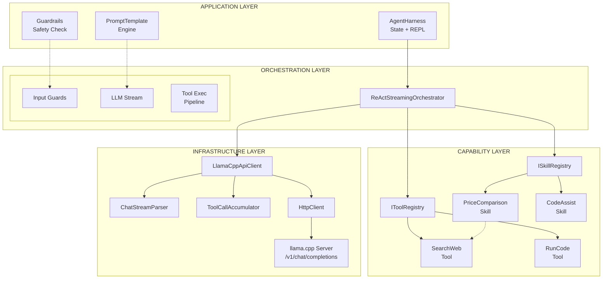
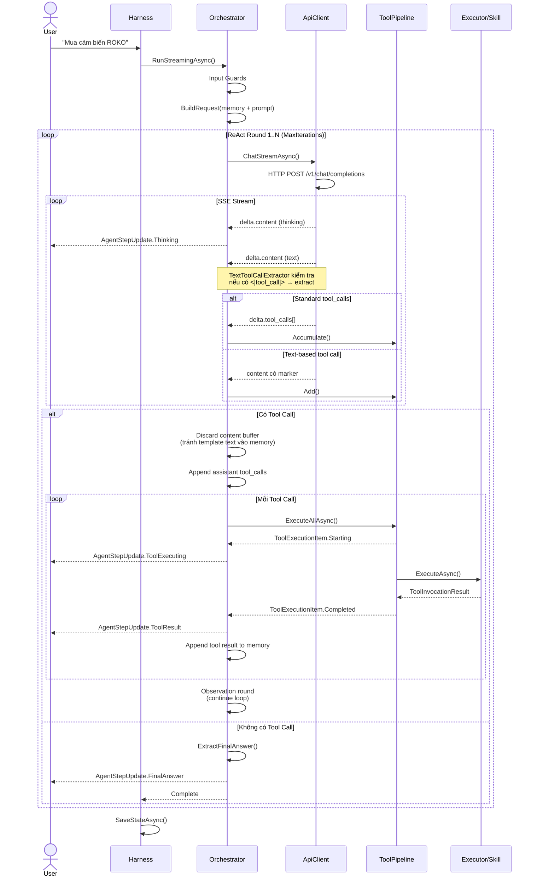
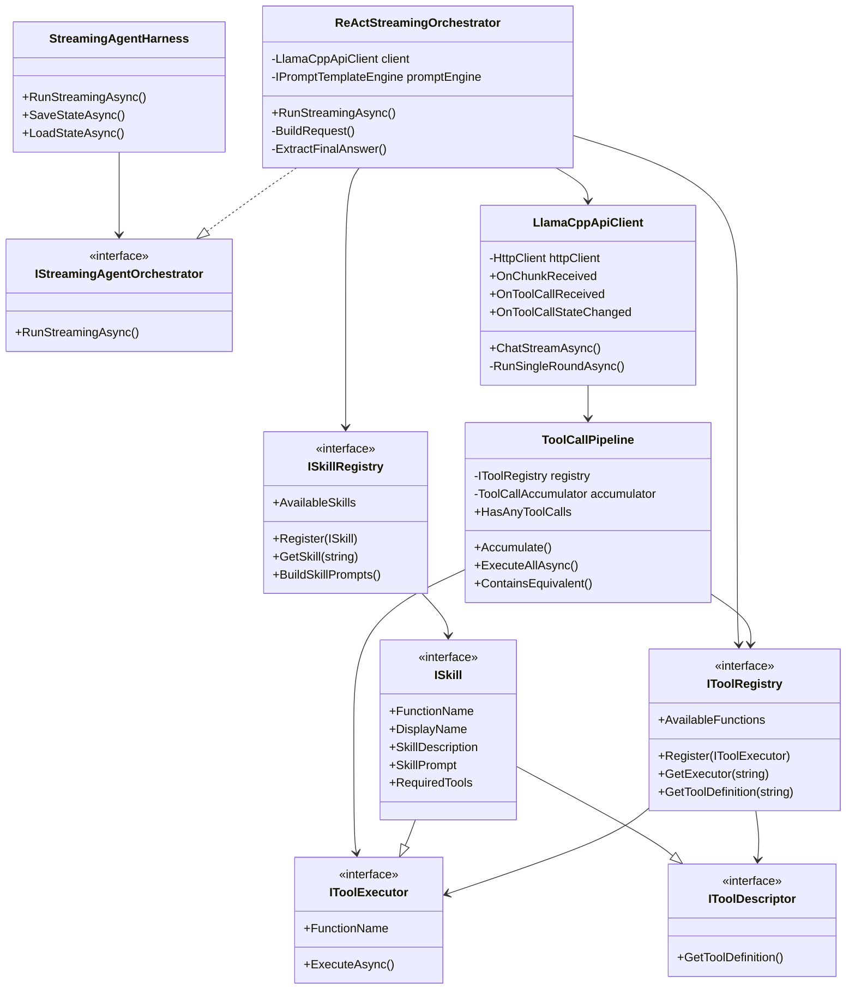
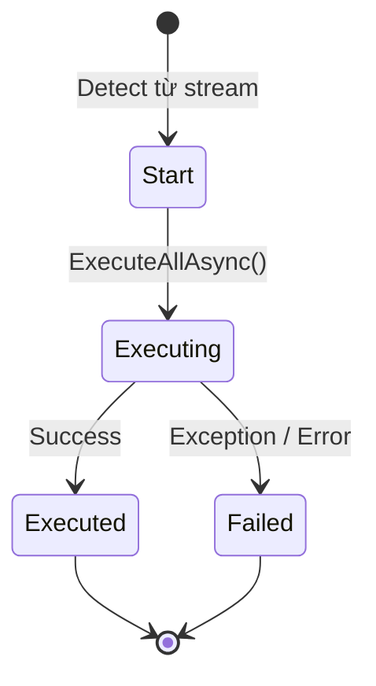
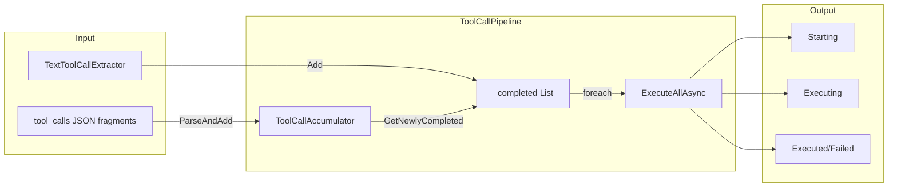
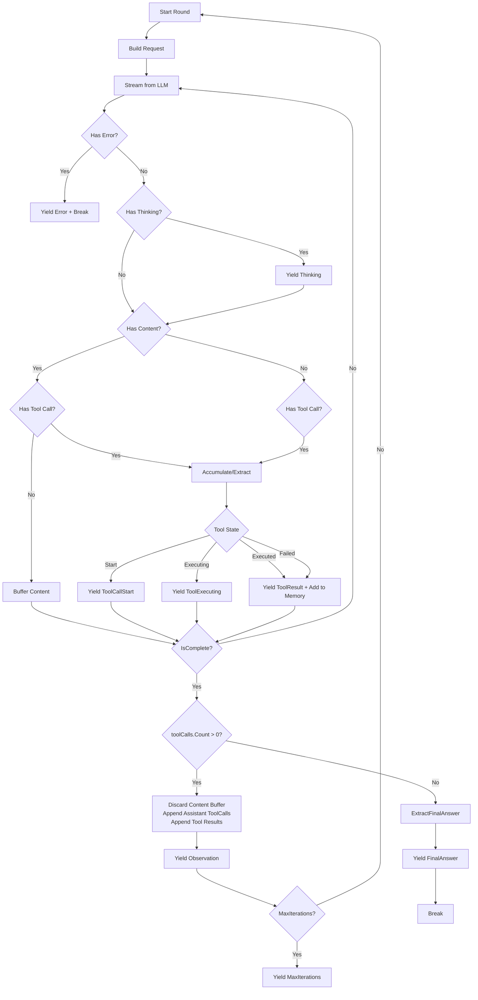
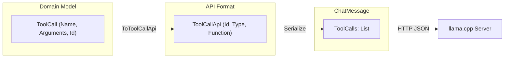
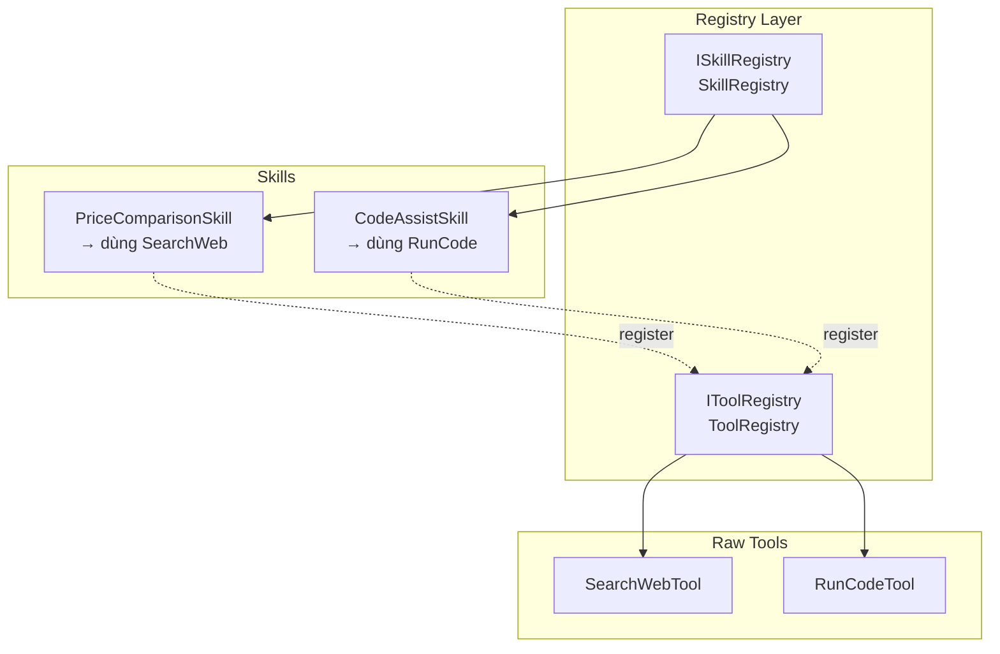

# TÀI LIỆU KIẾN TRÚC & TRIỂN KHAI
## VnMLStudio LLM Agent Framework

> Version: 1.0  
> Last updated: 2026-08-05  
> Author: VnMLStudio Team

---

## Mục lục

1. [High Level Design (HLD)](#1-high-level-design-hld)
2. [Detail Design (DD)](#2-detail-design-dd)
3. [Quick Guideline: Implement Agent Skills](#3-quick-guideline-implement-agent-skills)
4. [Quick Guideline: Run Agent Harness](#4-quick-guideline-run-agent-harness)
5. [Checklist Triển Khai](#5-checklist-triển-khai)

---

## 1. High Level Design (HLD)

### 1.1 Tổng quan kiến trúc

Hệ thống được thiết kế theo mô hình **Layered Plugin Architecture**, tách biệt rõ ràng giữa:
- **Infrastructure Layer**: Giao tiếp với LLM server (llama.cpp / Ollama / OpenAI-compatible)
- **Orchestration Layer**: Điều phối vòng lặp ReAct, quản lý memory và state
- **Capability Layer**: Tools và Skills (business logic chuyên biệt)
- **Application Layer**: Harness, Guardrails, Prompt Template Engine



### 1.2 Luồng xử lý chính (ReAct + Tool Calling)



### 1.3 Các nguyên tắc thiết kế then chốt

| Nguyên tắc | Áp dụng |
|-----------|---------|
| **Single Responsibility** | `LlamaCppApiClient` chỉ gọi HTTP. `Orchestrator` chỉ điều phối. `Skill` chỉ xử lý 1 nhiệm vụ. |
| **Open/Closed** | Thêm skill/tool mới không sửa `Orchestrator` hay `Harness`. |
| **Dependency Inversion** | `IStreamingAgentOrchestrator`, `IToolRegistry`, `ISkillRegistry`, `IConversationMemory`. |
| **Fail Fast** | `EnsureSuccessStatusCode`, `CancellationToken` linked với timeout mỗi step. |

---

## 2. Detail Design (DD)

### 2.1 Component Interaction



### 2.2 Chi tiết Module

#### 2.2.1 LlamaCppApiClient

| Aspect | Detail |
|--------|--------|
| **Nhiệm vụ** | Giao tiếp HTTP với llama.cpp server qua OpenAI-compatible API |
| **Streaming** | `IAsyncEnumerable<ChatStreamItem>` với `ResponseHeadersRead` |
| **Tool Detection** | 2 kênh: (1) Standard `delta.tool_calls`, (2) Text-based `<|tool_call|>` |
| **Deduplication** | `ToolCallPipeline.ContainsEquivalent()` + flag `hasStandardToolCalls`/`hasTextToolCalls` |
| **Event Model** | `OnChunkReceived`, `OnToolCallReceived`, `OnToolCallStateChanged`, `OnStreamComplete` |
| **ID Consistency** | `ToolCall.Id` gán 1 lần từ `ToolCallBuilder`, xuyên suốt Start→Executing→Executed |

**Lưu ý quan trọng**: `ChatStreamItem.ToolCallState` phân biệt rõ:
- `Start`: Vừa detect từ stream
- `Executing`: Pipeline bắt đầu chạy `executor.ExecuteAsync`
- `Executed`/`Failed`: Kết quả trả về



#### 2.2.2 ToolCallPipeline



| Method | Mục đích |
|--------|----------|
| `Accumulate(string)` | Nhận fragment JSON từ `delta.tool_calls`, trả về `ToolCall` hoàn chỉnh |
| `ForceCompleteAll()` | Ép hoàn thành khi `finish_reason = tool` |
| `ExecuteAllAsync()` | Chạy tuần tự từng tool, yield `ToolExecutionItem` (Starting + Completed) |
| `Add()` | Thêm tool call từ text-based extraction vào `_completed` |

#### 2.2.3 ReActStreamingOrchestrator

Vòng lặp chính (`MaxIterations` mặc định 3-5):



**Guard quan trọng trong Orchestrator**:
- `if (toolCalls.Count == 0)` → Final Answer
- `if (toolCalls.Count > 0)` → Append `ChatRequestBuilder.CreateAssistantToolCallMessage()`, KHÔNG yield content buffer
- Content buffer bị discard ở tool round để tránh "Thought: I need to search..." lọt vào memory

#### 2.2.4 ChatRequestBuilder & Message Format

**OpenAI API Format (bắt buộc đúng để llama.cpp không 500)**:

```json
// Assistant message có tool_calls
{
  "role": "assistant",
  "content": null,
  "tool_calls": [
    {
      "id": "call_xxx",
      "type": "function",
      "function": {
        "name": "SearchWeb",
        "arguments": "{\"query\":\"giá ROKO\"}"
      }
    }
  ]
}

// Tool result message
{
  "role": "tool",
  "tool_call_id": "call_xxx",
  "name": "SearchWeb",
  "content": "Kết quả tìm kiếm..."
}
```

**Mapping**:
- `ToolCall` (domain model: `Name`, `Arguments`, `Id`) → `ToolCallApi` (API format: `Id`, `Type`, `Function.Name/Arguments`)
- `ChatMessage.ToolCalls` là `List<ToolCallApi>` để serialize đúng schema
- `ChatRequestBuilder.Clone()` phải là **deep clone** (JSON serialize/deserialize) để tránh mutate request gốc giữa các round



#### 2.2.5 SkillRegistry vs ToolRegistry

| | ToolRegistry | SkillRegistry |
|---|---|---|
| **Implement** | `IToolRegistry` | `ISkillRegistry` |
| **Quản lý** | `IToolExecutor` + `ToolDefinition` | `ISkill` (kế thừa cả 2) |
| **Mục đích** | Raw tool (SearchWeb, RunCode) | Business capability (PriceComparison) |
| **Đăng ký** | `Register(new SearchWebTool())` | `Register(new PriceComparisonSkill())` |
| **Tự động** | SkillRegistry tự động `Register(skill)` vào ToolRegistry | — |



### 2.3 State Persistence

```json
{
  "agentName": "PriceHunter",
  "sessionId": "...",
  "messages": [
    {"role":"user","content":"..."},
    {"role":"assistant","content":null,"tool_calls":[{"id":"...","function":{"name":"SearchWeb"}}]},
    {"role":"tool","tool_call_id":"...","content":"..."}
  ],
  "steps": [...]
}
```

**Lưu ý**: `messages` array phải tuân thứ tự OpenAI:
1. `system`
2. `user`
3. `assistant` (có `tool_calls` nếu gọi tool)
4. `tool` (mỗi tool_call_id tương ứng 1 message)

---

## 3. Quick Guideline: Implement Agent Skills

### 3.1 Bước 1: Tạo Skill class

```csharp
using System.Text.Json.Nodes;
using VnMLStudio.Plugin.LlamaCppSharp.Agent.Skills;
using VnMLStudio.Plugin.LlamaCppSharp.Application;
using VnMLStudio.Plugin.LlamaCppSharp.Domain;

public class MySkill : ISkill
{
    public string FunctionName => "MySkill";
    public string DisplayName => "Tên hiển thị";
    public string SkillDescription => "Dùng khi nào...";

    public string SkillPrompt => @"
## SKILL: MySkill
Khi user hỏi về X, gọi skill này. KHÔNG tự trả lời.
";

    public IReadOnlyCollection<string> RequiredTools => new[] { "SearchWeb" };

    public ToolDefinition GetToolDefinition() => new()
    {
        Type = "function",
        Function = new()
        {
            Name = FunctionName,
            Description = "Mô tả cho LLM biết khi nào dùng",
            Parameters = new JsonObject
            {
                ["type"] = "object",
                ["properties"] = new JsonObject
                {
                    ["param1"] = new JsonObject { ["type"] = "string" }
                },
                ["required"] = new JsonArray("param1")
            }
        }
    };

    public async Task<ToolInvocationResult> ExecuteAsync(ToolCall toolCall, CancellationToken ct)
    {
        // Parse args defensive
        var args = ParseArgs(toolCall.Arguments);

        // Chạy logic nội bộ (có thể gọi sub-tools)
        var result = await DoWorkAsync(args, ct);

        return new ToolInvocationResult
        {
            ToolCallId = toolCall.Id ?? Guid.NewGuid().ToString(),
            FunctionName = FunctionName,
            Result = result,
            IsError = false
        };
    }
}
```

### 3.2 Bước 2: Đăng ký

```csharp
var toolRegistry = new ToolRegistry();
var skillRegistry = new SkillRegistry(toolRegistry);

// Register raw tools trước (nếu skill dùng)
toolRegistry.Register(new SearchWebTool(provider));

// Register skill (tự động inject vào ToolRegistry)
skillRegistry.Register(new MySkill());
```

### 3.3 Bước 3: Cấu hình AgentDefinition

```csharp
var definition = new AgentDefinition
{
    Name = "MyAgent",
    SystemPromptTemplate = "You are {{role}}.",
    PromptVariables = new() { ["role"] = "assistant" },
    AllowedTools = new() { "MySkill", "SearchWeb" }, // Liệt kê skill như tool
    MaxIterations = 3
};
```

### 3.4 Bước 4: Prompt Engineering cho Skill

**Nguyên tắc vàng**:
1. **SkillPrompt phải ngắn**: LLM chỉ cần biết "khi nào gọi", không cần biết "làm như thế nào"
2. **Cấm ReAct trong skill prompt**: `KHÔNG viết "Tôi sẽ tìm"`, chỉ gọi tool/skill
3. **Description rõ ràng**: LLM dùng `Description` để quyết định có gọi skill không

**Template SkillPrompt**:
```csharp
public string SkillPrompt => $@"
## SKILL: {DisplayName}
{SkillDescription}
- Input: [mô tả parameters]
- Output: [mô tả kết quả trả về]
- Rule: KHÔNG tự trả lời nếu chưa có kết quả từ skill.
";
```

---

## 4. Quick Guideline: Run Agent Harness

### 4.1 Bước 1: Khởi tạo Dependencies

```csharp
// Logger
var loggerFactory = LoggerFactory.Create(b => b.AddSerilog(Log.Logger));

// Search provider
var searchProvider = new DuckDuckGoSearchProvider(loggerFactory: loggerFactory);

// Registry
var toolRegistry = new ToolRegistry();
var skillRegistry = new SkillRegistry(toolRegistry);

toolRegistry.Register(new SearchWebTool(searchProvider));
skillRegistry.Register(new PriceComparisonSkill(searchProvider));

// LLM Client
var client = new LlamaCppApiClient(new LlamaClientOptions
{
    BaseAddress = "http://localhost:11434",
    LlamaExecutablePath = @"E:\llama.exe",
    ModelPath = @"E:\models\gemma-4-E2B-it-Q8_0.gguf"
});
```

### 4.2 Bước 2: Cấu hình AgentDefinition

```csharp
var definition = new AgentDefinition
{
    Name = "PriceHunter",
    SystemPromptTemplate = @"
You are {{role}}.
## RULES
1. Use PriceComparison skill when user asks about product prices.
2. Answer in Vietnamese with markdown table.
",
    PromptVariables = new() { ["role"] = "expert price comparison agent" },
    MaxIterations = 3,
    MaxContextMessages = 30,
    AllowedTools = new() { "PriceComparison" },
    StepTimeout = TimeSpan.FromSeconds(60),
    ToolTimeout = TimeSpan.FromSeconds(30)
};
```

### 4.3 Bước 3: Chạy Streaming

```csharp
var harness = new StreamingAgentHarness(definition, new LlamaClientOptions
{
    BaseAddress = "http://localhost:11434",
    // ...
}, toolRegistry);

await foreach (var update in harness.RunStreamingAsync("Mua cảm biến ROKO 10 cái"))
{
    switch (update.Type)
    {
        case AgentUpdateType.Thinking:
            Console.Write(update.Text); // DarkGray
            break;
        case AgentUpdateType.ToolCallStart:
            Console.WriteLine($"\n🔧 [{update.ToolCall?.Name}]");
            break;
        case AgentUpdateType.ToolExecuting:
            Console.WriteLine("   → Executing...");
            break;
        case AgentUpdateType.ToolResult:
            Console.WriteLine($"   → {update.ToolResult?.Result}");
            break;
        case AgentUpdateType.FinalAnswer:
            Console.WriteLine($"\n🏆 {update.Text}");
            break;
    }
}
```

### 4.4 Bước 4: State Persistence (Auto-save)

```csharp
var statePath = "session.json";

// Load nếu có
if (File.Exists(statePath))
    await harness.LoadStateAsync(statePath);

// Chạy xong auto-save
await harness.SaveStateAsync(statePath);
```

### 4.5 Bước 5: REPL Interactive Mode

```csharp
while (true)
{
    Console.Write("You: ");
    var input = Console.ReadLine();
    if (input is "/exit") break;
    if (input is "/clear") { /* clear memory */ continue; }

    await foreach (var u in harness.RunStreamingAsync(input))
    {
        // Handle updates...
    }

    // Auto-save sau mỗi turn
    await harness.SaveStateAsync(statePath);
}
```

---

## 5. Checklist Triển Khai

| # | Item | Status |
|---|------|--------|
| 1 | `ToolCallApi` format đúng OpenAI schema (`id`, `type`, `function`) | ☐ |
| 2 | `ChatMessage.ToolCalls` dùng `List<ToolCallApi>` | ☐ |
| 3 | `ChatRequestBuilder.Clone()` deep clone bằng JSON | ☐ |
| 4 | `TextToolCallExtractor` xử lý được `<|"|>` và unquoted keys | ☐ |
| 5 | Orchestrator discard content buffer khi có tool call | ☐ |
| 6 | `ExtractFinalAnswer` strip thinking prefix | ☐ |
| 7 | Skill `ExecuteAsync` defensive parse args (case-insensitive + regex fallback) | ☐ |
| 8 | Tool result append vào memory trước khi next round | ☐ |
| 9 | State save/load giữ `messages` đúng thứ tự | ☐ |
| 10 | `MaxIterations` giới hạn để tránh infinite loop | ☐ |

---

## Phụ lục: File Structure

```
VnMLStudio.Plugin.LlamaCppSharp/
├── Agent/
│   ├── Skills/
│   │   ├── ISkill.cs
│   │   ├── ISkillRegistry.cs
│   │   ├── SkillRegistry.cs
│   │   └── Impl/
│   │       └── PriceComparisonSkill.cs
│   ├── Tools/
│   │   ├── ISearchProvider.cs
│   │   ├── SearchWebTool.cs
│   │   └── DuckDuckGoSearchProvider.cs
│   ├── ReActStreamingOrchestrator.cs
│   └── StreamingAgentHarness.cs
├── Application/
│   ├── IToolExecutor.cs
│   ├── IToolRegistry.cs
│   ├── IToolDescriptor.cs
│   └── ToolRegistry.cs
├── Domain/
│   ├── ChatMessage.cs
│   ├── ToolCall.cs
│   ├── ToolCallApi.cs
│   └── ToolDefinition.cs
├── ChatRequestBuilder.cs
├── TextToolCallExtractor.cs
└── LlamaCppApiClient.cs
```
