# SEOCrawlSupervisorOrchestrator - High-Level Design & Detail Design

## Document Revision History

| Version | Date | Author | Changes | Description |
|---|---|---|---|---|
| 1.0.0 | 2026-08-28 | System | Initial Release | First version with basic ReAct loop |
| 1.1.0 | 2026-08-29 | System | Architecture Refactor | Introduced Chain of Responsibility pattern with 6 handlers |
| 1.2.0 | 2026-08-30 | System | Dynamic Timeout | Added token-based timeout calculation for LLM operations |
| 1.3.0 | 2026-08-31 | System | Event-Driven Progress | Unified streaming/non-streaming via Progress events with emoji logging |
| 1.4.0 | 2026-08-31 | System | Reflection Engine | Extracted Reflection logic into dedicated engine with 4-layer heuristic |
| 1.5.0 | 2026-09-04 | System | File-Based Processing | BREAKING: Removed LLM tool calls for file operations; handlers now read/write files directly and pass content via context |

# 1. Executive Summary

## 1.1 System Overview
The **SEOCrawlSupervisorOrchestrator** is a production-grade, pipeline-based orchestration system designed for automated SEO content processing. It manages end-to-end workflows including:

**Web crawling** – extract content from target URLs

**SEO analysis** – evaluate keyword density, readability, structure

**Content writing** – generate SEO-optimized articles

**Quality reflection** – multi-layer quality assurance with auto-correction

**Result persistence** – save articles and generate comprehensive reports

## 1.2 Key Features

| Feature | Description | Status |
| --- | --- | --- |
| Pipeline Architecture | Chain of Responsibility with 7 handlers | ✅ Complete |
| File-Based Processing | Handlers read/write files directly, LLM no longer calls file tools | ✅ Complete |
| Dynamic Timeout | Token-based timeout calculation per LLM with thinking mode | ✅ Complete |
| Event-Driven Progress | Real-time UI updates via Progress events | ✅ Complete |
| Vietnamese SEO | Custom heuristic for Vietnamese content | ✅ Complete |
| Auto Tool Synthesis | Dynamic tool generation for missing capabilities | ✅ Complete |
| 4-Layer Reflection | Duplicate words, templates, density, readability | ✅ Complete |
| Auto-Correction | Rewrite content when quality fails | ✅ Complete |
| Emoji Logging | Rich visual feedback with emojis | ✅ Complete |
## 1.3 Technology Stack

| Layer | Technology |
| --- | --- |
| Language | C# (.NET 10) |
| AI/LLM | LlamaCppSharp |
| Design Pattern | Chain of Responsibility, Pipeline, Observer |
| Logging | Serilog, Microsoft.Extensions.Logging |
| Data Format | JSON, Markdown |
| Concurrency | Async/Await, CancellationToken, Channels |
# 2. High-Level Design (HLD)

## 2.1 System Architecture

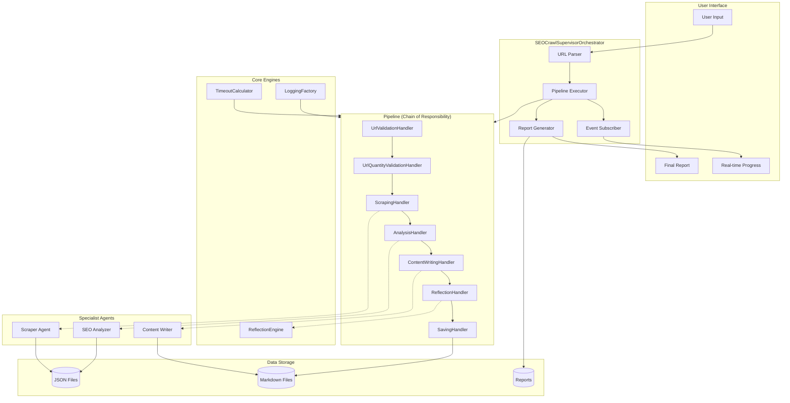

## 2.2 Data Flow – File-Based Processing (v1.5.0)

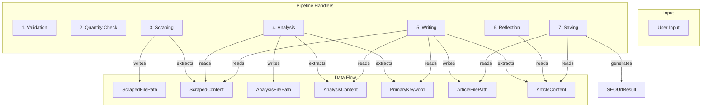

## 2.3 Component Overview


# 3. Detail Design (DD)

## 3.1 Chain of Responsibility Implementation

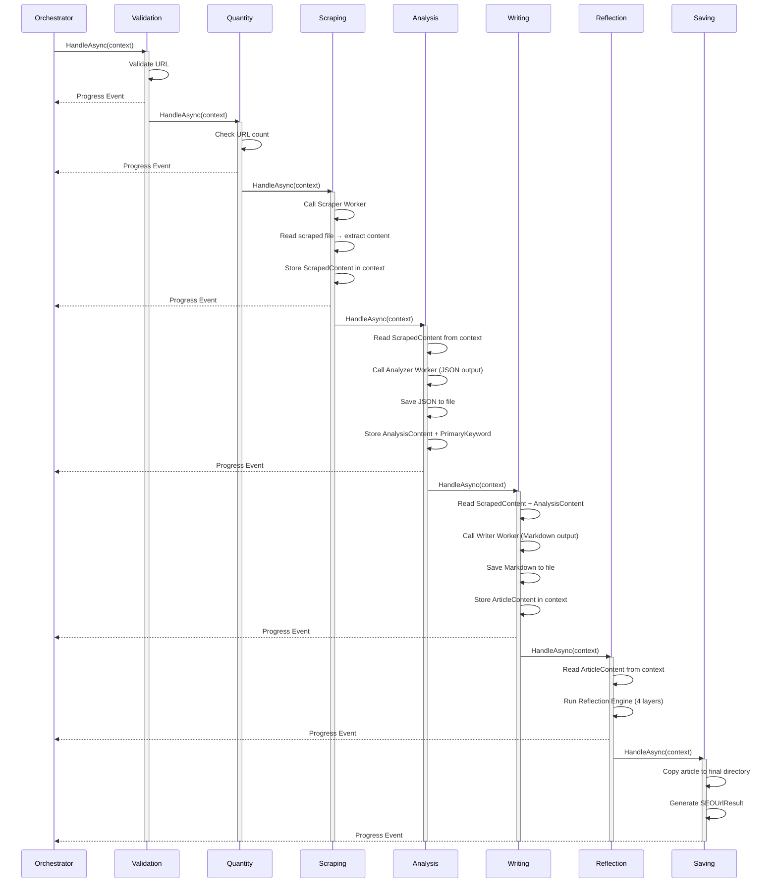

## 3.2 File-Based Data Flow (Key Changes in v1.5.0)

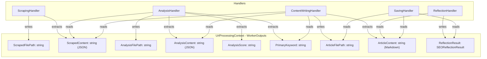

## 3.3 Reflection Engine - 4 Layers with Status Notification

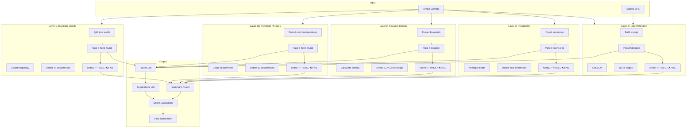

## 3.4 Dynamic Timeout with Thinking Mode

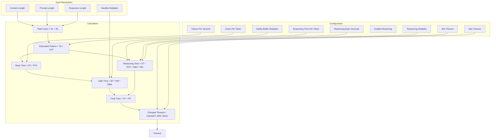

## 3.5 Event-Driven Progress Flow

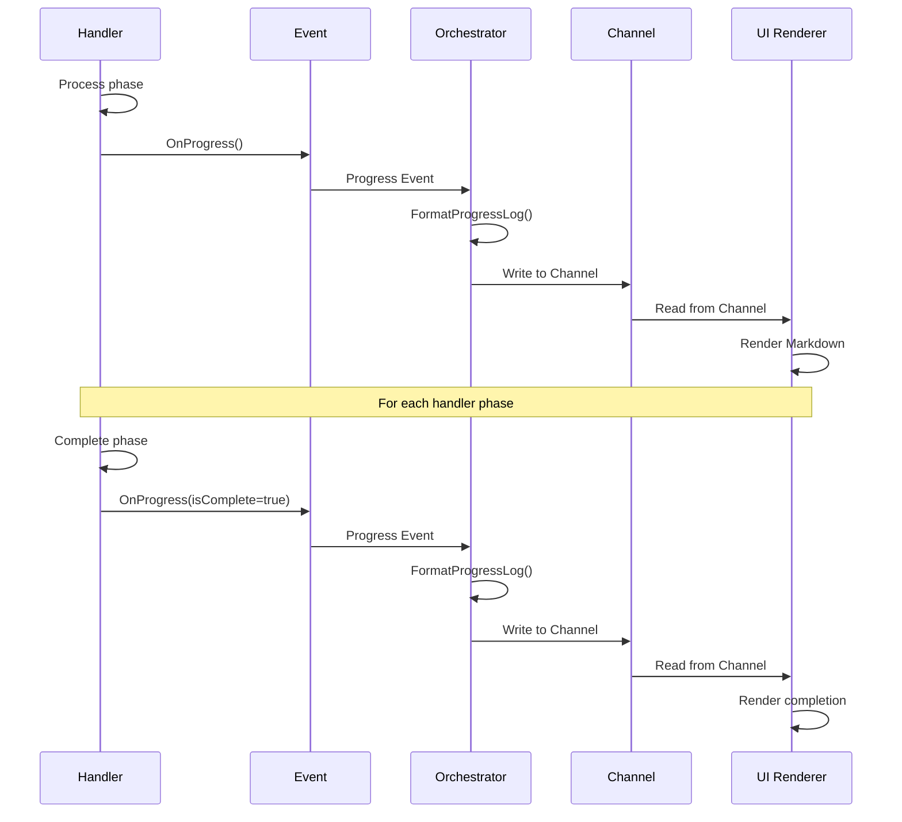

## 4.1 UrlProcessingContext (v1.5.0)

```csharp
public class UrlProcessingContext
{
    // === Core Info ===
    public string Url { get; set; } = string.Empty;
    public int Index { get; set; }
    public int Total { get; set; }
    public int ContentLength { get; set; }
    public int PromptLength { get; set; }

    // === Worker Outputs (File-Based) ===
    public Dictionary<string, string> WorkerOutputs { get; set; } = new(StringComparer.OrdinalIgnoreCase);

    // === Phase Tracking ===
    public List<PhaseTiming> PhaseTimings { get; set; } = new();
    public bool Success { get; set; } = true;
    public string? FailureReason { get; set; }
    public int RewriteRounds { get; set; }
    public SEOUrlResult? Result { get; set; }

    // === Timeout ===
    public Dictionary<string, TimeSpan> AdjustedTimeouts { get; set; } = new();

    // === Dependencies ===
    public SEOCrawlSupervisorOptions Options { get; set; } = null!;
    public AgentTeam Team { get; set; } = null!;
    public Dictionary<string, SEOReflectionResult> ReflectionCache { get; set; } = null!;
    public Dictionary<string, HashSet<string>> ScrapedEntityCache { get; set; } = null!;
    public HashSet<string> AttemptedSynthesis { get; set; } = null!;
    public DynamicToolSynthesizer? ToolSynthesizer { get; set; }
    public IDynamicToolRegistry? DynamicRegistry { get; set; }
    public ILoggerFactory? LoggerFactory { get; set; }
    public CancellationToken CancellationToken { get; set; }
    public ILogger Logger { get; set; } = null!;
}
```

## 4.2 WorkerOutputs - Standard Keys

| Key | Type | Description | Written By | Read By |
| --- | --- | --- | --- | --- |
| ScrapedFilePath | string | Path to scraped JSON file | ScrapingHandler | (reference) |
| ScrapedContent | string | Raw JSON content of scraped file | ScrapingHandler | AnalysisHandler, ContentWritingHandler |
| AnalysisFilePath | string | Path to analysis JSON file | AnalysisHandler | (reference) |
| AnalysisContent | string | Analysis JSON content | AnalysisHandler | ContentWritingHandler, SavingHandler |
| AnalysisScore | string | SEO score extracted from analysis | AnalysisHandler | SavingHandler |
| PrimaryKeyword | string | Primary keyword from analysis | AnalysisHandler | ContentWritingHandler |
| ArticleFilePath | string | Path to article MD file | ContentWritingHandler | SavingHandler |
| ArticleContent | string | Markdown article content | ContentWritingHandler | ReflectionHandler, SavingHandler |
| ReflectionResult | SEOReflectionResult | Reflection result | ReflectionHandler | SavingHandler |
## 4.3 SEOCrawlSupervisorOptions

```csharp
public class SEOCrawlSupervisorOptions
{
    // === Core Settings ===
    public bool EnableFinalReflection { get; set; } = true;
    public bool EnableAutoToolSynthesis { get; set; } = false;
    public bool SaveArticlesToFiles { get; set; } = true;
    public bool SaveFinalReport { get; set; } = true;
    public bool SkipL4IfHeuristicPass { get; set; } = true;
    public int MaxUrls { get; set; } = 10;

    // === Timeout Settings ===
    public int BatchTotalTimeoutMinutes { get; set; } = 120;
    public int? UrlTotalTimeoutMinutes { get; set; } = 15;
    public int MaxCorrectionRounds { get; set; } = 1;
    public int? WorkerTimeoutSeconds { get; set; } = 120;
    public int? AgentTimeoutSeconds { get; set; } = 60;

    // === LLM Token Settings ===
    public LlmConfig LlmConfig { get; set; } = new();

    // === Output Settings ===
    public string OutputDirectory { get; set; } = "./output";

    // === Handler Multipliers ===
    public Dictionary<string, double> HandlerTokenMultipliers { get; set; } = new()
    {
        ["Scrape"] = 0.5,
        ["Analyze"] = 1.0,
        ["Write"] = 2.5,
        ["Reflect"] = 1.8,
        ["Save"] = 0.3
    };
}

public class LlmConfig
{
    // === Token & Timeout ===
    public double TokensPerSecond { get; set; } = 50;
    public double SafetyBufferMultiplier { get; set; } = 1.5;
    public int MinTimeoutSeconds { get; set; } = 30;
    public int MaxTimeoutSeconds { get; set; } = 900;
    public double CharsPerToken { get; set; } = 4.0;

    // === Thinking / Reasoning ===
    public bool EnableReasoning { get; set; } = true;
    public double ReasoningTimePerToken { get; set; } = 0.02;
    public double ReasoningBaseSeconds { get; set; } = 5.0;
    public double ReasoningMultiplier { get; set; } = 1.8;
}
```

## 4.4 ProgressEventArgs

```csharp
public class ProgressEventArgs : EventArgs
{
    public string Phase { get; set; } = string.Empty;
    public int Step { get; set; }
    public int TotalSteps { get; set; }
    public string Message { get; set; } = string.Empty;
    public bool IsComplete { get; set; }
    public DateTime Timestamp { get; set; }
    public Exception? Error { get; set; }
    public Dictionary<string, object>? Data { get; set; }
    public int PercentComplete { get; set; }
    public string? Status { get; set; }
    public string? Detail { get; set; }
    public int Score { get; set; }
}
```
# 5. Handler Implementation Details

## 5.1 ScrapingHandler

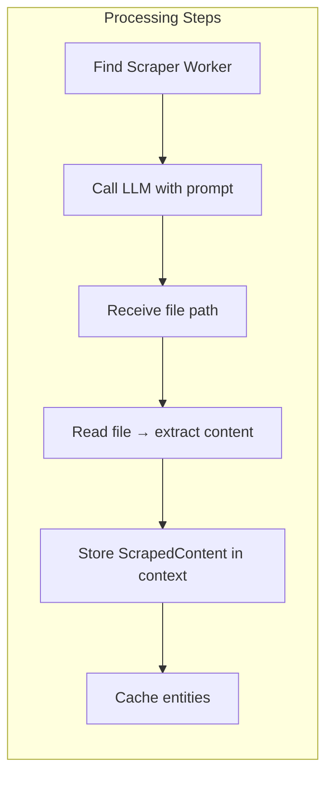

**Key Implementation**:

- Calls LLM to crawl URL

- LLM returns path to JSON file

- Handler reads file and extracts content

- Stores ScrapedContent and ScrapedFilePath in WorkerOutputs

- Caches entities for later use

## 5.2 AnalysisHandler

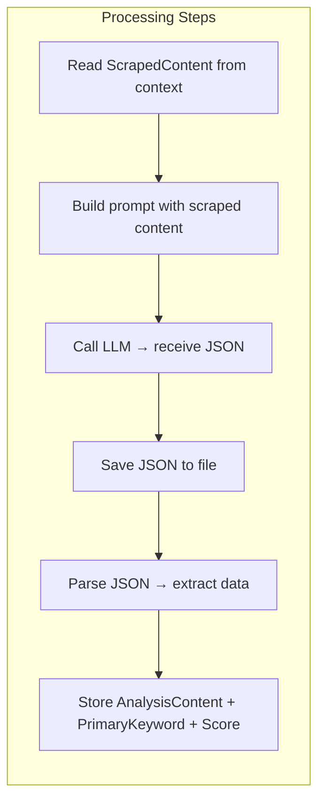

**Key Implementation**:

- Reads ScrapedContent from context

- LLM returns JSON directly (no file tool calls)

- Handler saves JSON to file

- Extracts top_keywords, score, readability

- Stores AnalysisContent, PrimaryKeyword, AnalysisScore

## 5.3 ContentWritingHandler

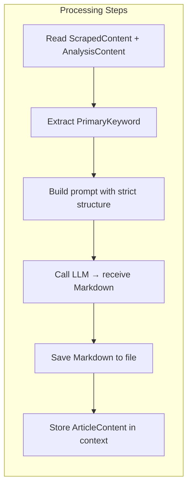

**Key Implementation:**

- Reads ScrapedContent, AnalysisContent, PrimaryKeyword

- LLM returns Markdown directly (no file tool calls)

- Handler saves Markdown to file

- Stores ArticleContent in context

- Prompt enforces:

- Meta Title & Description

- H1/H2/H3 structure

- 800-1000 words

- No template phrases

- 5+ entities, 2+ numbers

## 5.4 ReflectionHandler

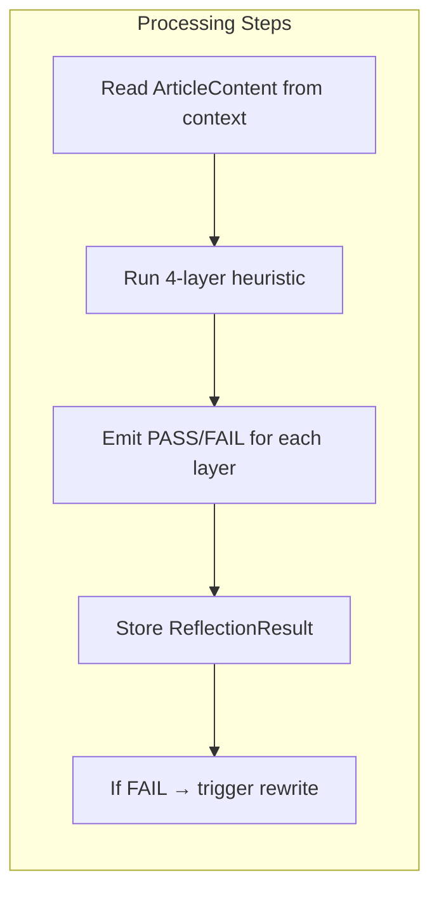

**Key Implementation:**

- Reads ArticleContent from context

- 4-layer heuristic with status notifications:

- L1: Duplicate Words → ✅ PASS / ❌ FAIL

- L1B: Template Phrases → ✅ PASS / ❌ FAIL

- L2: Keyword Density → ✅ PASS / ❌ FAIL

- L3: Readability → ✅ PASS / ❌ FAIL

- L4: LLM Reflection → ✅ PASS / ❌ FAIL

- Stores SEOReflectionResult

- Triggers rewrite if needed

## 5.5 SavingHandler

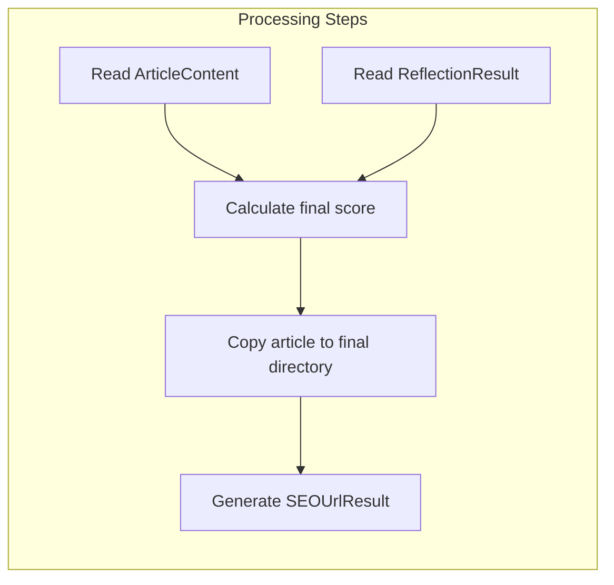
# 6. API Reference

## 6.1 Public Interface

```csharp
/// <summary>
/// Main orchestrator for SEO crawling and content generation pipeline
/// </summary>
public sealed class SEOCrawlSupervisorOrchestrator : IStreamingAgentOrchestrator
{
    /// <summary>
    /// Constructor with dependency injection
    /// </summary>
    public SEOCrawlSupervisorOrchestrator(
        AgentTeam team,
        IReflectionEngine? reflection = null,
        IPromptTemplateEngine? promptEngine = null,
        SEOCrawlSupervisorOptions? options = null,
        ILoggerFactory? loggerFactory = null,
        DynamicToolSynthesizer? toolSynthesizer = null,
        IDynamicToolRegistry? dynamicRegistry = null);

    /// <summary>
    /// Non-streaming execution - returns complete result set
    /// </summary>
    public IAsyncEnumerable<AgentStep> RunAsync(
        string userInput,
        AgentDefinition definition,
        IConversationMemory memory,
        IToolRegistry? tools,
        ISkillRegistry? skills,
        IReadOnlyList<IGuardrail> guardrails,
        CancellationToken ct = default);

    /// <summary>
    /// Streaming execution - returns real-time progress updates
    /// </summary>
    public IAsyncEnumerable<AgentStepUpdate> RunStreamingAsync(
        string userInput,
        AgentDefinition definition,
        IConversationMemory memory,
        IToolRegistry? tools,
        ISkillRegistry? skills,
        IReadOnlyList<IGuardrail> guardrails,
        CancellationToken ct = default);
}

# 7. Performance & Monitoring

```

## 7.1 Performance Metrics

| Metric | Target | Description |
| --- | --- | --- |
| URL Throughput | 5-10 URLs/min | URLs processed per minute |
| Per URL Latency | 2-5 minutes | Average time per URL |
| Success Rate | > 95% | Percentage of successful URLs |
| Reflection Accuracy | > 85% | Accuracy of quality detection |
| Memory Usage | < 2GB | Peak memory consumption |
| CPU Usage | < 80% | CPU utilization during batch |
## 7.2 Logging & Monitoring

| Level | Use Case | Example |
| --- | --- | --- |
| Debug | Detailed flow tracing | Worker invocation details |
| Information | Normal operation | Phase completion, URL processed |
| Warning | Recoverable issues | Retry attempts, timeout warnings |
| Error | Non-recoverable | Worker crash, file write failure |
# 8. Revision Summary

## 8.1 Changes from v1.4.0 to v1.5.0
| Component | v1.4.0 | v1.5.0 | Benefit |
| --- | --- | --- | --- |
| File Operations | LLM calls ReadFile/WriteFile tools | Handlers read/write files directly | Reduces LLM tool calls, faster, more reliable |
| Data Flow | LLM returns file paths only | LLM returns content directly, handler saves files | Eliminates file-reading round trips |
| Context Keys | Ad-hoc keys | Standardized keys (ScrapedContent, AnalysisContent, etc.) | Clear data flow, no duplication |
| Content Writing | LLM writes to file via tool | LLM returns Markdown, handler saves | More control, validates content before save |
| Reflection | Reads from file path | Reads from ArticleContent key | No disk I/O during reflection |
| Error Recovery | Hard to trace | Clear fallback with context | Better debugging |
## 8.2 Key Decisions

Why remove LLM file tool calls?

LLM often fails to call tools correctly (duplicate calls, wrong format)

File operations are deterministic – handlers can do it faster and more reliably

Reduces token usage (no tool call overhead)

Eliminates "file not found" errors

Why store content in context?

Avoids reading same file multiple times

Enables fallback if file is missing

Faster processing (no disk I/O for each handler)

Why use standardized keys?

Clear data flow visibility

Easier debugging

Prevents data collision between URLs

Why strict prompt for Writing?

Ensures consistent output format

Reduces post-processing needed

Guarantees meta title/description presence

# 9. Configuration Example

```json
{
  "SEOCrawlSupervisorOptions": {
    "EnableFinalReflection": true,
    "EnableAutoToolSynthesis": false,
    "SaveArticlesToFiles": true,
    "SaveFinalReport": true,
    "SkipL4IfHeuristicPass": true,
    "MaxUrls": 10,
    "BatchTotalTimeoutMinutes": 120,
    "MaxCorrectionRounds": 1,
    "WorkerTimeoutSeconds": 120,
    "LlmConfig": {
      "TokensPerSecond": 50,
      "SafetyBufferMultiplier": 1.5,
      "MinTimeoutSeconds": 30,
      "MaxTimeoutSeconds": 600,
      "CharsPerToken": 4.0,
      "EnableReasoning": true,
      "ReasoningTimePerToken": 0.02,
      "ReasoningBaseSeconds": 5.0,
      "ReasoningMultiplier": 1.8
    },
    "OutputDirectory": "./output",
    "HandlerTokenMultipliers": {
      "Scrape": 0.5,
      "Analyze": 1.0,
      "Write": 2.5,
      "Reflect": 1.8,
      "Save": 0.3
    }
  }
}
Document Version: 1.5.0
```
