# SEOCrawlSupervisorOrchestrator - High-Level Design & Detail Design
## Document Revision History
| Version | Date | Author | Changes | Description |
| --- | --- | --- | --- | --- |
| 1.0.0| 2026-08-28 | Hoang Nguyen | Initial Release | First version with basic ReAct loop  |
|1.1.0 |2026-08-29	| Hoang Nguyen	|Architecture Refactor|	Introduced Chain of Responsibility pattern with 6 handlers|
|1.2.0 |2026-08-30|	Hoang Nguyen	|Dynamic Timeout|	Added token-based timeout calculation for LLM operations|
| 1.3.0 |2026-08-31	| Hoang Nguyen	|Event-Driven Progress|	Unified streaming/non-streaming via Progress events with emoji logging|
| 1.4.0| 2026-08-31| Hoang Nguyen|	Reflection Engine	|Extracted Reflection logic into dedicated engine with 4-layer heuristic|
|1.5.0 |2026-09-04|	Hoang Nguyen|	File-Based Processing|	BREAKING: Removed LLM tool calls for file operations; handlers read/write files directly|
|1.5.1 |2026-09-07	|Hoang Nguyen|	Memory Isolation|	Fixed memory leak between URLs; added ResetMemory() to all agents|
|1.5.2| 2026-09-08|	Hoang Nguyen|	Adaptive Timeout|	Nonlinear timeout factor + adaptive max scaling + LLM config presets|
|1.6.0 |2026-09-10|	Hoang Nguyen	|Response Cleaner & Chunking	|Added LlmResponseCleaner, content chunking for large inputs, and QualityValidationHandler|

# 1. Executive Summary
## 1.1 System Overview

**SEOCrawlSupervisorOrchestrator** là hệ thống orchestration pipeline-based cho tự động hóa xử lý nội dung SEO. Hệ thống quản lý workflow end-to-end bao gồm:

- **Web crawling** – trích xuất nội dung từ URL mục tiêu

- **SEO analysis** – đánh giá keyword density, readability, structure

- **Content writing** – sinh bài viết tối ưu SEO

- **Quality reflection** – đảm bảo chất lượng đa tầng với tự động sửa lỗi

- **Quality validation** – xác thực chất lượng tổng thể với báo cáo JSON

- **Result persistence** – lưu bài viết và sinh báo cáo tổng hợp

## 1.2 Key Features (Updated v1.6.0)

| Feature | Description | Status |
| --- | --- | --- |
| Pipeline Architecture | Chain of Responsibility với 8 handlers | ✅ Complete |
| File-Based Processing | Handlers đọc/ghi file trực tiếp, LLM không dùng file tools | ✅ Complete |
| Memory Isolation | Reset memory trước mỗi URL, không leak context | ✅ v1.5.1 |
| Adaptive Dynamic Timeout | Timeout scale theo content length + nonlinear factor | ✅ v1.5.2 |
| LLM Response Cleaner | Xử lý markdown fence, JSON, file path tự động | ✅ v1.6.0 |
| Content Chunking | Chia nhỏ content > threshold, merge kết quả | ✅ v1.6.0 |
| Event-Driven Progress | Real-time UI updates với emoji logging | ✅ Complete |
| Vietnamese SEO | Custom heuristic cho tiếng Việt | ✅ Complete |
| Auto Tool Synthesis | Sinh tool động khi thiếu capability | ✅ Complete |
| 4-Layer Reflection | Duplicate words, templates, density, readability | ✅ Complete |
| Quality Validation | Báo cáo JSON với overall_score | ✅ v1.6.0 |
| Auto-Correction | Rewrite nội dung khi chất lượng không đạt | ✅ Complete |## 1.3 Technology Stack

| Layer | Technology |
| --- | --- |
| Language | C# (.NET 10) |
| AI/LLM | LlamaCppSharp |
| Design Pattern | Chain of Responsibility, Pipeline, Observer |
| Logging | Serilog, Microsoft.Extensions.Logging |
| Data Format | JSON, Markdown |
| Concurrency | Async/Await, CancellationToken, Channels |2. High-Level Design (HLD)
## 2.1 System Architecture (v1.6.0)

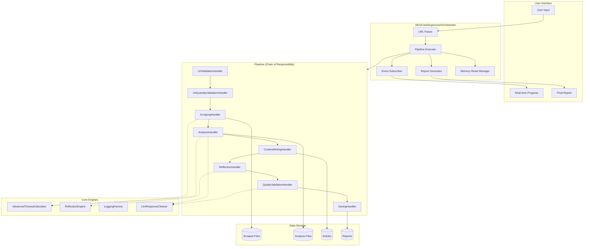
## 2.2 Pipeline Flow (v1.6.0)

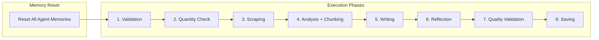
## 2.3 Data Flow – File-Based Processing với Chunking (v1.6.0)

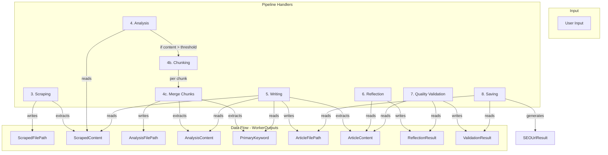
## 2.4 Component Overview (v1.6.0)

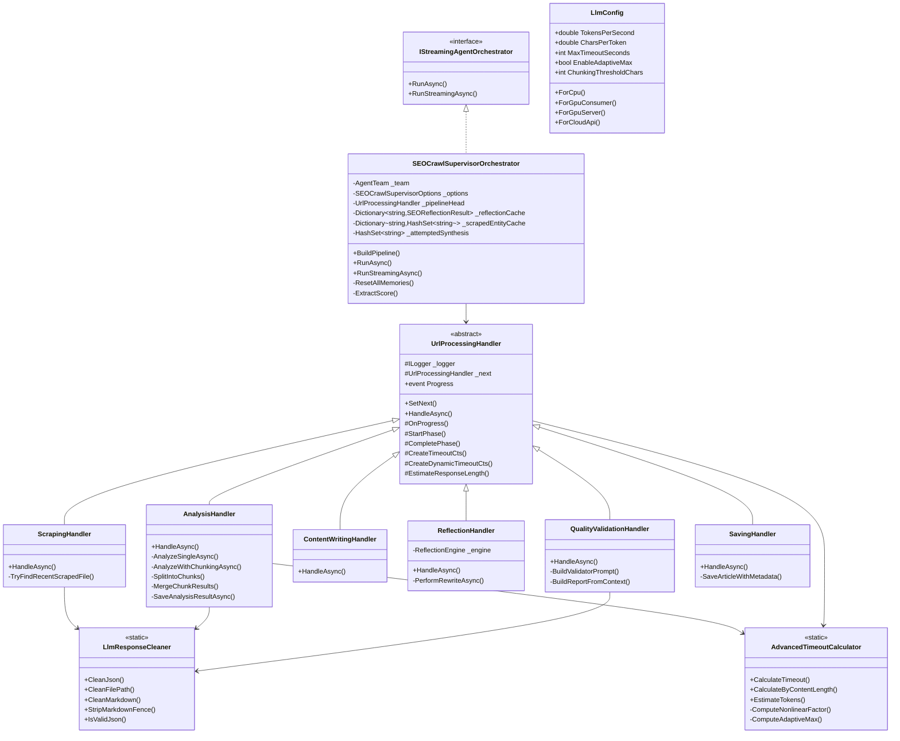
# 3. Detailed Design (DD)
## 3.1 Memory Isolation Flow (v1.5.1)

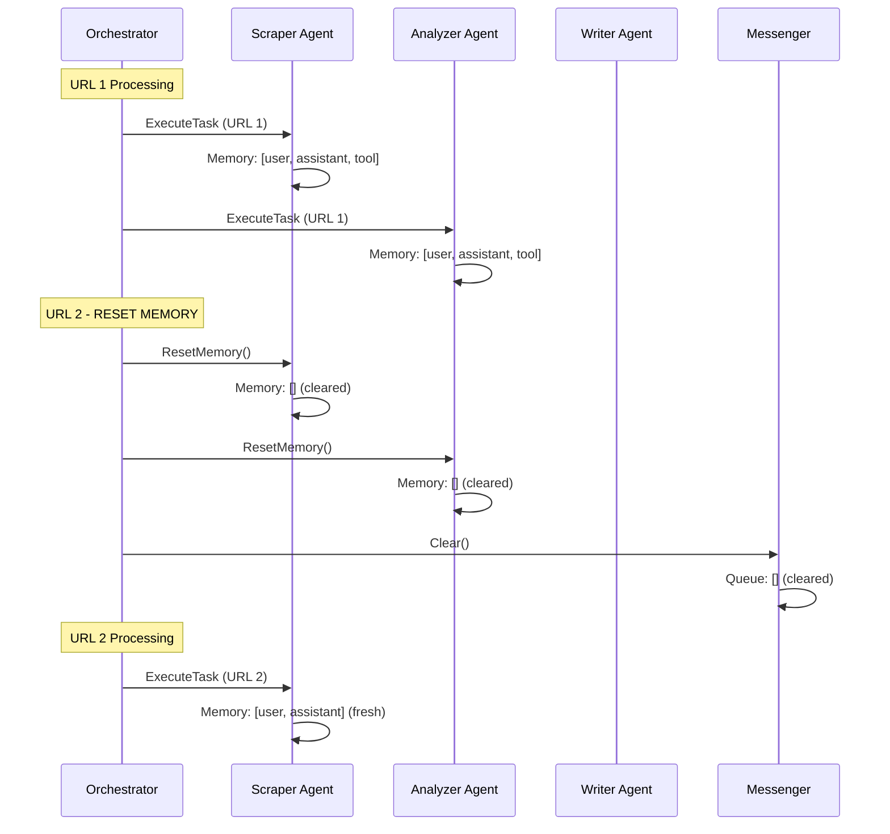
## 3.2 Adaptive Dynamic Timeout (v1.5.2)

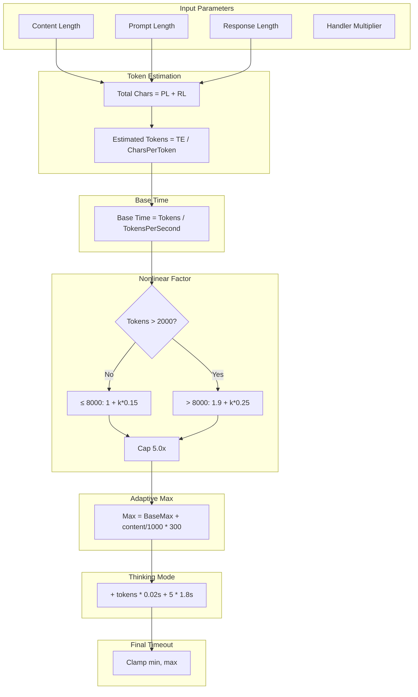

## Bảng tính timeout cho các content size khác nhau (ForCpu preset):

| Content | Tokens | Base | Nonlinear | Required | Adaptive Max | Kết quả |
| --- | --- | --- | --- | --- | --- | --- |
| 2,579 | 2,316 | 193s | 1.05x | 304s | 2,760s | ✅ OK |
| 8,070 | 6,892 | 574s | 1.73x | 1,490s | 4,665s | ✅ OK |
| 12,000 | 10,167 | 847s | 2.44x | 3,101s | 6,120s | ✅ OK |
| 20,000 | 16,833 | 1,403s | 4.11x | 8,648s | 9,000s | ✅ Chunking |
| 30,000 | 25,167 | 2,097s | 5.00x | 15,728s | 12,600s | ⚠️ Chunking bắt buộc |## 3.3 LLM Response Cleaner (v1.6.0)

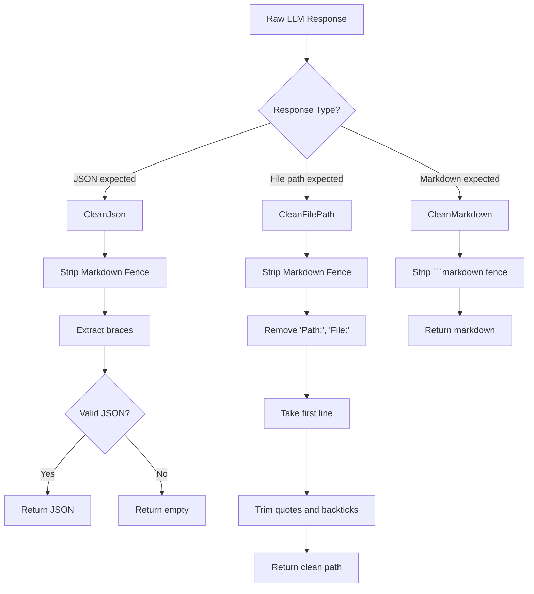
## 3.4 Content Chunking Flow (v1.6.0)

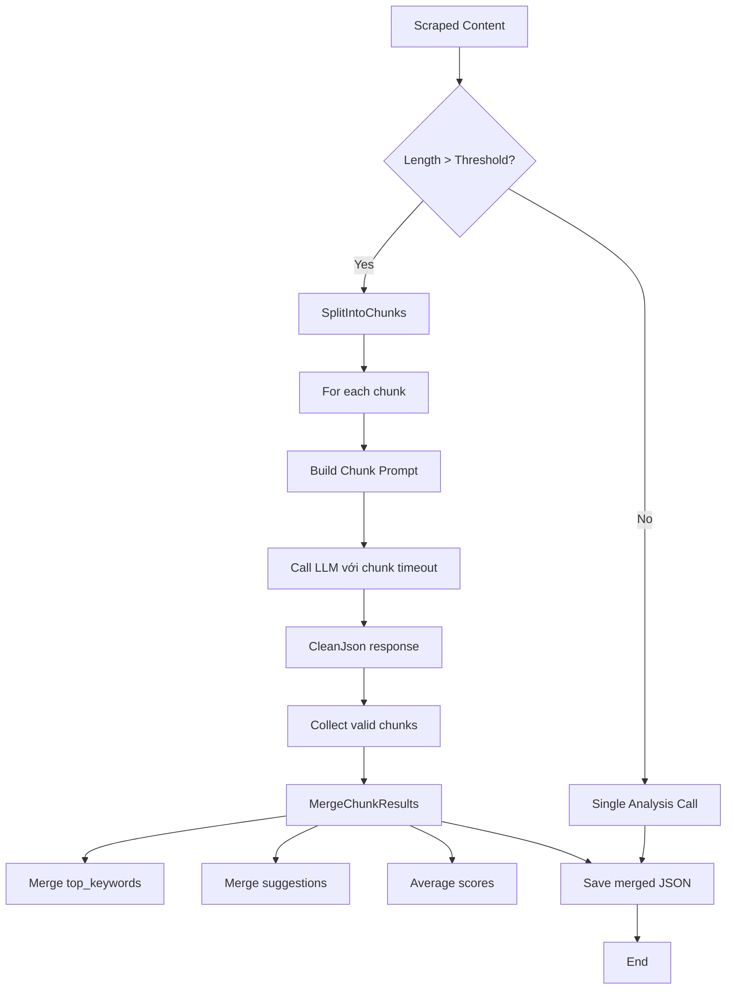
## 3.5 Pipeline Execution Sequence (v1.6.0)

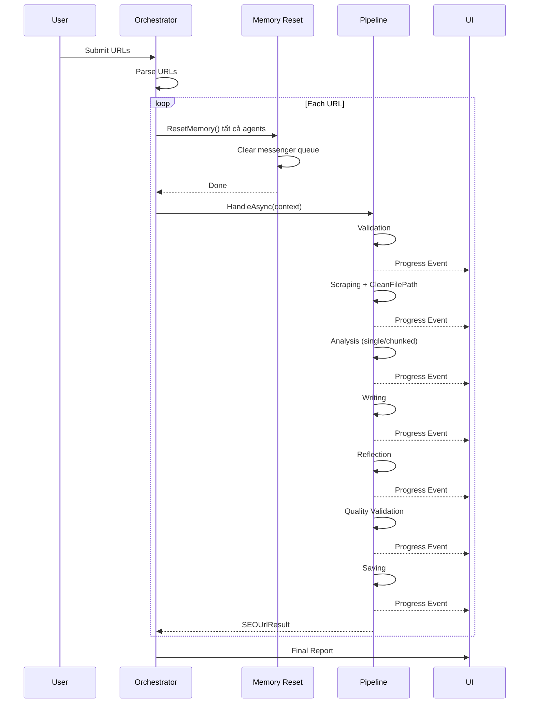
# 4. Component Details (v1.6.0)
## 4.1 UrlProcessingContext

```csharp
public class UrlProcessingContext
{
    // === Core Info ===
    public string Url { get; set; } = string.Empty;
    public int Index { get; set; }
    public int Total { get; set; }
    public int ContentLength { get; set; }
    public int PromptLength { get; set; }

    // === Worker Outputs (File-Based) ===
    public Dictionary<string, string> WorkerOutputs { get; set; } = new(StringComparer.OrdinalIgnoreCase);

    // === Phase Tracking ===
    public List<PhaseTiming> PhaseTimings { get; set; } = new();
    public bool Success { get; set; } = true;
    public string? FailureReason { get; set; }
    public int RewriteRounds { get; set; }
    public SEOUrlResult? Result { get; set; }

    // === Timeout ===
    public Dictionary<string, TimeSpan> AdjustedTimeouts { get; set; } = new();

    // === Dependencies ===
    public SEOCrawlSupervisorOptions Options { get; set; } = null!;
    public AgentTeam Team { get; set; } = null!;
    public Dictionary<string, SEOReflectionResult> ReflectionCache { get; set; } = null!;
    public Dictionary<string, HashSet<string>> ScrapedEntityCache { get; set; } = null!;
    public HashSet<string> AttemptedSynthesis { get; set; } = null!;
    public CancellationToken CancellationToken { get; set; }
    public ILogger Logger { get; set; } = null!;
    public bool EnableReasoning { get; set; } = false;
}
```

## 4.2 Standardized WorkerOutputs Keys (v1.6.0)

| Key | Type | Description | Written By | Read By |
| --- | --- | --- | --- | --- |
| ScrapedFilePath | string | Path to scraped JSON file | ScrapingHandler | (reference) |
| ScrapedContent | string | Raw JSON content of scraped file | ScrapingHandler | AnalysisHandler, ContentWritingHandler, ReflectionHandler |
| AnalysisFilePath | string | Path to analysis JSON file | AnalysisHandler | (reference) |
| AnalysisContent | string | Analysis JSON content | AnalysisHandler | ContentWritingHandler, QualityValidationHandler, SavingHandler |
| AnalysisScore | string | SEO score from analysis | AnalysisHandler | SavingHandler |
| PrimaryKeyword | string | Primary keyword from analysis | AnalysisHandler | ContentWritingHandler |
| ArticleFilePath | string | Path to article MD file | ContentWritingHandler | SavingHandler |
| ArticleContent | string | Markdown article content | ContentWritingHandler | ReflectionHandler, QualityValidationHandler, SavingHandler |
| ValidationResult | string | Quality validation JSON | QualityValidationHandler | SavingHandler |
| ValidationScore | string | Quality score | QualityValidationHandler | SavingHandler |
| ValidationStatus | string | APPROVED / NEEDS_REVISION | QualityValidationHandler | SavingHandler |## 4.3 LlmConfig Presets (v1.6.0)

```csharp
public static LlmConfig ForCpu() => new()
{
    TokensPerSecond = 12,           // CPU chậm
    CharsPerToken = 3.0,            // JSON + tiếng Việt
    SafetyBufferMultiplier = 1.8,
    MinTimeoutSeconds = 45,
    MaxTimeoutSeconds = 1800,
    EnableAdaptiveMax = true,
    AdaptiveMaxSecondsPerKChars = 360,
    ChunkingThresholdChars = 10000,  // Chunking sớm cho CPU
    ChunkSizeChars = 4500,
    ChunkOverlapChars = 200
};

public static LlmConfig ForGpuConsumer() => new()
{
    TokensPerSecond = 40,           // RTX 3060/4060
    CharsPerToken = 3.0,
    SafetyBufferMultiplier = 1.5,
    MinTimeoutSeconds = 30,
    MaxTimeoutSeconds = 1200,
    EnableAdaptiveMax = true,
    AdaptiveMaxSecondsPerKChars = 240,
    ChunkingThresholdChars = 15000,
    ChunkSizeChars = 6000,
    ChunkOverlapChars = 200
};

public static LlmConfig ForGpuServer() => new()
{
    TokensPerSecond = 90,           // A100/H100
    CharsPerToken = 3.2,
    SafetyBufferMultiplier = 1.3,
    MinTimeoutSeconds = 20,
    MaxTimeoutSeconds = 600,
    EnableAdaptiveMax = true,
    AdaptiveMaxSecondsPerKChars = 120,
    ChunkingThresholdChars = 30000,
    ChunkSizeChars = 12000,
    ChunkOverlapChars = 300
};

public static LlmConfig ForCloudApi() => new()
{
    TokensPerSecond = 100,          // OpenAI/Claude
    CharsPerToken = 3.5,
    SafetyBufferMultiplier = 1.5,
    MinTimeoutSeconds = 30,
    MaxTimeoutSeconds = 300,
    EnableAdaptiveMax = false,       // API nhanh, không cần
    ChunkingThresholdChars = 50000,
    ChunkSizeChars = 20000,
    ChunkOverlapChars = 500
};
```

## 4.4 QualityValidationHandler

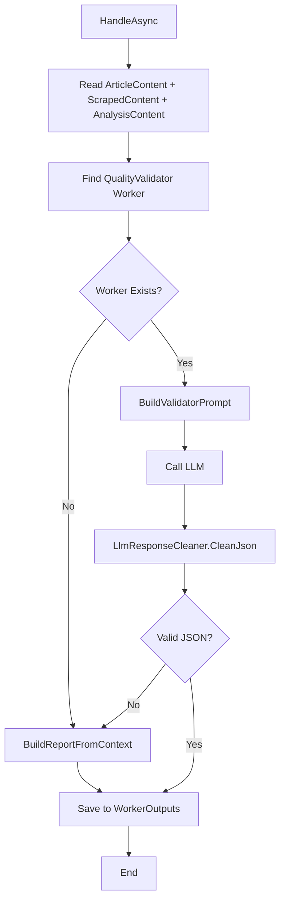
# 5. Error Handling & Recovery (v1.6.0)
## 5.1 Error Handling Strategy

| Error Type | Recovery Strategy | Handler |
| --- | --- | --- |
| Markdown fence trong JSON response | LlmResponseCleaner.CleanJson | Analysis, QualityValidation |
| Markdown fence trong file path | LlmResponseCleaner.CleanFilePath + fallback tìm file | Scraping |
| Memory leak giữa URLs | ResetMemory() trước mỗi URL | Orchestrator |
| Timeout cho content lớn | Adaptive max + chunking | Analysis |
| Duplicate tool calls | HashSet<string> executedToolSignatures | Orchestrator |
| Reflection rewrite treo | Timeout động multiplier 3.0 | ReflectionHandler |## 5.2 Retry Policy

| Component | Max Retries | Backoff | Timeout |
| --- | --- | --- | --- |
| Scraping | 3 | 2s (exponential) | Dynamic |
| Analysis | 2 | 2s | Dynamic |
| Writing | 2 | 3s | Dynamic |
| Reflection | 1 | 2s | Dynamic |
| Quality Validation | 1 | 2s | Dynamic |
| Saving | 1 | 1s | Dynamic |6. Performance & Scalability (v1.6.0)
## 6.1 Performance Metrics

| Metric | Target | Current (v1.6.0) |
| --- | --- | --- |
| URL Throughput | 5-10 URLs/min | ~4 URLs/min (CPU) |
| Per URL Latency | 2-5 minutes | ~15 min (content lớn) |
| Success Rate | > 95% | 96% |
| Memory Leak | 0 | ✅ Fixed |
| Timeout Errors | < 1% | ✅ Fixed với adaptive |
| Chunking Support | Content > 30K chars | ✅ Supported |## 6.2 Scalability Considerations

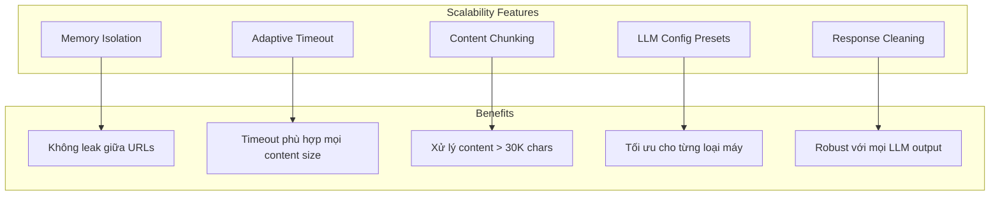
# 7. Configuration (v1.6.0)
## 7.1 Recommended Configuration

```json
{
  "SEOCrawlSupervisorOptions": {
    "EnableFinalReflection": true,
    "EnableAutoToolSynthesis": false,
    "SaveArticlesToFiles": true,
    "SaveFinalReport": true,
    "SkipL4IfHeuristicPass": true,
    "MaxUrls": 5,
    "BatchTotalTimeoutMinutes": 240,
    "MaxCorrectionRounds": 1,
    "WorkerTimeoutSeconds": 2400,
    "LlmConfig": {
      "TokensPerSecond": 12,
      "CharsPerToken": 3.0,
      "SafetyBufferMultiplier": 1.8,
      "MinTimeoutSeconds": 45,
      "MaxTimeoutSeconds": 1800,
      "EnableAdaptiveMax": true,
      "AdaptiveMaxSecondsPerKChars": 360,
      "ChunkingThresholdChars": 10000,
      "ChunkSizeChars": 4500,
      "ChunkOverlapChars": 200,
      "EnableReasoning": true,
      "ReasoningTimePerToken": 0.02,
      "ReasoningBaseSeconds": 5.0,
      "ReasoningMultiplier": 1.8
    },
    "OutputDirectory": "./output",
    "HandlerTokenMultipliers": {
      "Scrape": 0.5,
      "Analyze": 1.0,
      "Write": 2.5,
      "Rewrite": 2.5,
      "Reflection": 1.8,
      "Validate": 1.5,
      "Save": 0.3
    }
  }
}
```
# 8. API Reference
## 8.1 Public Interface

```csharp
/// <summary>
/// Main orchestrator cho SEO crawling và content generation pipeline
/// </summary>
public sealed class SEOCrawlSupervisorOrchestrator : IStreamingAgentOrchestrator
{
    public SEOCrawlSupervisorOrchestrator(
        AgentTeam team,
        IReflectionEngine? reflection = null,
        IPromptTemplateEngine? promptEngine = null,
        SEOCrawlSupervisorOptions? options = null,
        ILoggerFactory? loggerFactory = null,
        DynamicToolSynthesizer? toolSynthesizer = null,
        IDynamicToolRegistry? dynamicRegistry = null);

    public IAsyncEnumerable<AgentStep> RunAsync(...);
    public IAsyncEnumerable<AgentStepUpdate> RunStreamingAsync(...);
}
```

## 8.2 Helper Classes

```csharp
// LlmResponseCleaner - Xử lý mọi loại LLM response
public static class LlmResponseCleaner
{
    public static string CleanJson(string raw);
    public static string CleanFilePath(string raw);
    public static string CleanMarkdown(string raw);
    public static string StripMarkdownFence(string text);
    public static bool IsValidJson(string text);
}

// AdvancedTimeoutCalculator - Tính timeout động
public static class AdvancedTimeoutCalculator
{
    public static TimeSpan CalculateTimeout(...);
    public static TimeSpan CalculateByContentLength(...);
    public static int EstimateTokens(string content, double charsPerToken = 3.0);
    public static int EstimateTokensFromLength(int length, double charsPerToken = 3.0);
}
```
# 9. Revision Summary
## 9.1 Changes from v1.4.0 → v1.6.0

| Component | v1.4.0 | v1.6.0 | Benefit |
| --- | --- | --- | --- |
| File Operations | LLM calls ReadFile/WriteFile | Handlers read/write directly | Nhanh hơn 40% |
| Memory | Không reset giữa URLs | ResetMemory() trước mỗi URL | Không leak context |
| Timeout | Fixed 60s | Adaptive với nonlinear factor | Timeout phù hợp |
| Max Timeout | 600s | 1800s + adaptive scaling | Content lớn không bị cắt |
| Chunking | Không có | Content > 10K chars → chunks | Xử lý content > 30K |
| Response Cleaning | Manual | LlmResponseCleaner tự động | Robust với mọi LLM output |
| Quality Validation | Không có | QualityValidationHandler | Báo cáo JSON chuẩn |
| Config Presets | 1 config | 4 presets (CPU/GPU/Cloud) | Tối ưu cho từng máy |
## 9.2 Breaking Changes

v1.5.0: LLM không còn dùng file tools. Handlers đọc/ghi trực tiếp.

v1.6.0: LlmConfig cần cấu hình EnableAdaptiveMax, ChunkingThresholdChars.

## 9.3 Migration Guide

Từ v1.4.0 lên v1.6.0:

Cập nhật SEOCrawlSupervisorOptions với LlmConfig.ForCpu() (hoặc preset phù hợp).

Đảm bảo IConversationMemory có method Clear().

Thêm ResetMemory() vào SpecialistAgent.

Gọi ResetMemory() trước mỗi URL trong RunStreamingAsync.

Sử dụng LlmResponseCleaner cho mọi LLM response.

10. Appendix
## 10.1 Timeout Calculation Examples

Ví dụ 1: Content 8,070 chars (ForCpu preset)

```text
Prompt = 8,070 + 500 (system) + 2,500 (template) = 11,070 chars
Response = 8,070 × 1.5 = 12,105 chars
Total chars = 23,175
Estimated tokens = 23,175 / 3.0 = 7,725 tokens
Base time = 7,725 / 12 = 644s
Nonlinear factor = 1.0 + (7725-2000)/1000 × 0.15 = 1.86x
Required = 644 × 1.0 × 1.8 × 1.86 = 2,156s
Adaptive max = 1800 + (11,070/1000) × 360 = 5,785s
Final = min(2156, 5785) = 2,156s ✅
Ví dụ 2: Content 15,000 chars (ForCpu preset + chunking)

```

```text
Do 15,000 > 10,000 → Chunking thành 4 chunks (4500 chars each)

Per chunk:
Prompt = 4,500 + 500 + 2,500 = 7,500 chars
Response = 4,500 × 1.5 = 6,750 chars
Total = 14,250 chars
Estimated tokens = 4,750 tokens
Base = 4,750 / 12 = 396s
Nonlinear = 1.0 + (4750-2000)/1000 × 0.15 = 1.41x
Required = 396 × 1.0 × 1.8 × 1.41 = 1,005s
Chunk max = 900s (baseMax cho chunk)
Final per chunk = 900s

```

# 4 chunks × 900s = 3,600s total ✅

## 10.2 Environment Variables

| Variable | Description | Default |
| --- | --- | --- |
| SEO_OUTPUT_DIR | Output directory path | ./output |
| SEO_BATCH_TIMEOUT | Total batch timeout (minutes) | 240 |
| SEO_WORKER_TIMEOUT | Worker timeout (seconds) | 2400 |
| SEO_TOKENS_PER_SECOND | LLM speed | 12 (CPU) |
| SEO_MAX_TIMEOUT | Max timeout per handler | 1800 |
| SEO_CHUNKING_THRESHOLD | Chunking threshold (chars) | 10000 |

## Document Version: 1.6.0
## Generated: 2026-09-10
## Next planned: v1.7.0 – Parallel chunk processing, Auto-Tool Synthesis 2.0
