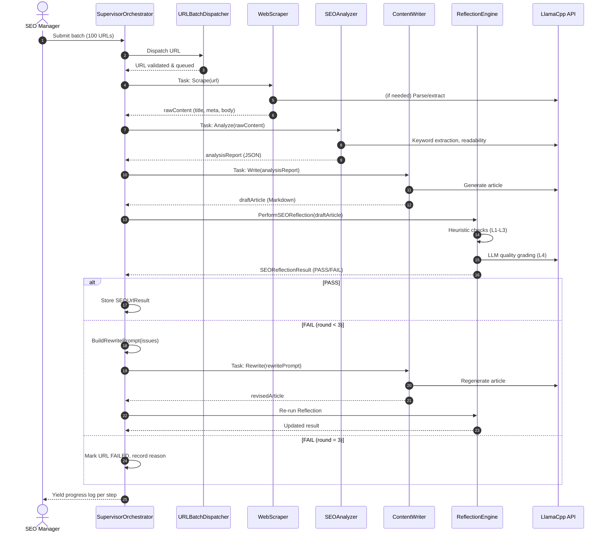
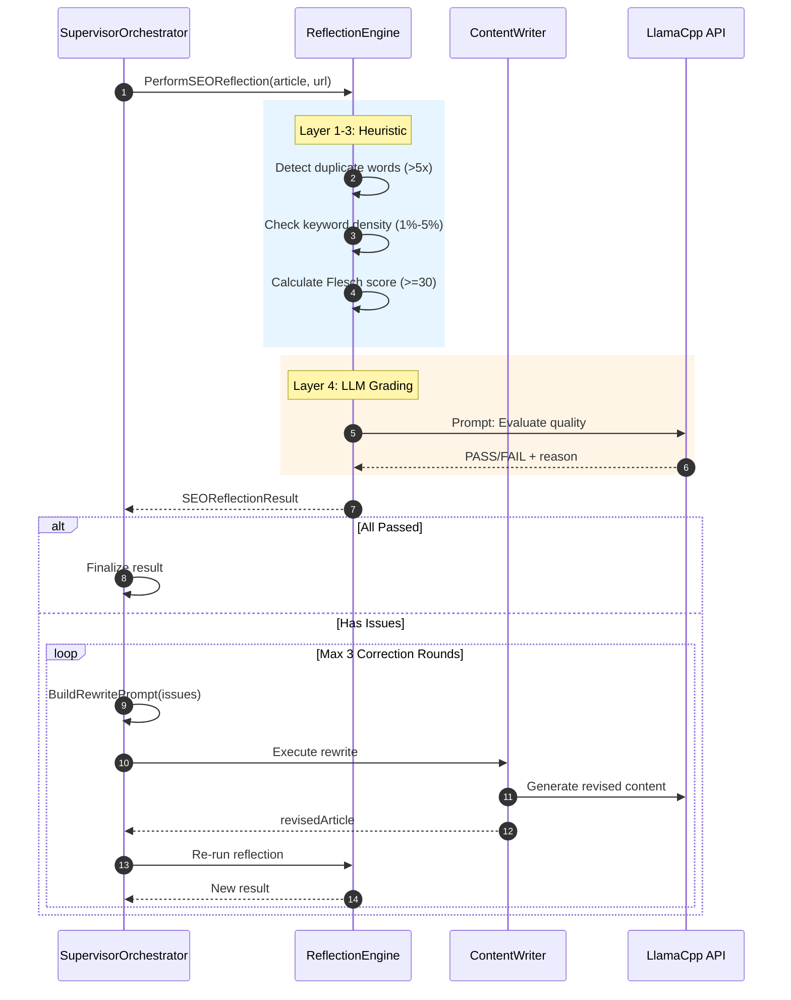
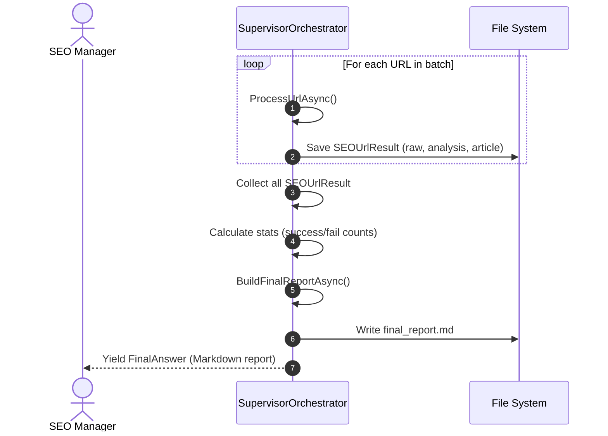
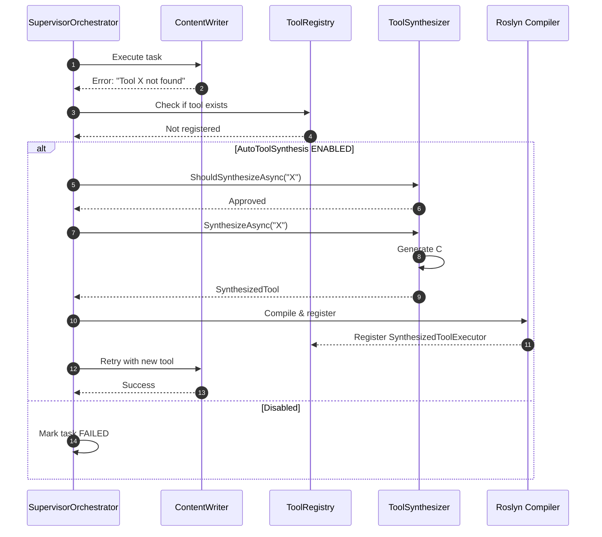

# SEO Content Crawl & Rewrite Orchestrator
## High-Level Design (HLD) & Detail Design Document

**Version:** 1.0  
**Date:** 2026-08-21  
**Author:** Hoang Nguyen Cong  
**Framework:** VnMLStudio.Plugin.LlamaCppSharp Agent Framework  
**Target Scale:** 100 URLs/batch, sequential processing with reflection loop

---

## Table of Contents

1. [Executive Summary](#1-executive-summary)
2. [High-Level Architecture](#2-high-level-architecture)
3. [System Context](#3-system-context)
4. [Component Overview](#4-component-overview)
5. [Data Flow](#5-data-flow)
6. [Technology Stack](#6-technology-stack)
7. [Detail Design](#7-detail-design)
   - 7.1 [Orchestrator Layer](#71-orchestrator-layer)
   - 7.2 [Agent Team](#72-agent-team)
   - 7.3 [Tool Registry](#73-tool-registry)
   - 7.4 [Reflection Engine](#74-reflection-engine)
   - 7.5 [Auto-Tool-Synthesis](#75-auto-tool-synthesis)
8. [Data Models](#8-data-models)
9. [Error Handling & Resilience](#9-error-handling--resilience)
10. [Security Considerations](#10-security-considerations)
11. [Performance & Scalability](#11-performance--scalability)
12. [Deployment Architecture](#12-deployment-architecture)
13. [API Contract](#13-api-contract)
14. [Test Plan](#14-test-plan)
15. [Appendix A: Tool Specifications](#appendix-a-tool-specifications)
16. [Appendix B: Configuration Reference](#appendix-b-configuration-reference)

---

## 1. Executive Summary

### 1.1 Purpose
Hệ thống **SEO Content Crawl & Rewrite Orchestrator** là một Multi-Agent System (MAS) chuyên biệt, được xây dựng trên framework `VnMLStudio.Plugin.LlamaCppSharp`, có khả năng:
- **Crawl** nội dung từ ~100 URL đối thủ
- **Phân tích** chiến lược SEO (từ khóa, cấu trúc, readability)
- **Viết lại** bài viết SEO gốc 100%, không duplicate
- **Validate** chất lượng qua Reflection Engine với heuristic + LLM grading
- **Re-plan** tự động nếu content không đạt chuẩn (tối đa 3 correction rounds)

### 1.2 Agent Level Classification
Theo thang phân loại Agent Autonomy, hệ thống này hoạt động ở **Level 4 (Self-Reflecting Agent với Hierarchical Planning)**:

| Level | Đặc điểm | Hệ thống này |
|-------|----------|--------------|
| L1 | Single-tool, hard-coded | ❌ |
| L2 | Multi-tool selection (ReAct) | ❌ |
| L3 | Hierarchical Planning (DAG) | ✅ Có DAG workflow |
| L4 | Self-Reflecting + Re-plan | ✅ **Reflection + Rewrite loop** |
| L5 | Self-Improving (sinh code) | ⚠️ Optional (AutoToolSynthesis) |

> **Quyết định kiến trúc:** Không dùng Level 5 (Roslyn dynamic compilation) cho pipeline SEO vì:
> - Các tool (Scrape/Analyze/Write) là **nghiệp vụ ổn định** — không cần sinh code runtime
> - Level 5 overhead ~15-20 giây/compile — quá chậm cho batch 100 URL
> - Level 4 giữ được **reflection + re-plan** — yếu tố quan trọng nhất cho chất lượng content

### 1.3 Non-Goals
- Không hỗ trợ real-time streaming crawl (batch processing only)
- Không tự động publish lên CMS (output là file/text)
- Không thay thế human editor (bản thảo cần human review trước publish)

---

## 2. High-Level Architecture

### 2.1 Architectural Pattern
**Hierarchical Multi-Agent with Supervisor-Orchestrator Pattern**

```
┌─────────────────────────────────────────────────────────────────────────┐
│                         USER INTERFACE LAYER                            │
│                    (CLI / API / Web Dashboard)                          │
└─────────────────────────────────────────────────────────────────────────┘
                                    │
                                    ▼
┌─────────────────────────────────────────────────────────────────────────┐
│                      ORCHESTRATOR LAYER (Level 4)                       │
│              SEOCrawlSupervisorOrchestrator (Singleton)                 │
│  ┌─────────────┐  ┌──────────────┐  ┌──────────────┐  ┌─────────────┐ │
│  │   PLANNER   │  │    ReAct     │  │  REFLECTION  │  │   Re-plan   │ │
│  │   (DAG)     │──│   Executor   │──│   Engine     │──│   Loop      │ │
│  └─────────────┘  └──────────────┘  └──────────────┘  └─────────────┘ │
└─────────────────────────────────────────────────────────────────────────┘
                                    │
                    ┌───────────────┼───────────────┐
                    ▼               ▼               ▼
┌─────────────────────────────────────────────────────────────────────────┐
│                         AGENT TEAM LAYER                                │
│  ┌──────────┐ ┌──────────┐ ┌──────────┐ ┌──────────┐ ┌──────────┐    │
│  │Dispatcher│ │ Scraper  │ │ Analyzer │ │  Writer  │ │ Validator│    │
│  │  (L3)    │ │  (L2)    │ │  (L3)    │ │  (L3)    │ │  (L4)    │    │
│  └──────────┘ └──────────┘ └──────────┘ └──────────┘ └──────────┘    │
└─────────────────────────────────────────────────────────────────────────┘
                                    │
                    ┌───────────────┼───────────────┐
                    ▼               ▼               ▼
┌─────────────────────────────────────────────────────────────────────────┐
│                         TOOL REGISTRY LAYER                             │
│  ┌─────────┐ ┌──────────┐ ┌───────────┐ ┌────────────┐ ┌───────────┐  │
│  │WebScraper│ │SEOAnalyze│ │ContentWrite│ │DataConvert │ │DirectQuery│  │
│  └─────────┘ └──────────┘ └───────────┘ └────────────┘ └───────────┘  │
│  ┌───────────┐ ┌────────────┐ ┌─────────────┐ ┌─────────────────────┐  │
│  │MathOperation│ │FactorialCalc│ │RunCommand   │ │DirectRequest (Session)│  │
│  └───────────┘ └────────────┘ └─────────────┘ └─────────────────────┘  │
└─────────────────────────────────────────────────────────────────────────┘
                                    │
                                    ▼
┌─────────────────────────────────────────────────────────────────────────┐
│                      INFRASTRUCTURE LAYER                               │
│  ┌────────────┐  ┌─────────────┐  ┌──────────────┐  ┌──────────────┐  │
│  │LlamaCpp API│  │InMemoryQueue│  │SlidingWindow │  │File System   │  │
│  │(Local LLM) │  │(Messenger)  │  │Memory        │  │(I/O)         │  │
│  └────────────┘  └─────────────┘  └──────────────┘  └──────────────┘  │
└─────────────────────────────────────────────────────────────────────────┘
```

### 2.2 Component Interaction

```
User Input (100 URLs)
       │
       ▼
[SEOCrawlSupervisorOrchestrator]
       │
       ├── Parse URLs ──► [URLBatchDispatcher]
       │
       ├── Per URL Loop ──► [WebScraper] ──► Raw HTML/Text
       │                           │
       │                           ▼
       │                    [SEOAnalyzer] ──► Analysis Report
       │                           │
       │                           ▼
       │                    [ContentWriter] ──► Draft Article
       │                           │
       │                           ▼
       │                    [QualityValidator]
       │                           │
       │              ┌────────────┴────────────┐
       │              │                         │
       │           PASS                      FAIL
       │              │                         │
       │              ▼                         ▼
       │         Finalize              [Re-plan Loop]
       │              │              (max 3 rounds)
       │              │                         │
       │              └────────► [ContentWriter] (Rewrite)
       │
       └── Aggregate ──► Final Report (Markdown)
```

---

## 3. System Context

### 3.1 Actors

| Actor | Description | Interaction |
|-------|-------------|-------------|
| **SEO Manager** | Người dùng cuối, cung cấp danh sách URL | Gửi batch URL, nhận báo cáo |
| **LLM Engine** | Gemma-4-3B / GPT-4o-mini | Tạo content, phân tích, reflection |
| **External Web** | Các website đối thủ | Được crawl qua HTTP |
| **File System** | Lưu trữ local | Lưu queue, report, article |

### 3.2 Use Cases

```
UC-01: Batch URL Dispatch
  Actor: SEO Manager
  Flow: Nhận 100 URL → Validate → Deduplicate → Chunk → Queue

UC-02: Competitor Content Extraction
  Actor: WebScraper Worker
  Flow: Fetch URL → Extract clean text → Remove noise → Save raw

UC-03: SEO Intelligence Analysis
  Actor: SEOAnalyzer Worker
  Flow: Đọc raw text → Keyword frequency → Density → Readability → Report

UC-04: Original Content Generation
  Actor: ContentWriter Worker
  Flow: Đọc analysis → Plan structure → Write article → Enforce SEO rules

UC-05: Quality Validation
  Actor: QualityValidator Worker
  Flow: Đọc article → Heuristic check → LLM reflection → PASS/FAIL

UC-06: Auto-Correction Loop
  Actor: SupervisorOrchestrator
  Flow: Nhận FAIL → Build rewrite prompt → Gửi Writer → Re-validate

UC-07: Final Report Aggregation
  Actor: SupervisorOrchestrator
  Flow: Collect all URL results → Stats → Export Markdown
```

---

## 4. Component Overview

### 4.1 Core Components

| Component | Type | Responsibility | File |
|-----------|------|----------------|------|
| `SEOCrawlSupervisorOrchestrator` | Orchestrator | Điều phối toàn pipeline, reflection, re-plan | `SEOCrawlSupervisorOrchestrator.cs` |
| `SEOCrawlContentTeamFactory` | Factory | Tạo AgentTeam với 5 workers + supervisor | `SEOCrawlContentTeamFactory.cs` |
| `AgentTeam` | Container | Quản lý workers, messenger, supervisor | Framework |
| `SpecialistAgent` | Worker | Thực thi task cụ thể với ReAct | Framework |
| `ReflectiveReActStreamingOrchestrator` | Sub-Orchestrator | ReAct streaming cho từng worker | Framework |

### 4.2 Tool Components

| Tool | Category | Key Capability | File |
|------|----------|----------------|------|
| `WebScraperTool` | Crawl | HTTP fetch, retry, noise removal | `WebScraperTool.cs` |
| `DirectRequestTool` | Crawl | Session-aware, cookie jar, download | `DirectRequestTool.cs` |
| `SEOAnalyzerTool` | Analysis | Keyword density, readability, headings | `SEOAnalyzerTool.cs` |
| `MathOperationTool` | Analysis | Statistics, expression evaluation | `MathOperationTool.cs` |
| `FactorialCalculationTool` | Analysis | Combinatorics (BigInteger) | `FactorialCalculationTool.cs` |
| `ContentWriterTool` | Generation | SEO article with mode/tone/structure | `ContentWriterTool.cs` |
| `DataConverterTool` | Utility | JSON/CSV/XML/Markdown/Plain text | `DataConverterTool.cs` |
| `DirectQueryTool` | Utility | Stateless HTTP API client | `DirectQueryTool.cs` |
| `RunCommandTool` | Utility | Shell command execution | `RunCommandTool.cs` |

---

## 5. Data Flow

### 5.1 Per-URL Processing Flow (Sequence)

```
Step  Actor              Action                              Output
───   ─────────────────  ──────────────────────────────────  ─────────────────────────
1     Supervisor         Parse input, detect URL #N          url, index, total
2     Supervisor         PlanWorkflow()                      [Dispatcher→Scraper→...]
3     Supervisor         Send task to WebScraper             taskPrompt
4     WebScraper         Execute WebScraperTool(url)         rawContent (15K chars)
5     WebScraper         Return result to Supervisor         resultText
6     Supervisor         Send task to SEOAnalyzer            rawContent + context
7     SEOAnalyzer        Execute SEOAnalyzerTool(text)       analysisReport (JSON)
8     SEOAnalyzer        Execute MathOperationTool(stats)    calculatedMetrics
9     SEOAnalyzer        Return result to Supervisor         combinedReport
10    Supervisor         Send task to ContentWriter          analysis + reference
11    ContentWriter      Execute ContentWriterTool(args)     draftArticle (Markdown)
12    ContentWriter      Return result to Supervisor         articleText
13    Supervisor         Trigger Reflection Engine           SEOReflectionResult
14    Reflection         Heuristic checks:                   Passed/Failed
                       - Duplicate words (>5x)
                       - Keyword density (1%-5%)
                       - Readability (>30 Flesch)
15    Reflection         LLM-based quality check             PASS/FAIL + reason
16    Supervisor         If FAIL → BuildRewritePrompt()      rewritePrompt
17    ContentWriter      Execute rewrite                     revisedArticle
18    Supervisor         Re-run Reflection (max 3 rounds)    finalQuality
19    Supervisor         Store result in SEOUrlResult        success/fail + content
20    Supervisor         Log completion                      [URL #N/100] DONE
```

### 5.2 Batch Aggregation Flow

```
After all URLs processed:
  Supervisor → Collect all SEOUrlResult
           → Calculate stats: successCount, failCount
           → BuildFinalReportAsync()
           → Generate Markdown report with:
               - Summary table (PASS/FAIL per URL)
               - Failure reasons
               - Article previews (500 chars)
               - Full articles section
           → Yield FinalAnswer to user
```

### 5.3 Sequence Diagrams (Mermaid)

#### 5.3.1 Single URL Processing Flow



#### 5.3.2 Reflection & Re-plan Loop (Detail)



#### 5.3.3 Batch Aggregation Flow



#### 5.3.4 Auto-Tool-Synthesis Flow



---

## 6. Technology Stack

| Layer | Technology | Version | Purpose |
|-------|-----------|---------|---------|
| **Runtime** | .NET | 10 | Core framework |
| **LLM** | Gemma-4-E2B (GGUF) | latest | Content generation, reflection |
| **LLM Binding** | LlamaCppSharp | 0.x | Local model inference |
| **HTTP** | HttpClient | Built-in | Web scraping, API calls |
| **JSON** | System.Text.Json | Built-in | Serialization, schema |
| **XML** | System.Xml.Linq | Built-in | XML conversion |
| **Regex** | System.Text.RegularExpressions | Built-in | Text extraction, parsing |
| **Math** | System.Numerics.BigInteger | Built-in | Large number factorial |
| **Process** | System.Diagnostics.Process | Built-in | Shell command execution |
| **Logging** | Microsoft.Extensions.Logging | Built-in | Structured logging |

---

## 7. Detail Design

### 7.1 Orchestrator Layer

#### 7.1.1 SEOCrawlSupervisorOrchestrator

```csharp
public sealed class SEOCrawlSupervisorOrchestrator : IStreamingAgentOrchestrator
```

**Responsibilities:**
- Parse và validate danh sách URL từ user input
- Lặp tuần tự qua từng URL (sequential để tránh rate limit)
- Điều phối workflow: Crawl → Analyze → Write → Validate
- Thực hiện **Reflection + Re-plan loop** cho ContentWriter output
- Tổng hợp báo cáo cuối cùng

**Key Methods:**

| Method | Return Type | Description |
|--------|-------------|-------------|
| `RunStreamingAsync` | `IAsyncEnumerable<AgentStepUpdate>` | Entry point, yield từng log step |
| `ProcessUrlAsync` | `Task<(SEOUrlResult, List<AgentStepUpdate>)>` | Xử lý 1 URL, trả về kết quả + updates |
| `PerformSEOReflectionAsync` | `Task<SEOReflectionResult>` | 4 tầng kiểm tra chất lượng |
| `BuildRewritePrompt` | `string` | Tạo prompt yêu cầu rewrite khi FAIL |
| `BuildFinalReportAsync` | `Task<string>` | Tổng hợp Markdown report |
| `RunWorkerWithAutoSynthesisAsync` | `Task<(string, List<string>)>` | Chạy worker + auto-synthesize tool nếu thiếu |

**Reflection Engine (4 Layers):**

```
Layer 1: Heuristic - Duplicate Word Detection
  └─ Regex: \b\w+\b, filter length>3, threshold>5 occurrences

Layer 2: Heuristic - Keyword Density
  └─ Top keyword count / total words
  └─ Pass if 1% <= density <= 5%

Layer 3: Heuristic - Readability (Flesch Reading Ease)
  └─ Formula: 206.835 - (1.015 * ASL) - (84.6 * ASW)
  └─ Pass if score >= 30

Layer 4: LLM-based Reflection
  └─ Prompt: Evaluate keyword stuffing, heading structure, tone, accuracy
  └─ Output: PASS/FAIL + one-line reason
```

**Re-plan Strategy:**
```
if (!reflectionResult.Passed):
    correctionRound = 0
    while (!passed && correctionRound < MaxCorrectionRounds):
        BuildRewritePrompt(worker, original, reflectionIssues, url)
        rewriteResult = RunWorkerToStringAsync(worker, rewritePrompt)
        reflectionResult = PerformSEOReflectionAsync(rewriteResult, url)
        correctionRound++

    if (!passed):
        Mark URL as FAILED, record FailureReason
```

### 7.2 Agent Team

#### 7.2.1 Team Composition

```
AgentTeam: "SEOCrawlContentTeam"
├── Supervisor: SEOCrawlSupervisor (SEOCrawlSupervisorOrchestrator)
├── Workers:
│   ├── [0] URLBatchDispatcher  (Role: Dispatcher)
│   ├── [1] WebScraper          (Role: Scraper)
│   ├── [2] SEOAnalyzer         (Role: Analyzer)
│   ├── [3] ContentWriter       (Role: Writer)
│   └── [4] QualityValidator    (Role: Validator)
└── Messenger: InMemoryAgentMessenger
```

#### 7.2.2 Worker Specifications

**URLBatchDispatcher**
- **Tools:** ReadFile, WriteFile, DataConverter
- **Input:** File path chứa danh sách URL hoặc raw text
- **Output:** Structured batch queue (JSON)
- **Logic:** Validate URL format, deduplicate, chunk

**WebScraper**
- **Tools:** WebScraper, DirectRequest, ReadFile, WriteFile
- **Input:** Single URL
- **Output:** Structured extraction (title, meta, headings, body, word_count)
- **Logic:** Ưu tiên WebScraperTool, fallback DirectRequestTool nếu cần session

**SEOAnalyzer**
- **Tools:** SEOAnalyzer, MathOperation, DataConverter, ReadFile, WriteFile
- **Input:** Raw scraped text
- **Output:** Analysis report JSON (keywords, density, readability, gaps)
- **Logic:** Dùng SEOAnalyzerTool cho metrics, MathOperationTool cho tính toán nâng cao

**ContentWriter**
- **Tools:** ContentWriter, DataConverter, ReadFile, WriteFile
- **Input:** Analysis report + reference content
- **Output:** Original SEO article (Markdown)
- **Logic:** Mode (new/rewrite/expand), Tone (seo/professional/friendly/persuasive), Structure hint

**QualityValidator**
- **Tools:** SEOAnalyzer, MathOperation, ReadFile, WriteFile
- **Input:** Written article + original analysis
- **Output:** Validation report JSON (PASS/FAIL per check)
- **Logic:** Re-run analysis tools để verify, không dựa vào ước tính

### 7.3 Tool Registry

#### 7.3.1 Tool Registration Pattern

```csharp
var tools = new ToolRegistry();
tools.Register(new WebScraperTool(loggerFactory.CreateLogger<WebScraperTool>()));
tools.Register(new SEOAnalyzerTool(loggerFactory.CreateLogger<SEOAnalyzerTool>()));
tools.Register(new ContentWriterTool(loggerFactory.CreateLogger<ContentWriterTool>()));
tools.Register(new DataConverterTool(loggerFactory.CreateLogger<DataConverterTool>()));
tools.Register(new FactorialCalculationTool(loggerFactory.CreateLogger<FactorialCalculationTool>()));
tools.Register(new DirectQueryTool(loggerFactory.CreateLogger<DirectQueryTool>()));
tools.Register(new MathOperationTool(loggerFactory.CreateLogger<MathOperationTool>()));
tools.Register(new RunCommandTool(loggerFactory.CreateLogger<RunCommandTool>()));
tools.Register(new DirectRequestTool(loggerFactory.CreateLogger<DirectRequestTool>()));
```

#### 7.3.2 Tool Interface Contract

```csharp
public interface IToolExecutor
{
    string FunctionName { get; }
    Task<ToolInvocationResult> ExecuteAsync(ToolCall toolCall, CancellationToken ct);
}

public interface IToolDescriptor
{
    ToolDefinition GetToolDefinition();
}

public class ToolInvocationResult
{
    public string FunctionName { get; set; } = "";
    public string Result { get; set; } = "";
    public bool IsError { get; set; }
    public string? ErrorMessage { get; set; }
}
```

### 7.4 Reflection Engine

#### 7.4.1 SEOReflectionResult Model

```csharp
public class SEOReflectionResult
{
    public bool Passed { get; set; }
    public List<string> Issues { get; set; } = new();
    public List<string> Suggestions { get; set; } = new();
}
```

#### 7.4.2 Reflection Decision Matrix

| Check | Threshold | Action on Fail |
|-------|-----------|----------------|
| Duplicate words | >5 occurrences of same word (length>3) | Yêu cầu dùng synonym |
| Keyword density | <1% or >5% | Yêu cầu điều chỉnh tần suất |
| Readability (Flesch) | <30 | Yêu cầu rút ngắn cau, đơn giản từ vựng |
| LLM quality flag | FAIL | Yêu cầu rewrite toàn bộ |

### 7.5 Auto-Tool-Synthesis

#### 7.5.1 Activation Conditions

```
IF (worker execution throws Exception) OR
   (output contains "I need a X tool") OR
   (output contains "Error: tool not found")
THEN:
   IF (AutoToolSynthesis ENABLED) AND
      (toolSynthesizer != null) AND
      (dynamicRegistry != null) AND
      (tool not attempted before)
   THEN:
      DetectMissingToolName() → Extract tool name
      toolSynthesizer.ShouldSynthesizeAsync() → Decision
      toolSynthesizer.SynthesizeAsync() → Generate C# code
      TryRegisterSynthesizedTool() → Compile/Register
      Retry worker execution
```

#### 7.5.2 SynthesizedToolExecutor

```csharp
private sealed class SynthesizedToolExecutor : IToolExecutor, IToolDescriptor
{
    // Constructor nhận SynthesizedTool + ILogger
    // GetToolDefinition(): Parse JsonSchema từ SynthesizedTool.JsonSchema
    // ExecuteAsync(): Ưu tiên ExecuteDelegate, fallback placeholder
}
```

---

## 8. Data Models

### 8.1 Core Models

```csharp
// Kết quả xử lý 1 URL
public class SEOUrlResult
{
    public string Url { get; set; } = "";
    public int Index { get; set; }
    public int Total { get; set; }
    public Dictionary<string, string> WorkerOutputs { get; set; } = new();
    public bool Success { get; set; }
    public string? FailureReason { get; set; }
    public int FinalStep { get; set; }
}

// Cấu hình Supervisor
public class SEOCrawlSupervisorOptions : SupervisorOptions
{
    public int MaxUrlBatchSize { get; set; } = 100;
    public bool EnableKeywordDensityCheck { get; set; } = true;
    public bool EnableDuplicateWordCheck { get; set; } = true;
    public bool EnableReadabilityCheck { get; set; } = true;
    public double MinKeywordDensity { get; set; } = 0.01;
    public double MaxKeywordDensity { get; set; } = 0.05;
    public int MaxDuplicateWordThreshold { get; set; } = 5;
    public double MinReadabilityScore { get; set; } = 30.0;
    public int MaxContentLength { get; set; } = 5000;
}
```

### 8.2 Tool Argument Models

| Tool | Args Class | Key Properties |
|------|-----------|----------------|
| WebScraper | `ScrapeArgs` | url, max_length |
| SEOAnalyzer | `AnalyzeArgs` | text, top_keywords |
| ContentWriter | `WriteArgs` | topic, reference_text, mode, tone, target_length, primary_keyword |
| DataConverter | `ConvertArgs` | data, from_format, to_format, delimiter, include_headers, pretty_print |
| MathOperation | `MathArgs` | operation, operands, expression, decimal_places |
| Factorial | `FactorialArgs` | operation, n, k, show_steps |
| DirectQuery | `QueryArgs` | url, method, headers, query_params, body, content_type, timeout_seconds |
| DirectRequest | `RequestArgs` | url, method, headers, body, body_type, form_data, download_path, session_id |
| RunCommand | `CommandArgs` | command, arguments, working_directory, timeout_seconds, environment_variables, shell |

---

## 9. Error Handling & Resilience

### 9.1 Retry Strategy

| Component | Max Retries | Backoff | Retryable Errors |
|-----------|-------------|---------|------------------|
| WebScraperTool | 3 | +10s timeout | Timeout, 5xx, 429 |
| DirectRequestTool | 0 (session state) | N/A | Connection errors |
| DirectQueryTool | 0 | N/A | Per request |
| ContentWriter | 3 (reflection loop) | Immediate | Quality FAIL |

### 9.2 Error Classification

```
CRITICAL (Skip URL, log error):
  - URL không hợp lệ
  - Web scrape fail sau 3 retries
  - Content validation fail sau 3 correction rounds

RECOVERABLE (Auto-fix):
  - Missing tool → Auto-synthesize
  - Keyword density slightly off → Rewrite
  - Duplicate words → Synonym replacement

WARNING (Log, continue):
  - Meta description too long/short
  - Readability marginal (25-30)
  - Word count slightly below target
```

### 9.3 Circuit Breaker Pattern (Recommended)

```
For batch processing:
  if (consecutive_failures >= 5):
      pause_batch()
      notify_user("Too many consecutive failures, possible rate limit or network issue")
      wait(60s)
      resume_batch()
```

---

## 10. Security Considerations

### 10.1 Input Validation

| Vector | Mitigation |
|--------|------------|
| Malicious URL | `Uri.TryCreate()` validation trước khi fetch |
| Command Injection | `RunCommandTool` chỉ chạy trusted commands, không concat user input trực tiếp |
| HTML/Script Injection | `WebUtility.HtmlDecode()` + regex strip `<script>` tags |
| JSON Injection | `JsonDocument.Parse()` với try/catch, không dùng `eval` |

### 10.2 Rate Limiting

```
- Sequential processing (1 URL at a time)
- Delay 5s giữa các request (configurable)
- User-Agent rotation (nếu cần mở rộng)
- Respect robots.txt (nếu cần mở rộng)
```

### 10.3 Data Privacy

- Không lưu cookie/session lâu dài (InMemoryAgentMessenger)
- Không gửi dữ liệu nhạy cảm ra LLM external (nếu dùng local model)
- File output chỉ lưu local, không upload cloud

---

## 11. Performance & Scalability

### 11.1 Time Budget (ước tính)

| Phase | Time/URL | 100 URLs |
|-------|----------|----------|
| Crawl | 3-8s | 5-13 min |
| Analyze | 2-4s | 3-7 min |
| Write | 5-15s | 8-25 min |
| Validate | 3-6s | 5-10 min |
| Re-plan (avg 1.2 rounds) | +5-10s | +8-17 min |
| **Total** | **~18-43s** | **~30-72 min** |

### 11.2 Memory Budget

| Component | Peak Memory |
|-----------|-------------|
| LLM Model (Gemma-4-3B GGUF) | ~3-6 GB |
| Per URL content | ~50 KB |
| 100 URL batch state | ~5 MB |
| Tool Registry | ~1 MB |
| **Total** | **~3-6 GB** |

### 11.3 Scalability Roadmap

```
Phase 1 (Current): Sequential, single machine
  └─ Throughput: ~100 URLs/hour

Phase 2 (Future): Parallel workers
  └─ Concurrent URL processing (5-10 parallel)
  └─ Throughput: ~500-1000 URLs/hour
  └─ Requires: Redis queue, worker pool

Phase 3 (Future): Distributed
  └─ Multi-machine agent cluster
  └─ Shared state via distributed memory
  └─ Throughput: ~10K+ URLs/hour
```

---

## 12. Deployment Architecture

### 12.1 Single Machine Deployment

```
┌────────────────────────────────────────┐
│           Host Machine                 │
│  ┌────────────────────────────────┐    │
│  │  .NET 8 Application            │    │
│  │  ┌────────────────────────┐    │    │
│  │  │ Agent Team (5 workers) │    │    │
│  │  │ + Supervisor           │    │    │
│  │  └────────────────────────┘    │    │
│  │  ┌────────────────────────┐    │    │
│  │  │ Tool Registry (9 tools)│    │    │
│  │  └────────────────────────┘    │    │
│  │  ┌────────────────────────┐    │    │
│  │  │ LlamaCppSharp (GGUF)   │    │    │
│  │  │ Model: gemma-4-3b      │    │    │
│  │  └────────────────────────┘    │    │
│  └────────────────────────────────┘    │
│  ┌────────────────────────────────┐    │
│  │  File System (output/)         │    │
│  │  - batch_queue.json            │    │
│  │  - url_01_raw.txt              │    │
│  │  - url_01_analysis.json        │    │
│  │  - url_01_article.md           │    │
│  │  - final_report.md             │    │
│  └────────────────────────────────┘    │
└────────────────────────────────────────┘
```

### 12.2 Docker Deployment (Future)

```dockerfile
FROM mcr.microsoft.com/dotnet/runtime:8.0
COPY ./publish /app
COPY ./models/gemma-4-3b.gguf /models/
ENV LLAMA_MODEL_PATH=/models/gemma-4-3b.gguf
WORKDIR /app
ENTRYPOINT ["dotnet", "SEOCrawlAgent.dll"]
```

---

## 13. API Contract

### 13.1 Orchestrator API

#### 13.1.1 IStreamingAgentOrchestrator

```csharp
public interface IStreamingAgentOrchestrator
{
    /// <summary>
    /// Entry point: chạy toàn bộ pipeline và yield từng step update.
    /// </summary>
    /// <param name="input">User input (URL list hoặc file path)</param>
    /// <param name="context">Agent context (session, memory, config)</param>
    /// <param name="ct">Cancellation token</param>
    /// <returns>Async stream of step updates</returns>
    IAsyncEnumerable<AgentStepUpdate> RunStreamingAsync(
        string input,
        AgentContext context,
        CancellationToken ct = default);
}
```

**Request Model:**

| Field | Type | Required | Description |
|-------|------|----------|-------------|
| `input` | `string` | Yes | Danh sách URL (newline-separated) hoặc file path |
| `context` | `AgentContext` | Yes | Session ID, memory window, tool registry reference |
| `ct` | `CancellationToken` | No | Hủy operation giữa chừng |

**Response Model (Stream):**

| Field | Type | Description |
|-------|------|-------------|
| `StepType` | `enum` | SYSTEM, PLANNER, REACT, REFLECTION, RESULT |
| `Message` | `string` | Human-readable log message |
| `Timestamp` | `DateTimeOffset` | Thời điểm phát sinh event |
| `Metadata` | `Dictionary<string,object>` | Optional: URL index, worker name, result preview |

#### 13.1.2 SEOCrawlSupervisorOrchestrator (Internal Methods)

```csharp
// Xử lý 1 URL đơn lẻ
Task<(SEOUrlResult result, List<AgentStepUpdate> updates)> ProcessUrlAsync(
    string url,
    int index,
    int total,
    AgentContext context,
    CancellationToken ct);

// Reflection engine
Task<SEOReflectionResult> PerformSEOReflectionAsync(
    string articleContent,
    string sourceUrl,
    CancellationToken ct);

// Build rewrite prompt từ reflection issues
string BuildRewritePrompt(
    SpecialistAgent writer,
    string originalContent,
    SEOReflectionResult reflection,
    string url);

// Tổng hợp báo cáo cuối
Task<string> BuildFinalReportAsync(
    List<SEOUrlResult> results,
    TimeSpan totalDuration,
    CancellationToken ct);
```

### 13.2 Agent Team API

#### 13.2.1 AgentTeam Contract

```csharp
public class AgentTeam
{
    public string TeamName { get; set; }           // "SEOCrawlContentTeam"
    public IAgent Supervisor { get; set; }          // SEOCrawlSupervisorOrchestrator
    public List<IAgent> Workers { get; set; }       // 5 workers
    public IAgentMessenger Messenger { get; set; }  // InMemoryAgentMessenger
    
    // Khởi động team với task
    Task<TeamExecutionResult> ExecuteAsync(
        string taskPrompt,
        AgentContext context,
        CancellationToken ct);
}
```

#### 13.2.2 Worker-to-Supervisor Message Contract

```csharp
public class AgentMessage
{
    public string MessageId { get; set; }        // UUID v4
    public string FromAgent { get; set; }        // Tên worker gửi
    public string ToAgent { get; set; }          // "Supervisor" hoặc tên worker khác
    public MessageType Type { get; set; }        // Task, Result, Error, Heartbeat
    public string Payload { get; set; }          // JSON hoặc plain text
    public DateTimeOffset SentAt { get; set; }
    public int Priority { get; set; }            // 0-10, default 5
}

public enum MessageType
{
    Task,      // Supervisor giao task
    Result,    // Worker trả kết quả
    Error,     // Worker báo lỗi
    Heartbeat, // Health check
    Replan     // Yêu cầu re-plan từ Reflection
}
```

### 13.3 Tool Registry API

#### 13.3.1 IToolExecutor & IToolDescriptor

```csharp
public interface IToolExecutor
{
    string FunctionName { get; }
    
    /// <summary>
    /// Thực thi tool với arguments từ LLM
    /// </summary>
    /// <param name="toolCall">Tên tool + parsed arguments</param>
    /// <param name="ct">Cancellation token</param>
    /// <returns>Kết quả hoặc lỗi</returns>
    Task<ToolInvocationResult> ExecuteAsync(ToolCall toolCall, CancellationToken ct);
}

public interface IToolDescriptor
{
    /// <summary>
    /// Trả về JSON Schema để LLM biết cách gọi tool
    /// </summary>
    ToolDefinition GetToolDefinition();
}

public class ToolInvocationResult
{
    public string FunctionName { get; set; } = "";
    public string Result { get; set; } = "";
    public bool IsError { get; set; }
    public string? ErrorMessage { get; set; }
    public TimeSpan ExecutionDuration { get; set; }
    public int RetryCount { get; set; }
}
```

#### 13.3.2 ToolRegistry Operations

```csharp
public class ToolRegistry
{
    // Đăng ký tool
    void Register(IToolExecutor tool);
    
    // Hủy đăng ký
    bool Unregister(string functionName);
    
    // Tìm tool theo tên
    IToolExecutor? Resolve(string functionName);
    
    // Lấy tất cả definitions cho LLM
    List<ToolDefinition> GetAllDefinitions();
    
    // Đăng ký tool động (Auto-Synthesis)
    bool TryRegisterSynthesizedTool(SynthesizedTool tool, out string? error);
}
```

### 13.4 Reflection Engine API

#### 13.4.1 SEOReflectionResult

```csharp
public class SEOReflectionResult
{
    public bool Passed { get; set; }
    public List<SEOCheckResult> Checks { get; set; } = new();
    public List<string> Issues { get; set; } = new();
    public List<string> Suggestions { get; set; } = new();
    public double OverallScore { get; set; }  // 0.0 - 1.0
    public DateTimeOffset EvaluatedAt { get; set; }
}

public class SEOCheckResult
{
    public string CheckName { get; set; }      // "DuplicateWords", "KeywordDensity", ...
    public bool Passed { get; set; }
    public double? NumericValue { get; set; }  // e.g., density = 0.025
    public string? Threshold { get; set; }   // e.g., "1%-5%"
    public string? Message { get; set; }
}
```

#### 13.4.2 Reflection Request/Response

```csharp
// Request
public class ReflectionRequest
{
    public string Content { get; set; }           // Article Markdown
    public string SourceUrl { get; set; }         // URL gốc (để context)
    public SEOCrawlSupervisorOptions Options { get; set; }
    public List<string>? PreviousIssues { get; set; }  // Issues từ round trước
}

// Response
public class ReflectionResponse
{
    public SEOReflectionResult Result { get; set; }
    public int CorrectionRound { get; set; }      // 0 = first check
    public TimeSpan ProcessingTime { get; set; }
}
```

### 13.5 Data Model Contracts (JSON Schema)

#### 13.5.1 SEOUrlResult Schema

```json
{
  "$schema": "http://json-schema.org/draft-07/schema#",
  "title": "SEOUrlResult",
  "type": "object",
  "required": ["url", "index", "total", "success"],
  "properties": {
    "url": { "type": "string", "format": "uri" },
    "index": { "type": "integer", "minimum": 1 },
    "total": { "type": "integer", "minimum": 1 },
    "workerOutputs": {
      "type": "object",
      "additionalProperties": { "type": "string" },
      "description": "Key: worker name, Value: output text"
    },
    "success": { "type": "boolean" },
    "failureReason": { "type": ["string", "null"] },
    "finalStep": { "type": "integer", "minimum": 0, "maximum": 20 },
    "processingDurationMs": { "type": "integer" },
    "correctionRoundsUsed": { "type": "integer", "minimum": 0, "maximum": 3 }
  }
}
```

#### 13.5.2 Analysis Report Schema

```json
{
  "$schema": "http://json-schema.org/draft-07/schema#",
  "title": "SEOAnalysisReport",
  "type": "object",
  "required": ["url", "wordCount", "topKeywords", "readability"],
  "properties": {
    "url": { "type": "string" },
    "title": { "type": "string" },
    "metaDescription": { "type": "string" },
    "wordCount": { "type": "integer" },
    "topKeywords": {
      "type": "array",
      "items": {
        "type": "object",
        "properties": {
          "word": { "type": "string" },
          "count": { "type": "integer" },
          "density": { "type": "number" }
        }
      }
    },
    "headings": {
      "type": "object",
      "properties": {
        "h1": { "type": "array", "items": { "type": "string" } },
        "h2": { "type": "array", "items": { "type": "string" } },
        "h3": { "type": "array", "items": { "type": "string" } }
      }
    },
    "readability": {
      "type": "object",
      "properties": {
        "fleschScore": { "type": "number" },
        "avgSentenceLength": { "type": "number" },
        "avgSyllablesPerWord": { "type": "number" }
      }
    },
    "suggestions": { "type": "array", "items": { "type": "string" } }
  }
}
```

### 13.6 Error Response Contract

```csharp
public class OrchestratorError
{
    public string ErrorCode { get; set; }       // e.g., "URL_INVALID", "SCRAPE_TIMEOUT"
    public string Message { get; set; }
    public string? Url { get; set; }              // URL liên quan (nếu có)
    public ErrorSeverity Severity { get; set; }   // Critical, Recoverable, Warning
    public DateTimeOffset Timestamp { get; set; }
    public string? StackTrace { get; set; }     // Debug mode only
}

public enum ErrorSeverity
{
    Critical,    // Skip URL, dừng batch nếu >= 5 consecutive
    Recoverable, // Auto-retry hoặc auto-fix
    Warning      // Log và tiếp tục
}
```

---

## 14. Test Plan

### 14.1 Test Strategy

| Level | Type | Tool | Responsibility | Coverage Target |
|-------|------|------|----------------|-----------------|
| **Unit** | Component isolation | xUnit + NSubstitute | Developer | >80% business logic |
| **Integration** | Multi-component | xUnit + TestContainers | Developer | All tool chains |
| **E2E** | Full pipeline | Custom test harness | QA | 5 critical paths |
| **Performance** | Load & stress | BenchmarkDotNet | DevOps | Baseline + regression |
| **Security** | Vulnerability scan | OWASP ZAP (future) | Security | Input vectors |

### 14.2 Unit Test Cases

#### 14.2.1 Orchestrator Layer Tests

| Test ID | Component | Scenario | Input | Expected | Priority |
|---------|-----------|----------|-------|----------|----------|
| UT-ORC-01 | `SEOCrawlSupervisorOrchestrator` | Parse valid URL list | 100 URLs newline-separated | `List<string>` count = 100 | P0 |
| UT-ORC-02 | `SEOCrawlSupervisorOrchestrator` | Parse empty input | `""` | `ArgumentException` | P1 |
| UT-ORC-03 | `SEOCrawlSupervisorOrchestrator` | Parse malformed URL | `"not-a-url"` | Filter out, log warning | P1 |
| UT-ORC-04 | `SEOCrawlSupervisorOrchestrator` | Deduplicate URLs | 3 duplicate in 10 | Result = 8 unique | P1 |
| UT-ORC-05 | `ProcessUrlAsync` | Happy path | Valid URL | `SEOUrlResult.Success = true` | P0 |
| UT-ORC-06 | `ProcessUrlAsync` | Scrape failure | 404 URL | `Success = false`, `FailureReason = "SCRAPE_FAIL"` | P0 |
| UT-ORC-07 | `PerformSEOReflectionAsync` | All heuristic pass | Good article | `Passed = true`, 0 issues | P0 |
| UT-ORC-08 | `PerformSEOReflectionAsync` | Duplicate words detected | "SEO SEO SEO..." | `Passed = false`, issue = "DuplicateWords" | P0 |
| UT-ORC-09 | `PerformSEOReflectionAsync` | Keyword density too high | 15% density | `Passed = false`, issue = "KeywordDensity" | P0 |
| UT-ORC-10 | `PerformSEOReflectionAsync` | Readability too low | Complex text | `Passed = false`, issue = "Readability" | P0 |
| UT-ORC-11 | `BuildRewritePrompt` | Generate prompt from issues | 2 issues | Prompt contains both issues + original text | P1 |
| UT-ORC-12 | `BuildFinalReportAsync` | Aggregate 100 results | Mixed pass/fail | Markdown with stats table | P1 |

#### 14.2.2 Reflection Engine Tests

| Test ID | Component | Scenario | Input | Expected | Priority |
|---------|-----------|----------|-------|----------|----------|
| UT-REF-01 | Duplicate word check | No duplicates | Normal text | Pass | P0 |
| UT-REF-02 | Duplicate word check | 6x "optimization" | "optimization" x6 | Fail, threshold = 5 | P0 |
| UT-REF-03 | Keyword density | 2.5% density | 25 keywords / 1000 words | Pass (1%-5%) | P0 |
| UT-REF-04 | Keyword density | 0.5% density | 5 keywords / 1000 words | Fail, too low | P0 |
| UT-REF-05 | Flesch readability | Score = 45 | Simple text | Pass (>=30) | P0 |
| UT-REF-06 | Flesch readability | Score = 15 | Academic text | Fail | P0 |
| UT-REF-07 | LLM reflection | PASS response | LLM returns "PASS" | `Passed = true` | P0 |
| UT-REF-08 | LLM reflection | FAIL response | LLM returns "FAIL: keyword stuffing" | `Passed = false`, issue captured | P0 |

#### 14.2.3 Tool Tests

| Test ID | Tool | Scenario | Input | Expected | Priority |
|---------|------|----------|-------|----------|----------|
| UT-TOOL-01 | `WebScraperTool` | Valid HTML page | `<html><body>Test</body></html>` | "Test", noise removed | P0 |
| UT-TOOL-02 | `WebScraperTool` | Retry on timeout | Simulated timeout | Retry 3x then fail | P0 |
| UT-TOOL-03 | `SEOAnalyzerTool` | Extract keywords | 500-word article | Top 10 keywords with density | P0 |
| UT-TOOL-04 | `ContentWriterTool` | Generate article | Topic + analysis | Markdown with H1, H2, H3 | P0 |
| UT-TOOL-05 | `DataConverterTool` | JSON to CSV | `[{"a":1}]` | CSV with headers | P1 |
| UT-TOOL-06 | `MathOperationTool` | Mean calculation | `[1,2,3,4,5]` | `3.0` | P1 |
| UT-TOOL-07 | `RunCommandTool` | Echo command | `echo "hello"` | "hello" | P2 |

### 14.3 Integration Test Cases

| Test ID | Flow | Components | Setup | Expected | Priority |
|---------|------|------------|-------|----------|----------|
| IT-FLOW-01 | Crawl → Analyze | Scraper + Analyzer | Mock HTTP server | Analysis report generated | P0 |
| IT-FLOW-02 | Analyze → Write | Analyzer + Writer | Analysis JSON | Article references keywords | P0 |
| IT-FLOW-03 | Write → Reflect | Writer + Reflection | Draft article | Reflection result produced | P0 |
| IT-FLOW-04 | Full loop with rewrite | All 4 workers | Article with issues | Revised article after 1 round | P0 |
| IT-FLOW-05 | Auto-tool-synthesis | Supervisor + Synthesizer | Missing tool request | New tool registered & executed | P1 |
| IT-FLOW-06 | Batch 10 URLs | Full pipeline | 10 real URLs | 10 results + final report | P0 |
| IT-FLOW-07 | Circuit breaker | Supervisor + Scraper | 5 consecutive 500 errors | Pause + resume | P2 |

### 14.4 E2E Test Scenarios

| Test ID | Scenario | Steps | Acceptance Criteria | Priority |
|---------|----------|-------|---------------------|----------|
| E2E-01 | Single URL end-to-end | 1. Input 1 URL<br>2. Run pipeline<br>3. Verify output files | Article generated, reflection PASS, files saved | P0 |
| E2E-02 | Batch 100 URLs | 1. Input 100 URLs<br>2. Run batch<br>3. Verify report | All 100 processed, report with stats | P0 |
| E2E-03 | Reflection correction loop | 1. Input low-quality content trigger<br>2. Verify rewrite | Article improved after <=3 rounds | P0 |
| E2E-04 | Invalid URL handling | 1. Input 50% invalid URLs<br>2. Run pipeline | Invalid skipped, valid processed, report notes failures | P1 |
| E2E-05 | Cancellation mid-batch | 1. Start 100 URL batch<br>2. Cancel at URL #50 | Graceful stop, partial results saved | P1 |

### 14.5 Performance Test Cases

| Test ID | Metric | Target | Method | Priority |
|---------|--------|--------|--------|----------|
| PERF-01 | Throughput | >=100 URLs/hour | Benchmark 100 URL batch | P0 |
| PERF-02 | Per-URL latency | <=45s (p95) | Measure 100 samples | P0 |
| PERF-03 | Memory peak | <=6 GB | dotMemory / BenchmarkDotNet | P0 |
| PERF-04 | Reflection overhead | <=30% of write time | Compare with/without reflection | P1 |
| PERF-05 | LLM token throughput | >=50 tokens/sec | Benchmark LlamaCppSharp | P1 |
| PERF-06 | Concurrent tool calls | No deadlock | Stress test 50 parallel tools | P2 |

### 14.6 Security Test Cases

| Test ID | Vector | Test | Expected | Priority |
|---------|--------|------|----------|----------|
| SEC-01 | Malicious URL | Input `javascript:alert(1)` | Rejected by `Uri.TryCreate` | P0 |
| SEC-02 | Command injection | Input `; rm -rf /` | Not passed to `RunCommandTool` | P0 |
| SEC-03 | HTML injection | Scrape page with `<script>` | Script tags stripped | P0 |
| SEC-04 | Large payload | Input 10MB single line | Handled gracefully, no OOM | P1 |
| SEC-05 | Rate limit respect | 100 rapid requests | Delay 5s between requests | P1 |

### 14.7 Test Data

#### 14.7.1 Mock URLs

| ID | URL | Expected Behavior |
|----|-----|-------------------|
| MOCK-01 | `https://example.com/seo-guide` | Returns valid HTML, 200 OK |
| MOCK-02 | `https://example.com/timeout` | Times out (simulate) |
| MOCK-03 | `https://example.com/404` | Returns 404 |
| MOCK-04 | `https://example.com/500` | Returns 500, retry then fail |
| MOCK-05 | `not-a-url` | Invalid, filtered |
| MOCK-06 | `https://example.com/duplicate` | Duplicate of MOCK-01 |

#### 14.7.2 Sample Articles for Reflection Testing

| ID | Description | Expected Reflection |
|----|-------------|---------------------|
| ART-01 | Well-structured SEO article | PASS |
| ART-02 | Keyword stuffed ("SEO" x20 in 200 words) | FAIL - KeywordDensity |
| ART-03 | Complex academic language | FAIL - Readability |
| ART-04 | Repeated phrases | FAIL - DuplicateWords |
| ART-05 | Good content but missing headings | FAIL - LLM quality |

### 14.8 Test Environment

```
Local Dev:
  OS: Windows 11 / Ubuntu 22.04
  .NET: 8.0 SDK
  LLM: Gemma-4-3B GGUF (local)
  
CI/CD (GitHub Actions):
  OS: ubuntu-latest
  .NET: 8.0
  LLM: Mocked (NSubstitute) hoặc GPT-4o-mini API key
  
Staging:
  Docker container
  Volume mount: ./models /models
  Env: LLAMA_MODEL_PATH=/models/gemma-4-3b.gguf
```

### 14.9 Test Schedule

| Phase | Duration | Tests | Exit Criteria |
|-------|----------|-------|---------------|
| Sprint 0-1 | 2 weeks | UT-ORC-01 to UT-TOOL-07 | 100% P0 pass |
| Sprint 2 | 1 week | IT-FLOW-01 to IT-FLOW-07 | 100% P0 pass, 80% P1 pass |
| Sprint 3 | 1 week | E2E-01 to E2E-05 | All P0 pass |
| Sprint 4 | 3 days | PERF-01 to PERF-06 | Meet all targets |
| Sprint 5 | 2 days | SEC-01 to SEC-05 | No critical vulnerabilities |

### 14.10 Defect Severity Classification

| Severity | Definition | Example | Response Time |
|----------|------------|---------|---------------|
| **S1** | Pipeline crash / data loss | NullReference in Supervisor | Fix within 4h |
| **S2** | Feature broken, workaround exists | Reflection always FAIL | Fix within 1 day |
| **S3** | Minor issue, cosmetic | Log format incorrect | Fix within 3 days |
| **S4** | Enhancement / suggestion | Add more metrics | Next sprint |

---

### A.1 WebScraperTool

```yaml
Name: WebScraper
Input: { url: string, max_length: int(15000) }
Output: Clean text extraction with metadata
Retry: 3 attempts, +10s timeout per attempt
Noise Removal: script, style, nav, footer, aside, noscript, form elements
```

### A.2 SEOAnalyzerTool

```yaml
Name: SEOAnalyzer
Input: { text: string, top_keywords: int(10) }
Output: Markdown report with:
  - Top keywords (word, count, density%)
  - Heading structure (H1-H6 detection)
  - Flesch readability score
  - Improvement suggestions
Stop Words: 80+ English + Vietnamese common words
```

### A.3 ContentWriterTool

```yaml
Name: ContentWriter
Input: { topic?, reference_text?, primary_keyword?, secondary_keywords?, mode, tone, target_length, structure? }
Modes: new | rewrite | expand
Tones: seo | professional | friendly | persuasive | informative
Structures: review | guide | listicle | comparison
Auto-features:
  - Guess primary keyword if not provided
  - Auto-add FAQ if content < 70% target length
  - Enforce H1/H2/H3 structure
```

### A.4 DataConverterTool

```yaml
Name: DataConverter
Formats: json | csv | xml | markdown | text
Features:
  - CSV delimiter customization (; default)
  - Pretty-print JSON/XML
  - Header inclusion
  - XML name sanitization
  - Markdown table generation
```

### A.5 MathOperationTool

```yaml
Name: MathOperation
Operations: 30+
Categories:
  - Arithmetic: add, subtract, multiply, divide, modulo
  - Power/Root: power, sqrt, cbrt, root
  - Log: log, log10, ln, exp
  - Round: abs, round, floor, ceiling, truncate
  - Trig: sin, cos, tan, asin, acos, atan
  - Stats: mean, median, mode, stddev, variance, min, max, sum, product
  - Expression: evaluate (DataTable.Compute)
```

### A.6 FactorialCalculationTool

```yaml
Name: FactorialCalculation
Operations: factorial, permutation, combination, double_factorial, stirling_approx
Data Type: BigInteger (unlimited precision)
Max n: 10,000
Features: show_steps (for n <= 20), scientific notation for large results
```

### A.7 DirectQueryTool

```yaml
Name: DirectQuery
Methods: GET, POST, PUT, DELETE, PATCH
Features:
  - Custom headers
  - Query parameters
  - Raw body with content-type
  - Timeout (default 60s)
  - Auto JSON pretty-print
State: Stateless
```

### A.8 DirectRequestTool

```yaml
Name: DirectRequest
Methods: GET, POST, PUT, DELETE, PATCH, HEAD, OPTIONS
Features:
  - CookieContainer (session persistence)
  - Form data (application/x-www-form-urlencoded)
  - File download (binary save)
  - Binary content detection
  - Response headers dump
  - Auto-redirect (10 max)
State: Stateful (cookie jar maintained)
```

### A.9 RunCommandTool

```yaml
Name: RunCommand
Shells: cmd, powershell, bash, sh, zsh (auto-detect OS)
Features:
  - Working directory
  - Environment variables
  - Timeout with auto-kill (default 60s)
  - Separate stdout/stderr capture
  - Exit code reporting
Security: Warning — only run trusted commands
```

---

## Appendix B: Configuration Reference

### B.1 SEOCrawlSupervisorOptions

```json
{
  "maxUrlBatchSize": 100,
  "enableKeywordDensityCheck": true,
  "enableDuplicateWordCheck": true,
  "enableReadabilityCheck": true,
  "minKeywordDensity": 0.01,
  "maxKeywordDensity": 0.05,
  "maxDuplicateWordThreshold": 5,
  "minReadabilityScore": 30.0,
  "maxContentLength": 5000,
  "enableAutoToolSynthesis": false,
  "enableAutoFix": true,
  "enableFinalReflection": true,
  "maxCorrectionRounds": 3
}
```

### B.2 AgentDefinition Defaults

```json
{
  "maxIterations": 5,
  "maxToolRounds": 2,
  "toolTimeout": "00:10:00",
  "allowedTools": ["ReadFile", "WriteFile", "WebScraper", "SEOAnalyzer", "ContentWriter"]
}
```

### B.3 Log Format

```
[HH:mm:ss][SYSTEM] == KHOI DONG CHUOI TAC VU: URL #01 ==
[HH:mm:ss][PLANNER] Phat hien 100 URL can xu ly. Lap ke hoach DAG...
[HH:mm:ss][REACT] Kich hoat [WebScraper] ── Thuc thi ReAct Streaming...
[HH:mm:ss][SYSTEM] WebScraper: Tra ve thanh cong du lieu tho (4200 ky tu).
[HH:mm:ss][REACT] Kich hoat [SEOAnalyzer] ── Phan tich tu khoa nang cao.
[HH:mm:ss][REFLECTION] Dang kiem tra chat luong dau ra (Reflection Engine)...
[HH:mm:ss][REFLECTION] Kiem tra dau ra: Dat chuan 100%!
[HH:mm:ss][SYSTEM] == HOAN THANH TAC VU URL #01 (Tong thoi gian: 32 giay) ==
```

---

## Revision History

| Version | Date | Author | Changes |
|---------|------|--------|---------|
| 1.0 | 2026-08-21 | Hoang Nguyen Cong | Initial HLD & Detail Design |

---

