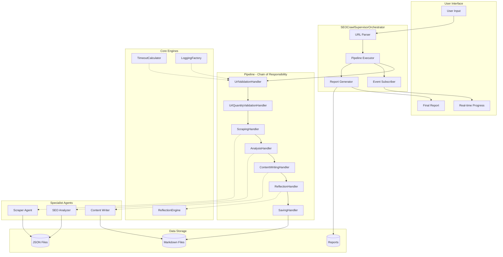
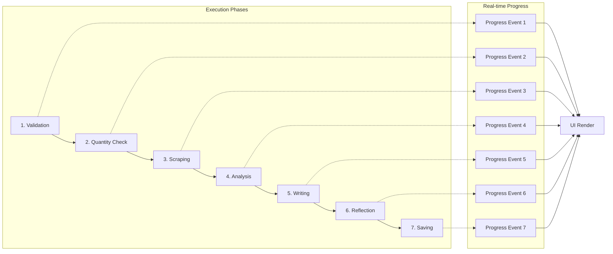
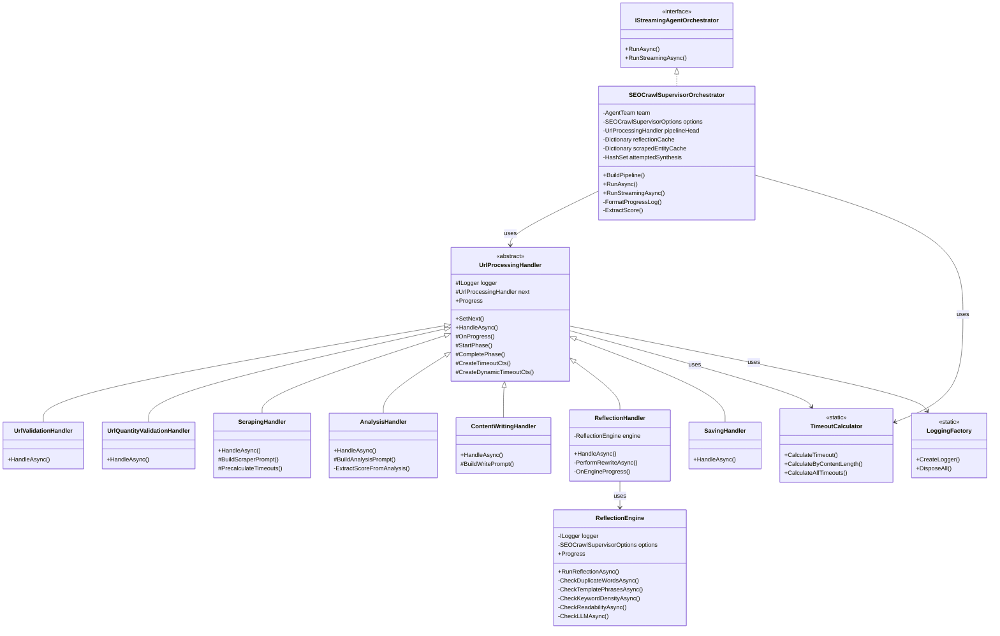
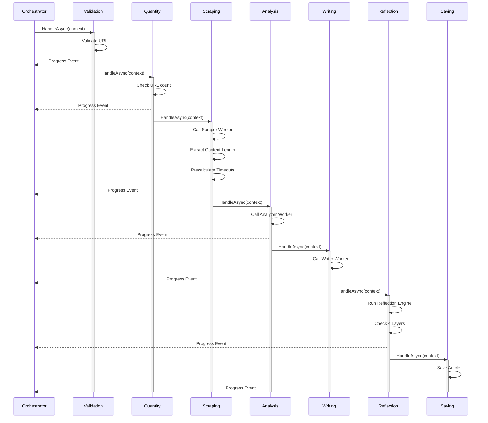
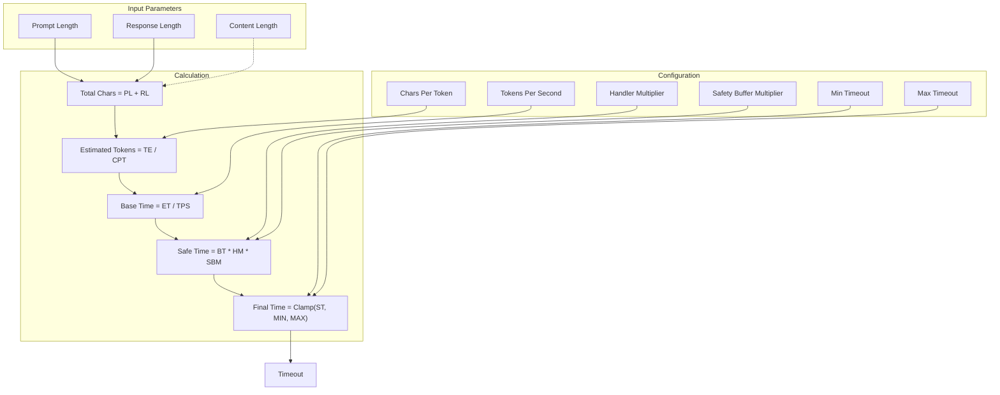
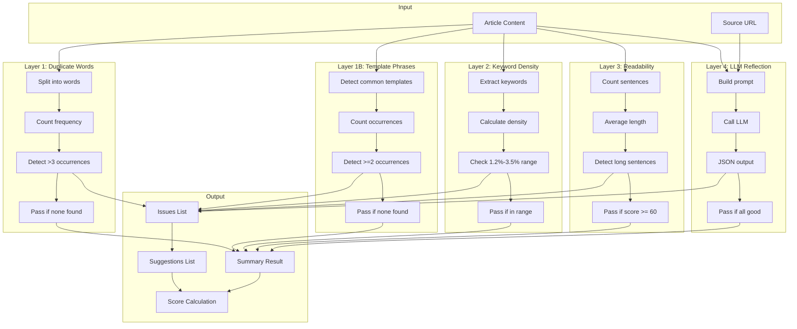
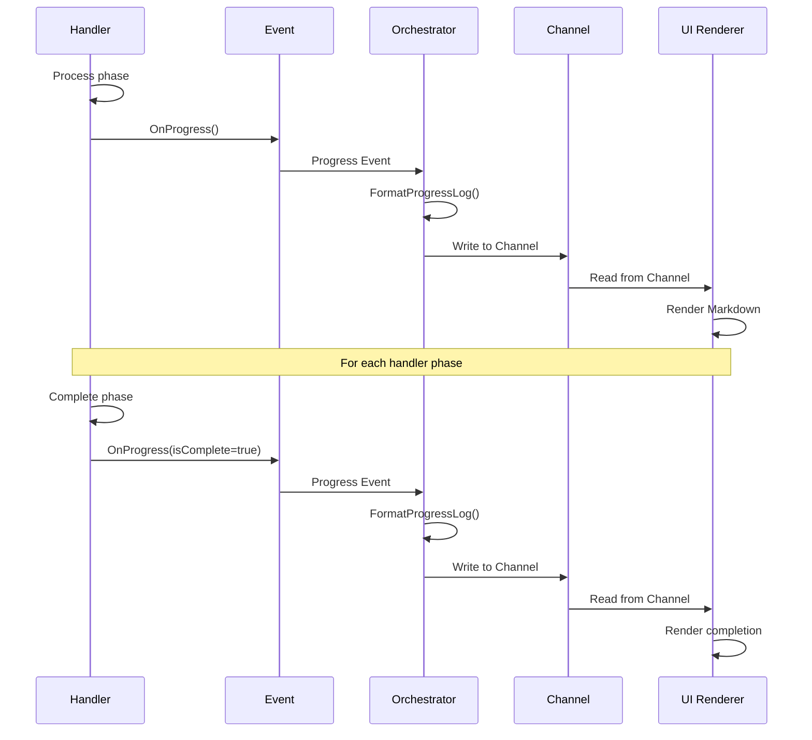
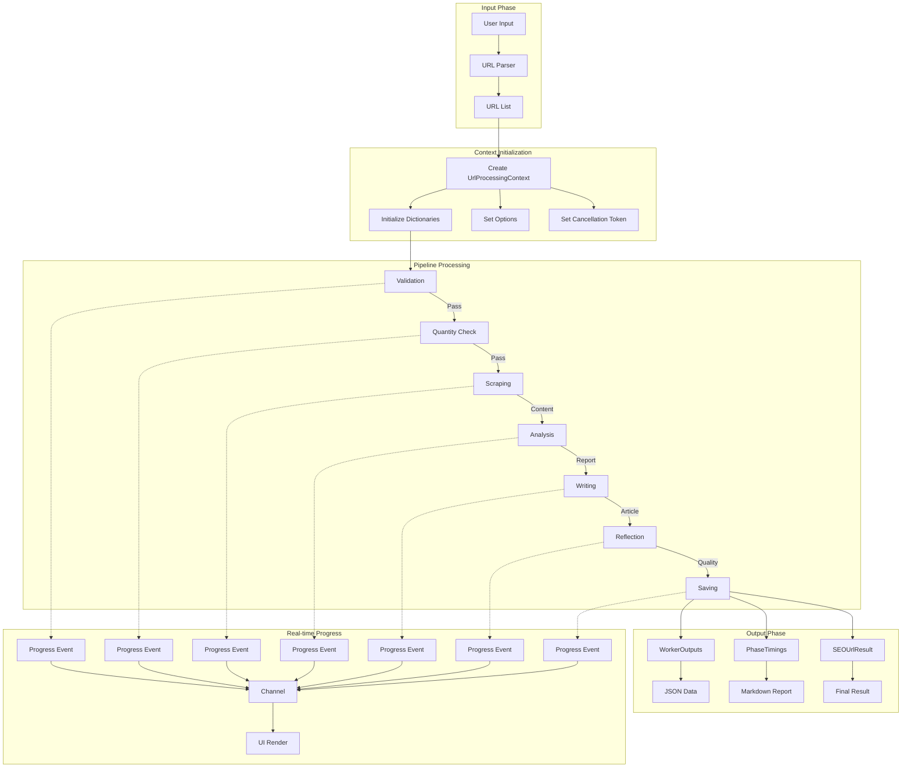
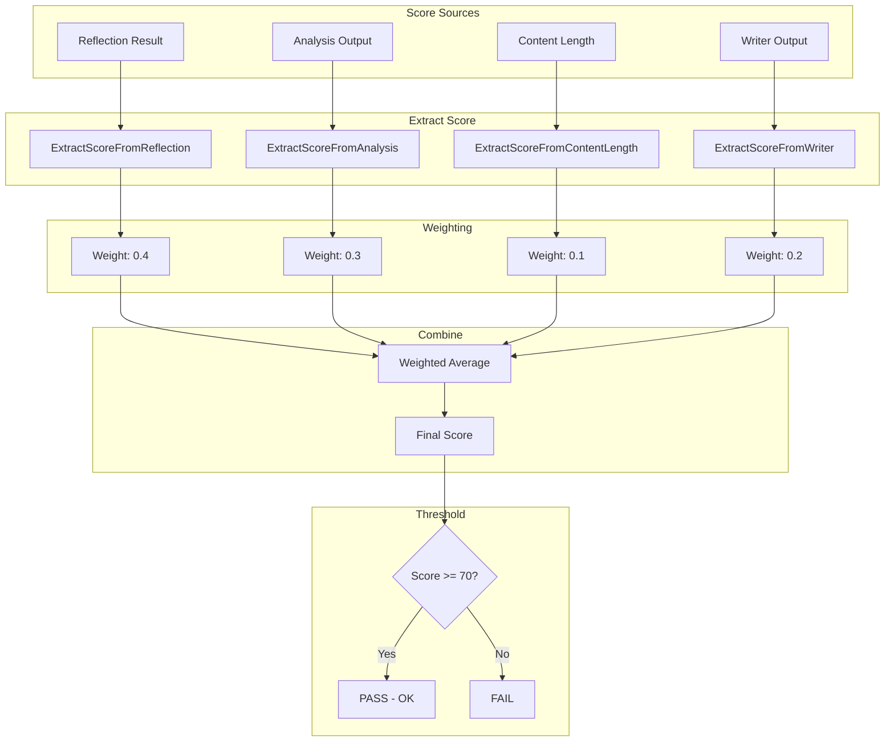

# SEOCrawlSupervisorOrchestrator — High-Level Design & Detail Design

## Document Revision History

| Version | Date | Author | Changes | Description |
|---|---|---|---|---|
| 1.0.0 | 2026-08-28 | System | Initial Release | First version with basic ReAct loop |
| 1.1.0 | 2026-08-29 | System | Architecture Refactor | Introduced Chain of Responsibility pattern with 6 handlers |
| 1.2.0 | 2026-08-30 | System | Dynamic Timeout | Added token-based timeout calculation for LLM operations |
| 1.3.0 | 2026-08-31 | System | Event-Driven Progress | Unified streaming/non-streaming via Progress events with emoji logging |
| 1.4.0 | 2026-08-31 | System | Reflection Engine | Extracted Reflection logic into dedicated engine with 4-layer heuristic |


# 1. Executive Summary

1.1 System Overview

The SEOCrawlSupervisorOrchestrator is a production-grade, pipeline-based orchestration system designed for automated SEO content processing. It manages end-to-end workflows including:

- Web crawling – extract content from target URLs
- SEO analysis – evaluate keyword density, readability, structure
- Content writing – generate SEO-optimized articles
- Quality reflection – multi-layer quality assurance with auto-correction
- Result persistence – save articles and generate comprehensive reports
1.2 Key Features

| Feature | Description | Status |
| --- | --- | --- |
| Pipeline Architecture | Chain of Responsibility with 6 handlers | ✅ Complete |
| Dynamic Timeout | Token-based timeout calculation per LLM | ✅ Complete |
| Event-Driven Progress | Real-time UI updates via Progress events | ✅ Complete |
| Vietnamese SEO | Custom heuristic for Vietnamese content | ✅ Complete |
| Auto Tool Synthesis | Dynamic tool generation for missing capabilities | ✅ Complete |
| 4-Layer Reflection | Duplicate words, templates, density, readability | ✅ Complete |
| Auto-Correction | Rewrite content when quality fails | ✅ Complete |
| Emoji Logging | Rich visual feedback with emojis | ✅ Complete |

1.3 Technology Stack

| Layer | Technology |
| --- | --- |
| Language | C# (.NET 10) |
| AI/LLM | LlamaCppSharp |
| Design Pattern | Chain of Responsibility, Pipeline, Observer |
| Logging | Serilog, Microsoft.Extensions.Logging |
| Data Format | JSON, Markdown |
| Concurrency | Async/Await, CancellationToken, Channels |


# 2. High-Level Design (HLD)

2.1 System Architecture











# 3. Detail Design (DD)

3.1 Chain of Responsibility Implementation




















# 4. Component Details

4.1 SEOCrawlSupervisorOptions


```csharp
public class SEOCrawlSupervisorOptions
{
    // === Core Settings ===
    public bool EnableFinalReflection { get; set; } = true;
    public bool EnableAutoToolSynthesis { get; set; } = false;
    public bool SaveArticlesToFiles { get; set; } = true;
    public bool SaveFinalReport { get; set; } = true;
    public bool SkipL4IfHeuristicPass { get; set; } = true;
    
    // === Timeout Settings ===
    public int BatchTotalTimeoutMinutes { get; set; } = 120;
    public int? UrlTotalTimeoutMinutes { get; set; } = 15;
    public int MaxCorrectionRounds { get; set; } = 1;
    public int? WorkerTimeoutSeconds { get; set; } = 120;
    public int? AgentTimeoutSeconds { get; set; } = 60;
    
    // === LLM Token Settings ===
    public LlmConfig LlmConfig { get; set; } = new();
    
    // === Output Settings ===
    public string OutputDirectory { get; set; } = "./output";
    public int? MaxUrls { get; set; } = 10;
    
    // === Handler Multipliers ===
    public Dictionary<string, double> HandlerTokenMultipliers { get; set; } = new()
    {
        ["Scrape"] = 0.5,
        ["Analyze"] = 1.0,
        ["Write"] = 2.5,
        ["Reflect"] = 1.8,
        ["Save"] = 0.3
    };
}

public class LlmConfig
{
    public double TokensPerSecond { get; set; } = 50;
    public double SafetyBufferMultiplier { get; set; } = 1.5;
    public int MinTimeoutSeconds { get; set; } = 30;
    public int MaxTimeoutSeconds { get; set; } = 900;
    public double CharsPerToken { get; set; } = 4.0;
}
4.2 ProgressEventArgs
```


```csharp
public class ProgressEventArgs : EventArgs
{
    public string Phase { get; set; } = string.Empty;
    public int Step { get; set; }
    public int TotalSteps { get; set; }
    public string Message { get; set; } = string.Empty;
    public bool IsComplete { get; set; }
    public DateTime Timestamp { get; set; }
    public Exception? Error { get; set; }
    public Dictionary<string, object>? Data { get; set; }
    public int PercentComplete { get; set; }
    public string? Status { get; set; }
    public string? Detail { get; set; }
    public int Score { get; set; }
}
4.3 ReflectionProgressEventArgs
```


```csharp
public class ReflectionProgressEventArgs : EventArgs
{
    public string LayerName { get; set; } = string.Empty;
    public int LayerIndex { get; set; }
    public int TotalLayers { get; set; }
    public bool Passed { get; set; }
    public string Detail { get; set; } = string.Empty;
    public double ElapsedMs { get; set; }
    public bool IsComplete { get; set; }
    public bool AllPassed { get; set; }
    public List<string> Issues { get; set; } = new();
    public List<string> Suggestions { get; set; } = new();
}
```


# 5. API Reference

5.1 Public Interface


```csharp
/// <summary>
/// Main orchestrator for SEO crawling and content generation pipeline
/// </summary>
public sealed class SEOCrawlSupervisorOrchestrator : IStreamingAgentOrchestrator
{
    /// <summary>
    /// Constructor with dependency injection
    /// </summary>
    public SEOCrawlSupervisorOrchestrator(
        AgentTeam team,
        IReflectionEngine? reflection = null,
        IPromptTemplateEngine? promptEngine = null,
        SEOCrawlSupervisorOptions? options = null,
        ILoggerFactory? loggerFactory = null,
        DynamicToolSynthesizer? toolSynthesizer = null,
        IDynamicToolRegistry? dynamicRegistry = null);

    /// <summary>
    /// Non-streaming execution - returns complete result set
    /// </summary>
    public IAsyncEnumerable<AgentStep> RunAsync(
        string userInput,
        AgentDefinition definition,
        IConversationMemory memory,
        IToolRegistry? tools,
        ISkillRegistry? skills,
        IReadOnlyList<IGuardrail> guardrails,
        CancellationToken ct = default);

    /// <summary>
    /// Streaming execution - returns real-time progress updates
    /// </summary>
    public IAsyncEnumerable<AgentStepUpdate> RunStreamingAsync(
        string userInput,
        AgentDefinition definition,
        IConversationMemory memory,
        IToolRegistry? tools,
        ISkillRegistry? skills,
        IReadOnlyList<IGuardrail> guardrails,
        CancellationToken ct = default);
}
```


# 6. Deployment & Configuration

6.1 Environment Variables

| Variable | Description | Default |
| --- | --- | --- |
| SEO_OUTPUT_DIR | Output directory path | ./output |
| SEO_BATCH_TIMEOUT | Total batch timeout (minutes) | 120 |
| SEO_WORKER_TIMEOUT | Worker timeout (seconds) | 120 |
| SEO_BASE_TIMEOUT | Base timeout per handler (seconds) | 60 |
| SEO_MAX_TIMEOUT | Maximum timeout (seconds) | 600 |
| SEO_AUTO_SYNTHESIS | Enable auto tool synthesis | false |
| SEO_ENABLE_REFLECTION | Enable final reflection | true |
| SEO_TOKENS_PER_SECOND | LLM tokens per second | 50 |

6.2 Configuration Example


```json
{
  "SEOCrawlSupervisorOptions": {
    "EnableFinalReflection": true,
    "EnableAutoToolSynthesis": false,
    "SaveArticlesToFiles": true,
    "SaveFinalReport": true,
    "SkipL4IfHeuristicPass": true,
    "BatchTotalTimeoutMinutes": 120,
    "MaxCorrectionRounds": 1,
    "WorkerTimeoutSeconds": 120,
    "LlmConfig": {
      "TokensPerSecond": 50,
      "SafetyBufferMultiplier": 1.5,
      "MinTimeoutSeconds": 30,
      "MaxTimeoutSeconds": 600,
      "CharsPerToken": 4.0
    },
    "OutputDirectory": "./output",
    "MaxUrls": 10,
    "HandlerTokenMultipliers": {
      "Scrape": 0.5,
      "Analyze": 1.0,
      "Write": 2.5,
      "Reflect": 1.8,
      "Save": 0.3
    }
  }
}
```


# 7. Performance & Monitoring

7.1 Performance Metrics

| Metric | Target | Description |
| --- | --- | --- |
| URL Throughput | 5-10 URLs/min | URLs processed per minute |
| Per URL Latency | 2-5 minutes | Average time per URL |
| Success Rate | > 95% | Percentage of successful URLs |
| Reflection Accuracy | > 85% | Accuracy of quality detection |
| Memory Usage | < 2GB | Peak memory consumption |
| CPU Usage | < 80% | CPU utilization during batch |

7.2 Logging Levels

| Level | Use Case | Example |
| --- | --- | --- |
| Debug | Detailed flow tracing | Worker invocation details |
| Information | Normal operation | Phase completion, URL processed |
| Warning | Recoverable issues | Retry attempts, timeout warnings |
| Error | Non-recoverable | Worker crash, file write failure |


# 8. Revision Summary

8.1 Changes from v1.0.0 to v1.4.0

| Component | v1.0.0 | v1.4.0 | Benefit |
| --- | --- | --- | --- |
| Architecture | Single monolithic loop | Chain of Responsibility with 7 handlers | Separation of concerns, easier maintenance |
| Progress | Manual yield updates | Event-driven with Channels | Unified streaming, better UI experience |
| Timeout | Fixed values | Dynamic token-based calculation | Adaptive, prevents premature timeout |
| Reflection | Embedded in orchestrator | Dedicated ReflectionEngine with 4 layers | Reusable, testable, extensible |
| Logging | Plain text | Emoji-enhanced with timestamps | Better UX, instant status recognition |
| Scoring | Basic (PASS/FAIL) | Weighted multi-source scoring | More accurate quality measurement |
| Cache | None | Dictionary-based result caching | Avoids redundant processing |
| Auto-Correction | None | Rewrite with worker synthesis | Self-healing, improved quality |

8.2 Key Decisions

Why Chain of Responsibility?

- Each handler has single responsibility
- Easy to add/remove/reorder phases
- Natural fit for pipeline processing
Why Event-Driven Progress?

- Unifies streaming and non-streaming
- Decouples logic from presentation
- Enables multiple subscribers (UI, logging, metrics)
Why Token-Based Timeout?

- LLM processing time is proportional to tokens
- Adaptive to content length and model speed
- Prevents both premature and excessive timeouts
Why 4-Layer Reflection?

- Covers all SEO quality dimensions
- Layer 1-3 are fast heuristics (no LLM)
- Layer 4 is optional LLM-based validation
- SkipL4IfHeuristicPass saves cost

# 9. Appendix

9.1 Vietnamese Stopwords


```csharp
public static readonly HashSet<string> VietnameseStopWords = new()
{
    "và", "của", "là", "để", "thì", "mà", "cho", "trong", "các", "những",
    "một", "có", "được", "đã", "đang", "sẽ", "từ", "đến", "với", "tại",
    // ... full list in source code
};
9.2 Template Phrases Detection
```


```csharp
public static readonly List<string> TemplatePhrases = new()
{
    "ngoài ra bạn cũng nên quan tâm đến",
    "bạn có biết",
    "trong bài viết này chúng tôi sẽ",
    // ... full list in source code
};
```
---

**Document Version:** 1.4.0  

